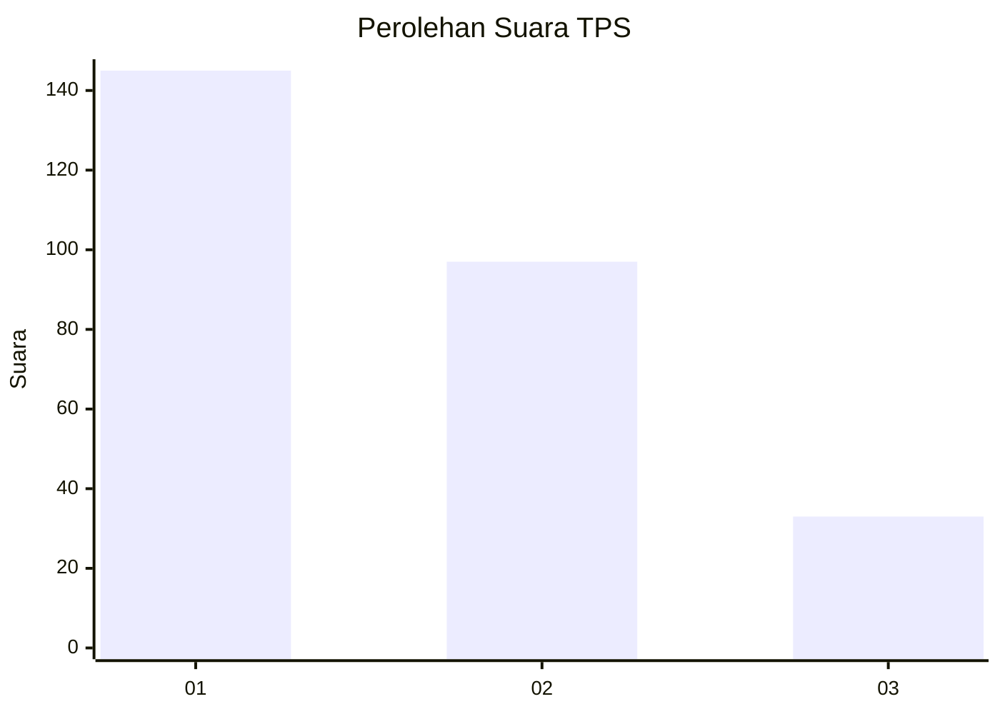
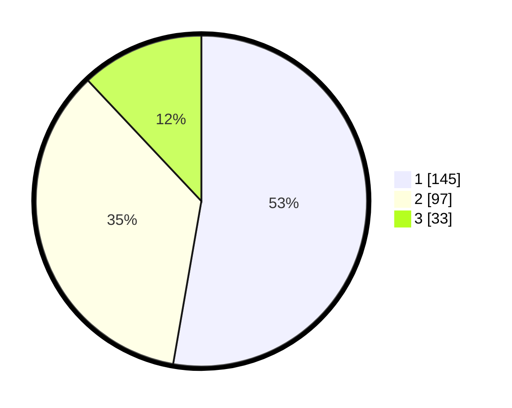

# Hasil

## Grafik

## Tabel

| No. | Nama Paslon    | Suara | Suara (raw) | Persentase |
|:--- |:-------------- | -----:| -----------:| ----------:|
| 1   | ANIES MUHAIMIN | 145   | [145][p-1]  | 52,73      |
| 2   | PRABOWO GIBRAN | 97    | [97][p-2]   | 35,27      |
| 3   | GANJAR MAHFUD  | 33    | [33][p-3]   | 12,00      |

[p-1]: https://github.com/gigit-pemilu/pemilu-2024/blob/main/pilpres/hitung-suara/sub/36-banten/sub/03-tangerang/sub/13-teluknaga/sub/2001-teluknaga/sub/026-tps/sub/paslon-1.txt
[p-2]: https://github.com/gigit-pemilu/pemilu-2024/blob/main/pilpres/hitung-suara/sub/36-banten/sub/03-tangerang/sub/13-teluknaga/sub/2001-teluknaga/sub/026-tps/sub/paslon-2.txt
[p-3]: https://github.com/gigit-pemilu/pemilu-2024/blob/main/pilpres/hitung-suara/sub/36-banten/sub/03-tangerang/sub/13-teluknaga/sub/2001-teluknaga/sub/026-tps/sub/paslon-3.txt

## Foto C Plano

https://sirekap-obj-formc.kpu.go.id/1197/pemilu/ppwp/36/03/13/20/01/3603132001026-20240222-152016--85b38f12-6cb3-4279-8d9f-b2aaced24212.jpg

https://sirekap-obj-formc.kpu.go.id/1197/pemilu/ppwp/36/03/13/20/01/3603132001026-20240222-152109--38ffcfb8-7236-40cd-ac9d-12bbdf620523.jpg

https://sirekap-obj-formc.kpu.go.id/1197/pemilu/ppwp/36/03/13/20/01/3603132001026-20240222-152151--f5d17623-ff4c-4cd9-84f1-a45bbc598748.jpg

## Metadata

| Key        | Value               |
| ---------- | ------------------- |
| Time Stamp | 2024-02-24 22:31:28 |

