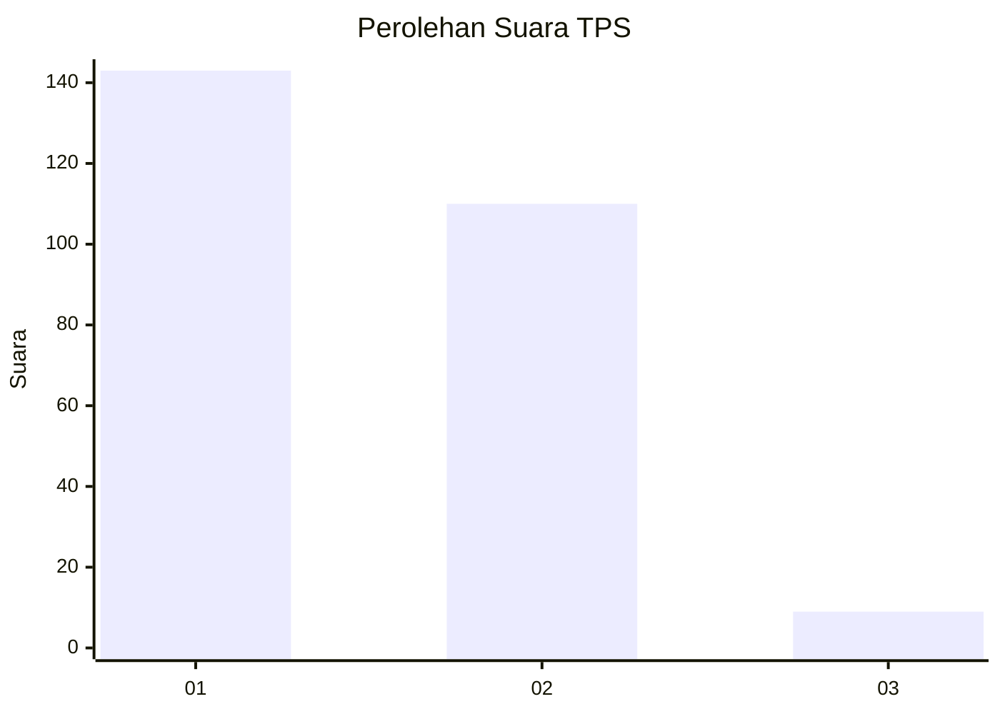
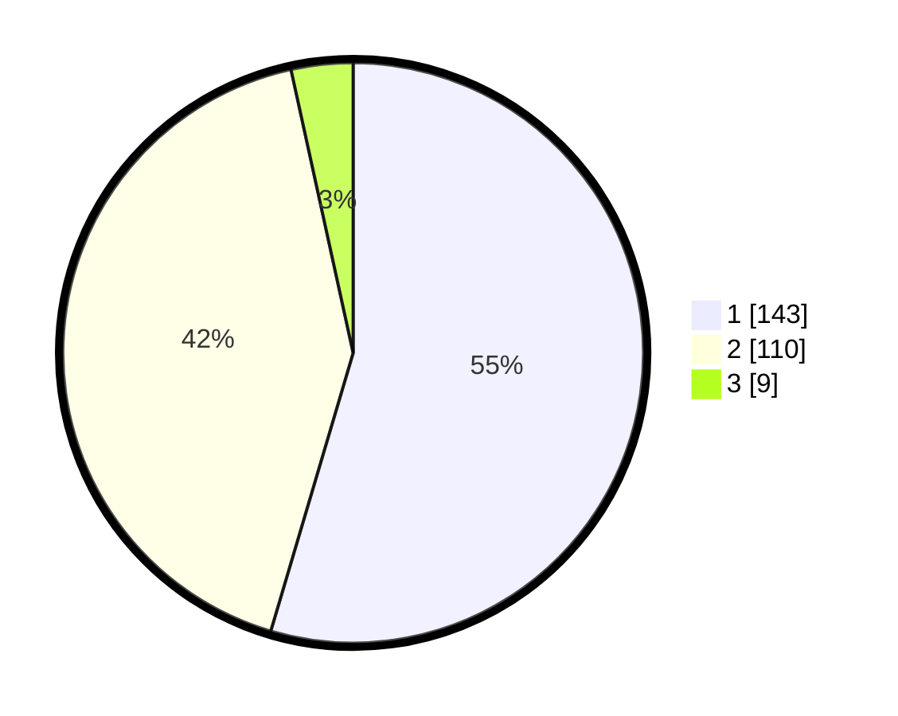

# Hasil

## Grafik

## Tabel

| No. | Nama Paslon    | Suara | Suara (raw) | Persentase |
|:--- |:-------------- | -----:| -----------:| ----------:|
| 1   | ANIES MUHAIMIN | 143   | [143][p-1]  | 54,58      |
| 2   | PRABOWO GIBRAN | 110   | [110][p-2]  | 41,98      |
| 3   | GANJAR MAHFUD  | 9     | [9][p-3]    | 3,44       |

[p-1]: https://github.com/gigit-pemilu/pemilu-2024-36-banten/blob/main/pilpres/hitung-suara/sub/36-banten/sub/03-tangerang/sub/13-teluknaga/sub/2001-teluknaga/sub/034-tps/sub/paslon-1.txt
[p-2]: https://github.com/gigit-pemilu/pemilu-2024-36-banten/blob/main/pilpres/hitung-suara/sub/36-banten/sub/03-tangerang/sub/13-teluknaga/sub/2001-teluknaga/sub/034-tps/sub/paslon-2.txt
[p-3]: https://github.com/gigit-pemilu/pemilu-2024-36-banten/blob/main/pilpres/hitung-suara/sub/36-banten/sub/03-tangerang/sub/13-teluknaga/sub/2001-teluknaga/sub/034-tps/sub/paslon-3.txt

## Foto C Plano

https://sirekap-obj-formc.kpu.go.id/0763/pemilu/ppwp/36/03/13/20/01/3603132001034-20240222-160230--5060bc4f-f95b-4d9b-b1ee-87cbf31c3822.jpg

https://sirekap-obj-formc.kpu.go.id/0763/pemilu/ppwp/36/03/13/20/01/3603132001034-20240222-160336--034d57a8-f507-48d2-8501-4759ea894a33.jpg

https://sirekap-obj-formc.kpu.go.id/0763/pemilu/ppwp/36/03/13/20/01/3603132001034-20240222-160457--5d307029-bcf5-4884-9585-be881d4a2c40.jpg

## Metadata

| Key        | Value               |
| ---------- | ------------------- |
| Time Stamp | 2024-02-24 22:31:28 |

