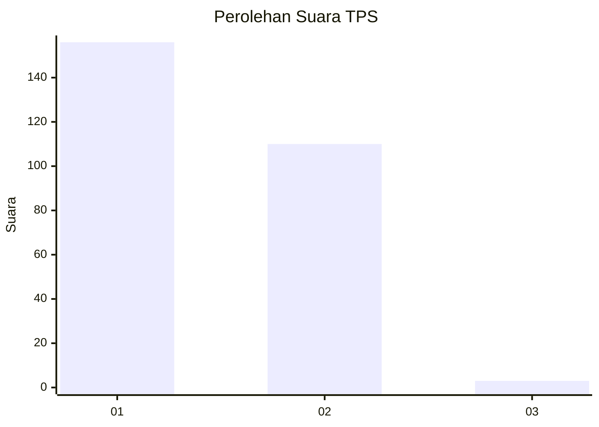
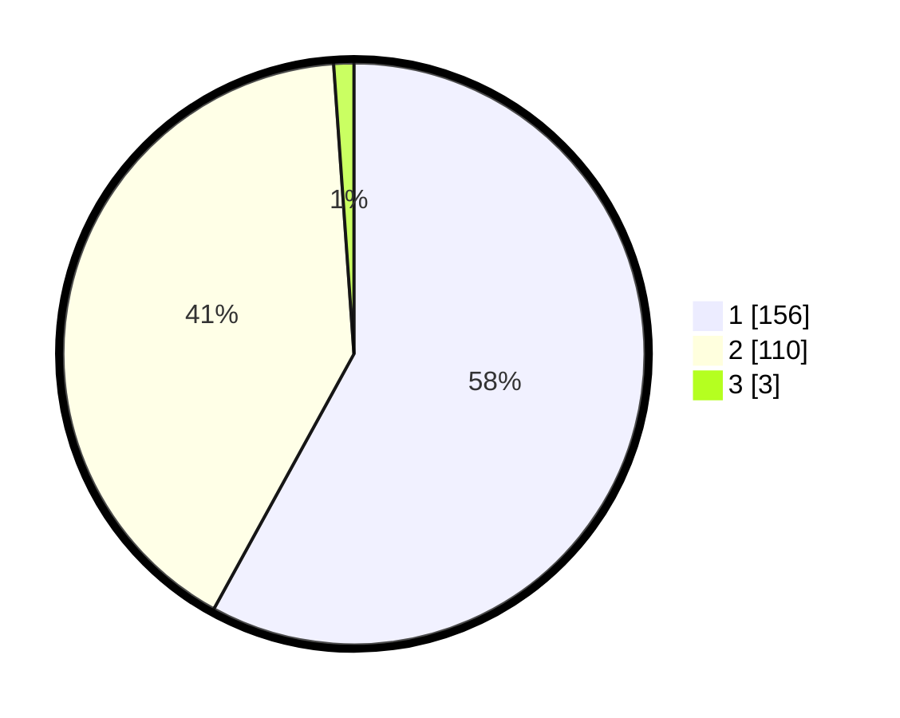

# Hasil

## Grafik

## Tabel

| No. | Nama Paslon    | Suara | Suara (raw) | Persentase |
|:--- |:-------------- | -----:| -----------:| ----------:|
| 1   | ANIES MUHAIMIN | 156   | [156][p-1]  | 57,99      |
| 2   | PRABOWO GIBRAN | 110   | [110][p-2]  | 40,89      |
| 3   | GANJAR MAHFUD  | 3     | [3][p-3]    | 1,12       |

[p-1]: https://github.com/gigit-pemilu/pemilu-2024/blob/main/pilpres/hitung-suara/sub/36-banten/sub/03-tangerang/sub/13-teluknaga/sub/2001-teluknaga/sub/037-tps/sub/paslon-1.txt
[p-2]: https://github.com/gigit-pemilu/pemilu-2024/blob/main/pilpres/hitung-suara/sub/36-banten/sub/03-tangerang/sub/13-teluknaga/sub/2001-teluknaga/sub/037-tps/sub/paslon-2.txt
[p-3]: https://github.com/gigit-pemilu/pemilu-2024/blob/main/pilpres/hitung-suara/sub/36-banten/sub/03-tangerang/sub/13-teluknaga/sub/2001-teluknaga/sub/037-tps/sub/paslon-3.txt

## Foto C Plano

https://sirekap-obj-formc.kpu.go.id/e79a/pemilu/ppwp/36/03/13/20/01/3603132001037-20240222-161446--112a2329-150c-4727-8a43-600353bed4e1.jpg

https://sirekap-obj-formc.kpu.go.id/e79a/pemilu/ppwp/36/03/13/20/01/3603132001037-20240222-161221--0d1e4f3f-12b4-4ce3-99db-a5509c35a2a3.jpg

https://sirekap-obj-formc.kpu.go.id/e79a/pemilu/ppwp/36/03/13/20/01/3603132001037-20240222-161308--2dbeb377-89c0-449f-b85f-467ea551bc68.jpg

## Metadata

| Key        | Value               |
| ---------- | ------------------- |
| Time Stamp | 2024-02-24 22:31:28 |

