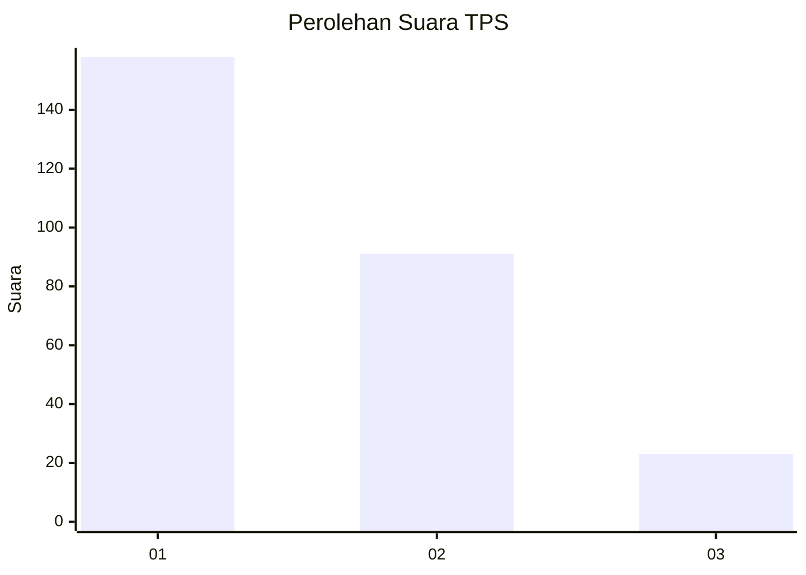
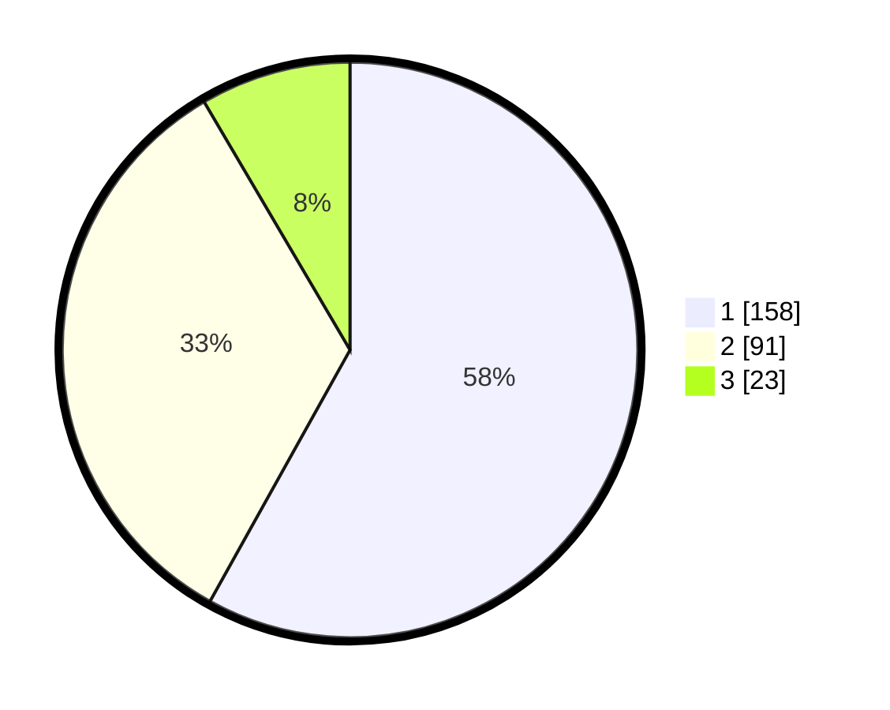

# Hasil

## Grafik

## Tabel

| No. | Nama Paslon    | Suara | Suara (raw) | Persentase |
|:--- |:-------------- | -----:| -----------:| ----------:|
| 1   | ANIES MUHAIMIN | 158   | [158][p-1]  | 58,09      |
| 2   | PRABOWO GIBRAN | 91    | [91][p-2]   | 33,46      |
| 3   | GANJAR MAHFUD  | 23    | [23][p-3]   | 8,46       |

[p-1]: https://github.com/gigit-pemilu/pemilu-2024-36-banten/blob/main/pilpres/hitung-suara/sub/36-banten/sub/03-tangerang/sub/13-teluknaga/sub/2001-teluknaga/sub/038-tps/sub/paslon-1.txt
[p-2]: https://github.com/gigit-pemilu/pemilu-2024-36-banten/blob/main/pilpres/hitung-suara/sub/36-banten/sub/03-tangerang/sub/13-teluknaga/sub/2001-teluknaga/sub/038-tps/sub/paslon-2.txt
[p-3]: https://github.com/gigit-pemilu/pemilu-2024-36-banten/blob/main/pilpres/hitung-suara/sub/36-banten/sub/03-tangerang/sub/13-teluknaga/sub/2001-teluknaga/sub/038-tps/sub/paslon-3.txt

## Foto C Plano

https://sirekap-obj-formc.kpu.go.id/a637/pemilu/ppwp/36/03/13/20/01/3603132001038-20240222-161730--f1b4ee55-8f5d-4d1a-8e4a-3f331e3e3d05.jpg

https://sirekap-obj-formc.kpu.go.id/a637/pemilu/ppwp/36/03/13/20/01/3603132001038-20240222-161809--a0c57284-221a-46ef-bcb2-907c1b84011a.jpg

https://sirekap-obj-formc.kpu.go.id/a637/pemilu/ppwp/36/03/13/20/01/3603132001038-20240222-161909--f7d03a4a-5f76-4b54-b67b-6b8ca1020a4d.jpg

## Metadata

| Key        | Value               |
| ---------- | ------------------- |
| Time Stamp | 2024-02-24 22:31:28 |

