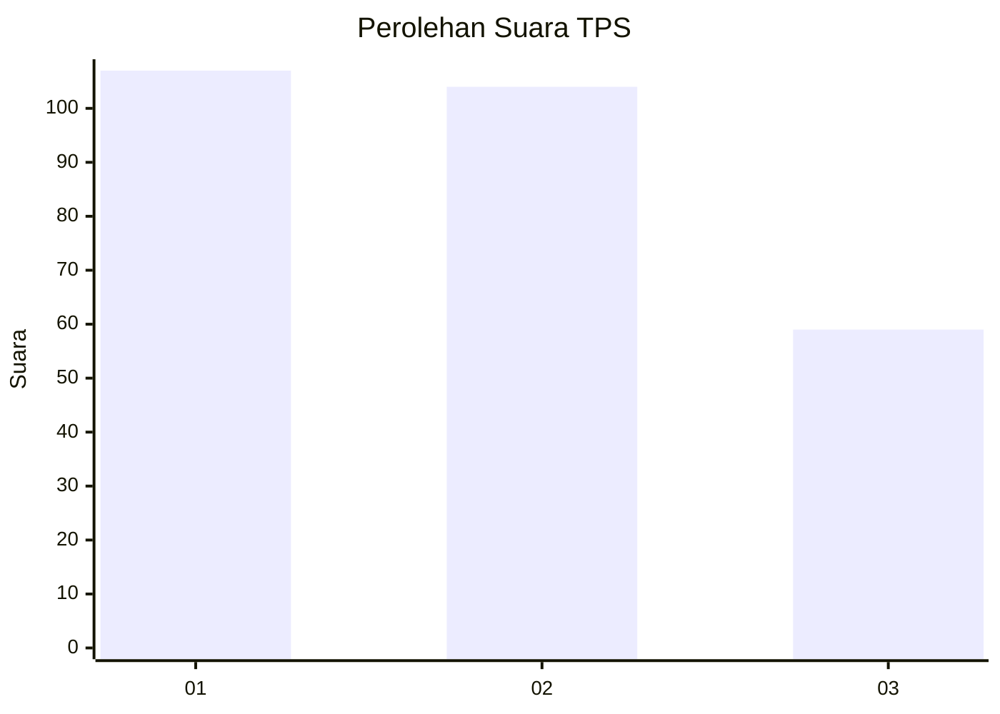
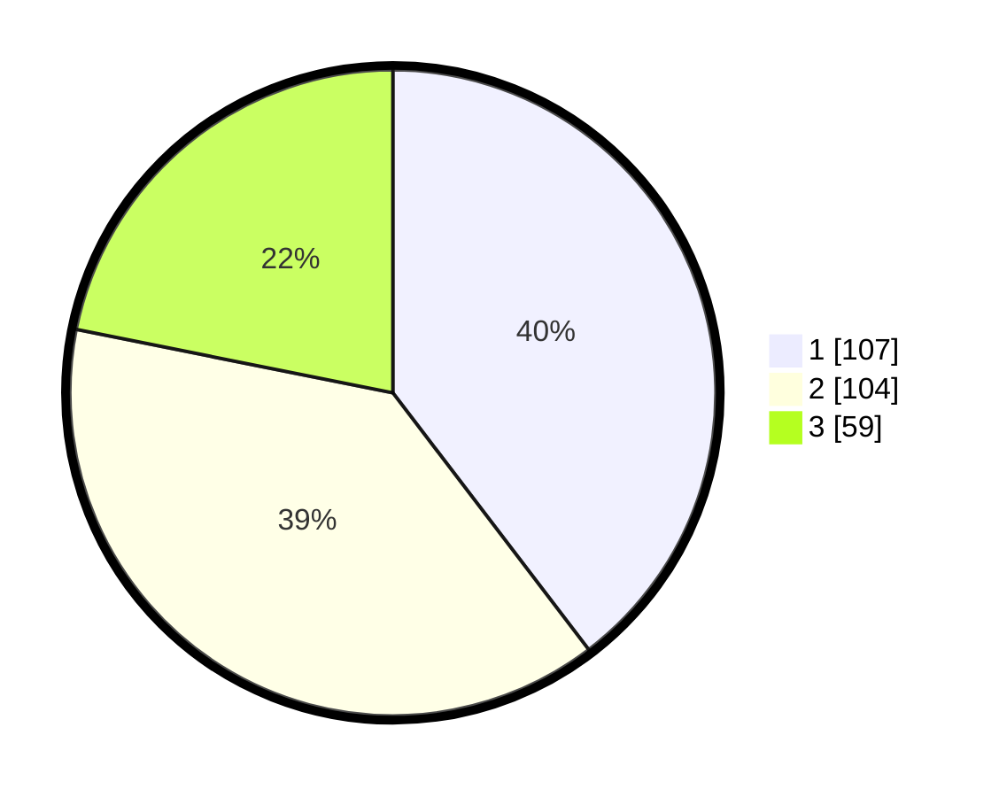

# Hasil

## Grafik

## Tabel

| No. | Nama Paslon    | Suara | Suara (raw) | Persentase |
|:--- |:-------------- | -----:| -----------:| ----------:|
| 1   | ANIES MUHAIMIN | 107   | [107][p-1]  | 39,63      |
| 2   | PRABOWO GIBRAN | 104   | [104][p-2]  | 38,52      |
| 3   | GANJAR MAHFUD  | 59    | [59][p-3]   | 21,85      |

[p-1]: https://github.com/gigit-pemilu/pemilu-2024-36-banten/blob/main/pilpres/hitung-suara/sub/36-banten/sub/03-tangerang/sub/13-teluknaga/sub/2001-teluknaga/sub/039-tps/sub/paslon-1.txt
[p-2]: https://github.com/gigit-pemilu/pemilu-2024-36-banten/blob/main/pilpres/hitung-suara/sub/36-banten/sub/03-tangerang/sub/13-teluknaga/sub/2001-teluknaga/sub/039-tps/sub/paslon-2.txt
[p-3]: https://github.com/gigit-pemilu/pemilu-2024-36-banten/blob/main/pilpres/hitung-suara/sub/36-banten/sub/03-tangerang/sub/13-teluknaga/sub/2001-teluknaga/sub/039-tps/sub/paslon-3.txt

## Foto C Plano

https://sirekap-obj-formc.kpu.go.id/7198/pemilu/ppwp/36/03/13/20/01/3603132001039-20240222-162025--a7e62d88-4359-4dc7-814b-64adb6661ebf.jpg

https://sirekap-obj-formc.kpu.go.id/7198/pemilu/ppwp/36/03/13/20/01/3603132001039-20240222-162107--dfef8281-8381-4617-906b-df5f7d39489e.jpg

https://sirekap-obj-formc.kpu.go.id/7198/pemilu/ppwp/36/03/13/20/01/3603132001039-20240222-162159--963b7985-a0c6-4935-b740-cba351eaebe6.jpg

## Metadata

| Key        | Value               |
| ---------- | ------------------- |
| Time Stamp | 2024-02-24 22:31:28 |

