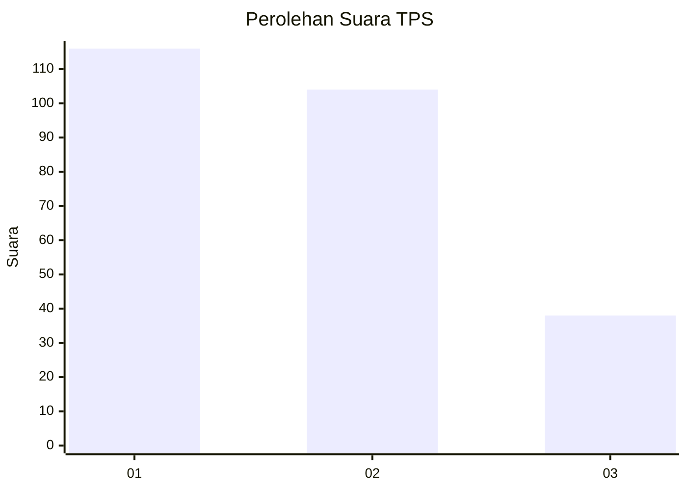
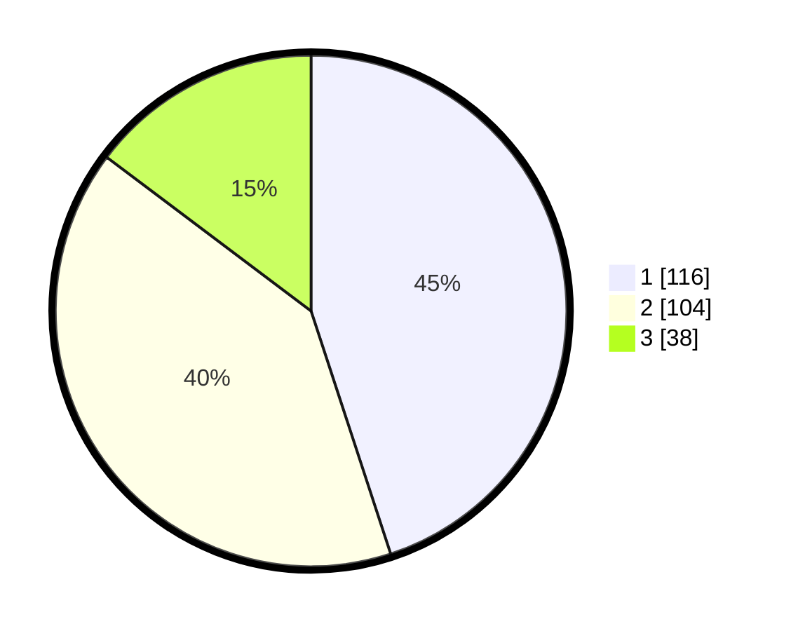

# Hasil

## Grafik

## Tabel

| No. | Nama Paslon    | Suara | Suara (raw) | Persentase |
|:--- |:-------------- | -----:| -----------:| ----------:|
| 1   | ANIES MUHAIMIN | 116   | [116][p-1]  | 44,96      |
| 2   | PRABOWO GIBRAN | 104   | [104][p-2]  | 40,31      |
| 3   | GANJAR MAHFUD  | 38    | [38][p-3]   | 14,73      |

[p-1]: https://github.com/gigit-pemilu/pemilu-2024/blob/main/pilpres/hitung-suara/sub/36-banten/sub/03-tangerang/sub/13-teluknaga/sub/2001-teluknaga/sub/040-tps/sub/paslon-1.txt
[p-2]: https://github.com/gigit-pemilu/pemilu-2024/blob/main/pilpres/hitung-suara/sub/36-banten/sub/03-tangerang/sub/13-teluknaga/sub/2001-teluknaga/sub/040-tps/sub/paslon-2.txt
[p-3]: https://github.com/gigit-pemilu/pemilu-2024/blob/main/pilpres/hitung-suara/sub/36-banten/sub/03-tangerang/sub/13-teluknaga/sub/2001-teluknaga/sub/040-tps/sub/paslon-3.txt

## Foto C Plano

https://sirekap-obj-formc.kpu.go.id/c0ce/pemilu/ppwp/36/03/13/20/01/3603132001040-20240222-162338--7ce5f5d2-4fae-49ef-b297-bb919eee5391.jpg

https://sirekap-obj-formc.kpu.go.id/c0ce/pemilu/ppwp/36/03/13/20/01/3603132001040-20240222-162802--33cf541d-4dfb-4db3-9630-f1e80f3a238c.jpg

https://sirekap-obj-formc.kpu.go.id/c0ce/pemilu/ppwp/36/03/13/20/01/3603132001040-20240222-162648--e6fed2a2-6238-4de3-a0b8-6273fabfdc35.jpg

## Metadata

| Key        | Value               |
| ---------- | ------------------- |
| Time Stamp | 2024-02-24 22:31:28 |

## DATA PEMILIH TETAP

Jumlah pemilih dalam DPT: **258**.
 * L: **356**.
 * P: **327**.

## DATA PENGGUNA HAK PILIH

Jumlah pengguna hak pilih dalam DPT: **279**.
 * L: **335**.
 * P: **452**.

Jumlah pengguna hak pilih dalam DPTb: **777**.
 * L: **275**.
 * P: **257**.

Jumlah pengguna hak pilih dalam DPK: **575**.
 * L: **552**.
 * P: **557**.

Jumlah pengguna hak pilih: **379**.
 * L: **335**.
 * P: **433**.

## JUMLAH SUARA SAH DAN TIDAK SAH

JUMLAH SELURUH SUARA SAH: **258**.

JUMLAH SUARA TIDAK SAH: **12**.

JUMLAH SELURUH SUARA SAH DAN SUARA TIDAK SAH: **270**.

