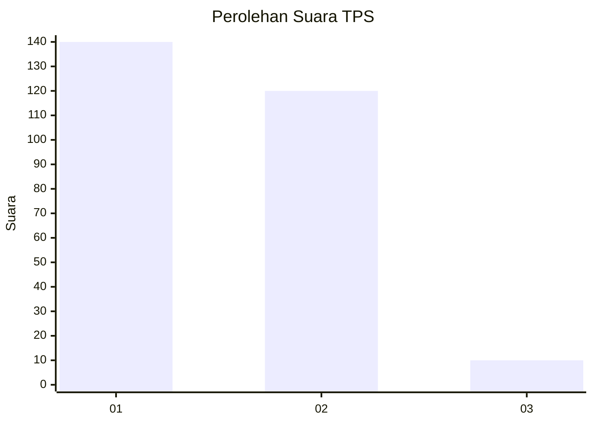
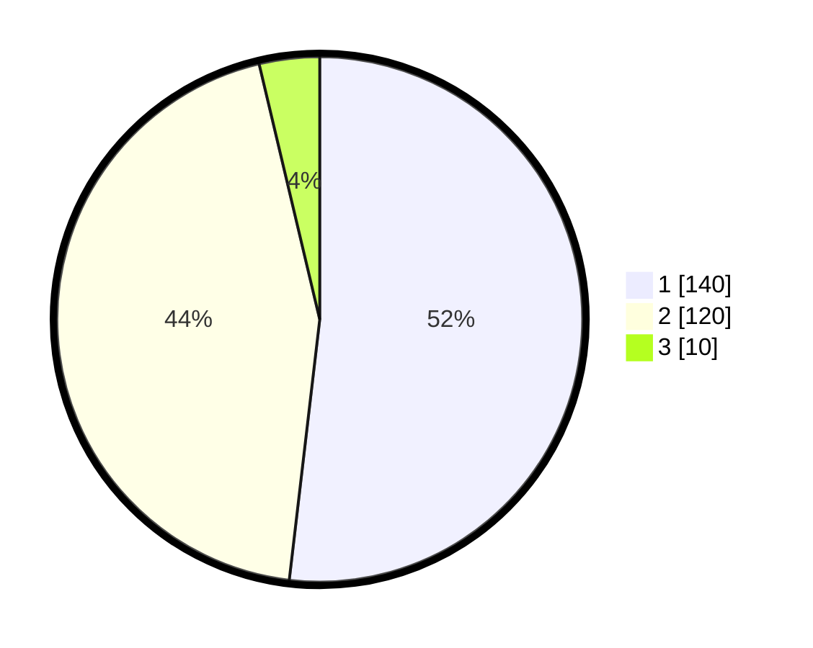

# Hasil

## Grafik

## Tabel

| No. | Nama Paslon    | Suara | Suara (raw) | Persentase |
|:--- |:-------------- | -----:| -----------:| ----------:|
| 1   | ANIES MUHAIMIN | 140   | [140][p-1]  | 51,85      |
| 2   | PRABOWO GIBRAN | 120   | [120][p-2]  | 44,44      |
| 3   | GANJAR MAHFUD  | 10    | [10][p-3]   | 3,70       |

[p-1]: https://github.com/gigit-pemilu/pemilu-2024-36-banten/blob/main/pilpres/hitung-suara/sub/36-banten/sub/03-tangerang/sub/13-teluknaga/sub/2002-bojong-renged/sub/031-tps/sub/paslon-1.txt
[p-2]: https://github.com/gigit-pemilu/pemilu-2024-36-banten/blob/main/pilpres/hitung-suara/sub/36-banten/sub/03-tangerang/sub/13-teluknaga/sub/2002-bojong-renged/sub/031-tps/sub/paslon-2.txt
[p-3]: https://github.com/gigit-pemilu/pemilu-2024-36-banten/blob/main/pilpres/hitung-suara/sub/36-banten/sub/03-tangerang/sub/13-teluknaga/sub/2002-bojong-renged/sub/031-tps/sub/paslon-3.txt

## Foto C Plano

https://sirekap-obj-formc.kpu.go.id/099e/pemilu/ppwp/36/03/13/20/02/3603132002031-20240222-142523--1d13158c-09a7-4e6a-957b-f6fd583bfb9f.jpg

https://sirekap-obj-formc.kpu.go.id/099e/pemilu/ppwp/36/03/13/20/02/3603132002031-20240222-142548--9bddad01-251d-4979-8b77-2700241b7b4c.jpg

https://sirekap-obj-formc.kpu.go.id/099e/pemilu/ppwp/36/03/13/20/02/3603132002031-20240222-142615--c3b44f78-a863-435b-b59c-af87fdf55421.jpg

## Metadata

| Key        | Value               |
| ---------- | ------------------- |
| Time Stamp | 2024-02-24 22:31:28 |

