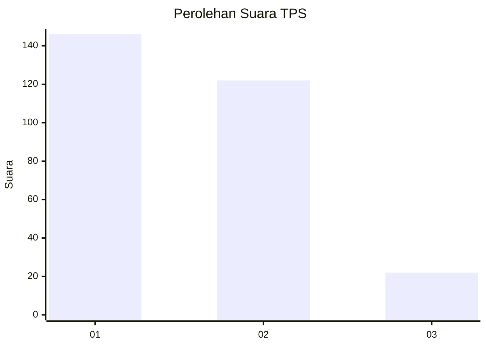
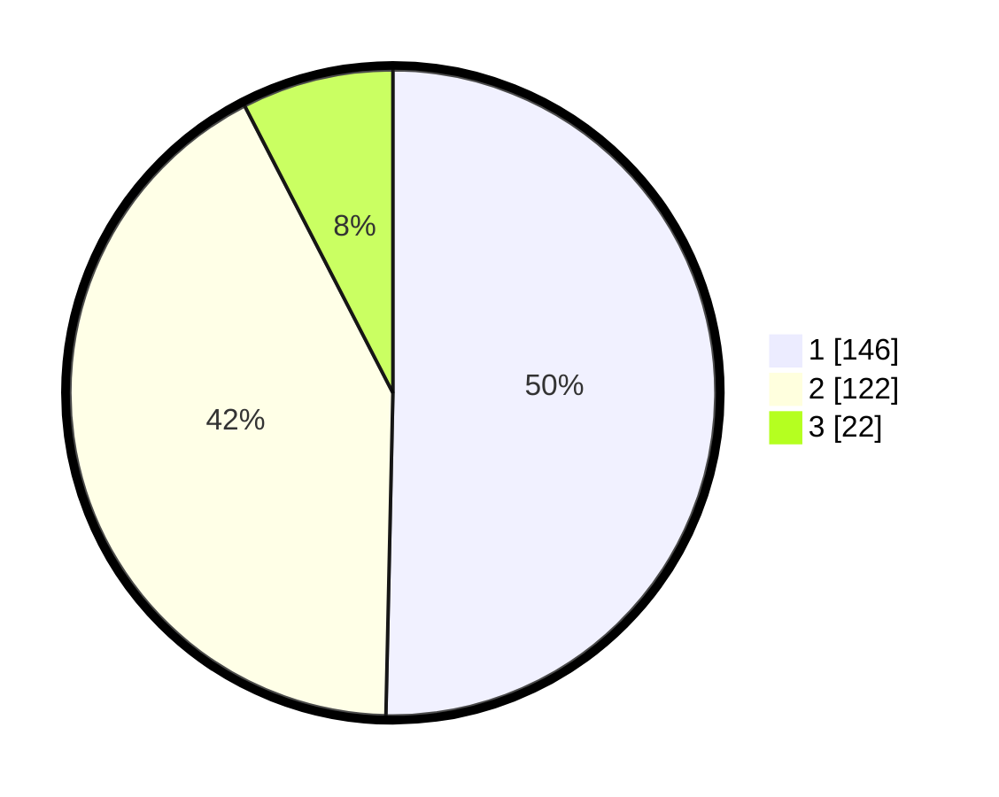

# Hasil

## Grafik

## Tabel

| No. | Nama Paslon    | Suara | Suara (raw) | Persentase |
|:--- |:-------------- | -----:| -----------:| ----------:|
| 1   | ANIES MUHAIMIN | 146   | [146][p-1]  | 50,34      |
| 2   | PRABOWO GIBRAN | 122   | [122][p-2]  | 42,07      |
| 3   | GANJAR MAHFUD  | 22    | [22][p-3]   | 7,59       |

[p-1]: https://github.com/gigit-pemilu/pemilu-2024-36-banten/blob/main/pilpres/hitung-suara/sub/36-banten/sub/03-tangerang/sub/13-teluknaga/sub/2002-bojong-renged/sub/039-tps/sub/paslon-1.txt
[p-2]: https://github.com/gigit-pemilu/pemilu-2024-36-banten/blob/main/pilpres/hitung-suara/sub/36-banten/sub/03-tangerang/sub/13-teluknaga/sub/2002-bojong-renged/sub/039-tps/sub/paslon-2.txt
[p-3]: https://github.com/gigit-pemilu/pemilu-2024-36-banten/blob/main/pilpres/hitung-suara/sub/36-banten/sub/03-tangerang/sub/13-teluknaga/sub/2002-bojong-renged/sub/039-tps/sub/paslon-3.txt

## Foto C Plano

https://sirekap-obj-formc.kpu.go.id/467b/pemilu/ppwp/36/03/13/20/02/3603132002039-20240222-150813--53b088b3-0ae0-4ae0-8487-ce8d07e04e16.jpg

https://sirekap-obj-formc.kpu.go.id/467b/pemilu/ppwp/36/03/13/20/02/3603132002039-20240222-150856--b17daea9-d308-4496-8440-d23bb96d9d5e.jpg

https://sirekap-obj-formc.kpu.go.id/467b/pemilu/ppwp/36/03/13/20/02/3603132002039-20240222-150936--ec0b0d1a-b8a1-45b2-b419-8fbd2ba72f4c.jpg

## Metadata

| Key        | Value               |
| ---------- | ------------------- |
| Time Stamp | 2024-02-24 22:31:28 |

