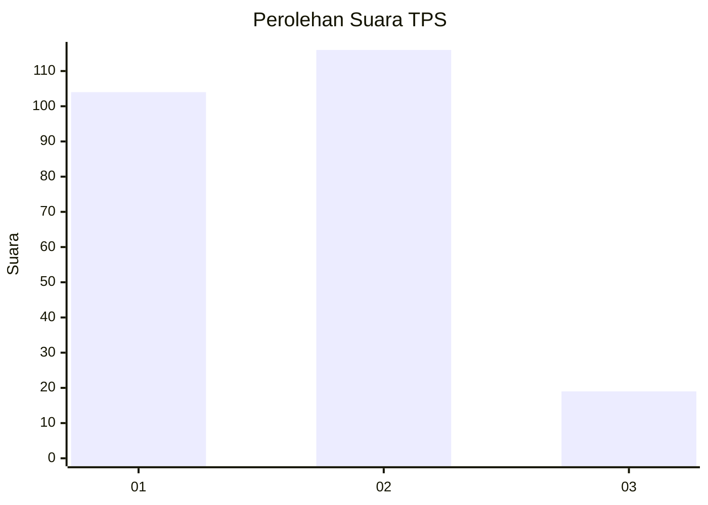
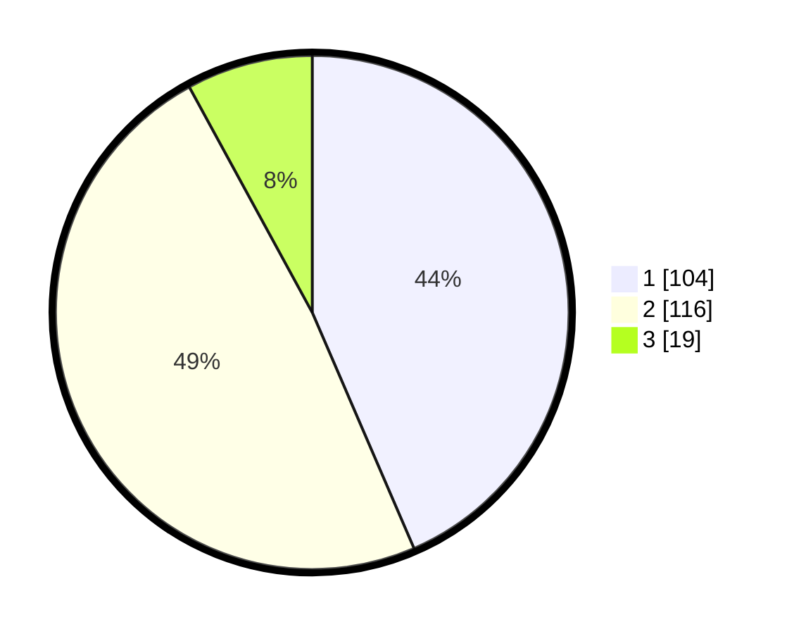

# Hasil

## Grafik

## Tabel

| No. | Nama Paslon    | Suara | Suara (raw) | Persentase |
|:--- |:-------------- | -----:| -----------:| ----------:|
| 1   | ANIES MUHAIMIN | 104   | [104][p-1]  | 43,51      |
| 2   | PRABOWO GIBRAN | 116   | [116][p-2]  | 48,54      |
| 3   | GANJAR MAHFUD  | 19    | [19][p-3]   | 7,95       |

[p-1]: https://github.com/gigit-pemilu/pemilu-2024/blob/main/pilpres/hitung-suara/sub/36-banten/sub/03-tangerang/sub/13-teluknaga/sub/2003-babakan-asem/sub/033-tps/sub/paslon-1.txt
[p-2]: https://github.com/gigit-pemilu/pemilu-2024/blob/main/pilpres/hitung-suara/sub/36-banten/sub/03-tangerang/sub/13-teluknaga/sub/2003-babakan-asem/sub/033-tps/sub/paslon-2.txt
[p-3]: https://github.com/gigit-pemilu/pemilu-2024/blob/main/pilpres/hitung-suara/sub/36-banten/sub/03-tangerang/sub/13-teluknaga/sub/2003-babakan-asem/sub/033-tps/sub/paslon-3.txt

## Foto C Plano

https://sirekap-obj-formc.kpu.go.id/2302/pemilu/ppwp/36/03/13/20/03/3603132003033-20240217-131217--585a37d7-6b9f-48c4-a78d-99f937af5182.jpg

https://sirekap-obj-formc.kpu.go.id/2302/pemilu/ppwp/36/03/13/20/03/3603132003033-20240217-131256--b88ab3d2-ab69-488a-a9af-4dbda604584f.jpg

https://sirekap-obj-formc.kpu.go.id/2302/pemilu/ppwp/36/03/13/20/03/3603132003033-20240217-131331--11ca9151-6786-4139-ab0c-ec0b28ba7cc5.jpg

## Metadata

| Key        | Value               |
| ---------- | ------------------- |
| Time Stamp | 2024-02-19 06:16:00 |

## DATA PEMILIH TETAP

Jumlah pemilih dalam DPT: **278**.
 * L: **42**.
 * P: **36**.

## DATA PENGGUNA HAK PILIH

Jumlah pengguna hak pilih dalam DPT: **232**.
 * L: **0**.
 * P: **5**.

Jumlah pengguna hak pilih dalam DPTb: **0**.
 * L: **880**.
 * P: **880**.

Jumlah pengguna hak pilih dalam DPK: **812**.
 * L: **6**.
 * P: **86**.

Jumlah pengguna hak pilih: **244**.
 * L: **423**.
 * P: **221**.

## JUMLAH SUARA SAH DAN TIDAK SAH

JUMLAH SELURUH SUARA SAH: **239**.

JUMLAH SUARA TIDAK SAH: **5**.

JUMLAH SELURUH SUARA SAH DAN SUARA TIDAK SAH: **244**.

