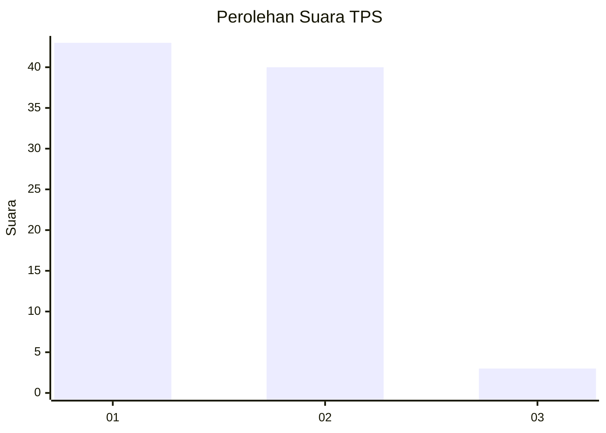
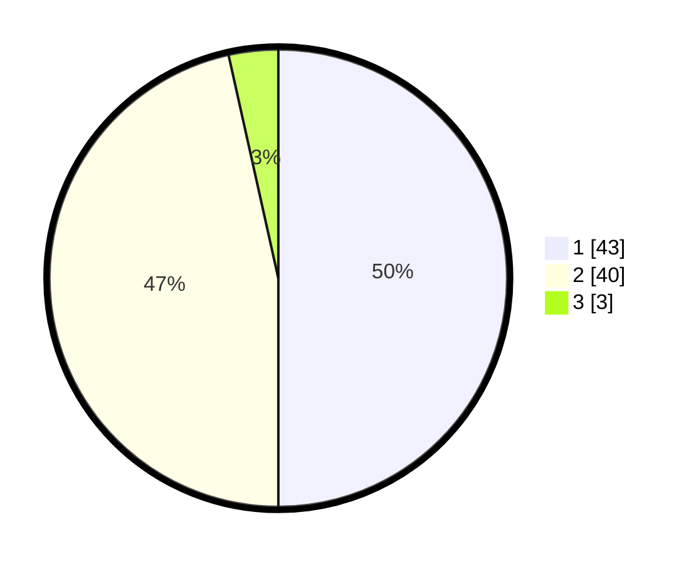

# Hasil

## Grafik

## Tabel

| No. | Nama Paslon    | Suara | Suara (raw) | Persentase |
|:--- |:-------------- | -----:| -----------:| ----------:|
| 1   | ANIES MUHAIMIN | 43    | [43][p-1]   | 50,00      |
| 2   | PRABOWO GIBRAN | 40    | [40][p-2]   | 46,51      |
| 3   | GANJAR MAHFUD  | 3     | [3][p-3]    | 3,49       |

[p-1]: https://github.com/gigit-pemilu/pemilu-2024-36-banten/blob/main/pilpres/hitung-suara/sub/36-banten/sub/03-tangerang/sub/13-teluknaga/sub/2003-babakan-asem/sub/034-tps/sub/paslon-1.txt
[p-2]: https://github.com/gigit-pemilu/pemilu-2024-36-banten/blob/main/pilpres/hitung-suara/sub/36-banten/sub/03-tangerang/sub/13-teluknaga/sub/2003-babakan-asem/sub/034-tps/sub/paslon-2.txt
[p-3]: https://github.com/gigit-pemilu/pemilu-2024-36-banten/blob/main/pilpres/hitung-suara/sub/36-banten/sub/03-tangerang/sub/13-teluknaga/sub/2003-babakan-asem/sub/034-tps/sub/paslon-3.txt

## Foto C Plano

https://sirekap-obj-formc.kpu.go.id/153a/pemilu/ppwp/36/03/13/20/03/3603132003034-20240217-131608--e8d11f1e-f7ca-4dfb-8836-3cb64bc7e961.jpg

https://sirekap-obj-formc.kpu.go.id/153a/pemilu/ppwp/36/03/13/20/03/3603132003034-20240217-131637--0ee6201f-5e27-4c01-b236-db355c83e2f2.jpg

https://sirekap-obj-formc.kpu.go.id/153a/pemilu/ppwp/36/03/13/20/03/3603132003034-20240217-131705--262b3b3d-4362-4011-8e10-2989953886c1.jpg

## Metadata

| Key        | Value               |
| ---------- | ------------------- |
| Time Stamp | 2024-02-17 13:37:34 |

## DATA PEMILIH TETAP

Jumlah pemilih dalam DPT: **290**.
 * L: **83**.
 * P: **650**.

## DATA PENGGUNA HAK PILIH

Jumlah pengguna hak pilih dalam DPT: **240**.
 * L: **600**.
 * P: **137**.

Jumlah pengguna hak pilih dalam DPTb: **888**.
 * L: **888**.
 * P: **688**.

Jumlah pengguna hak pilih dalam DPK: **88**.
 * L: **808**.
 * P: **888**.

Jumlah pengguna hak pilih: **242**.
 * L: **660**.
 * P: **832**.

## JUMLAH SUARA SAH DAN TIDAK SAH

JUMLAH SELURUH SUARA SAH: **236**.

JUMLAH SUARA TIDAK SAH: **71**.

JUMLAH SELURUH SUARA SAH DAN SUARA TIDAK SAH: **240**.

