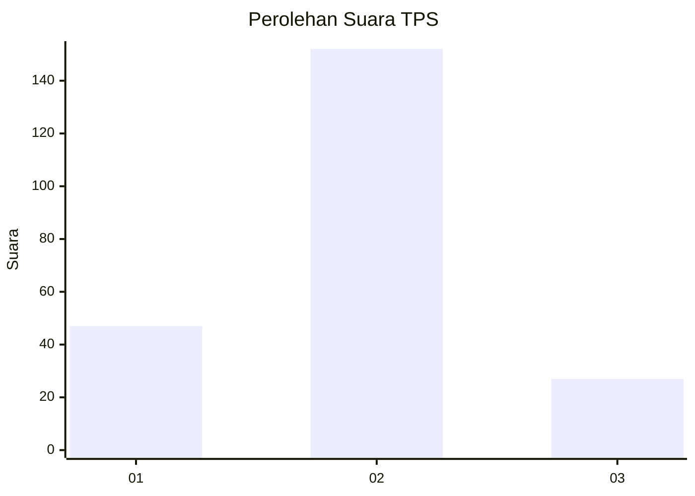
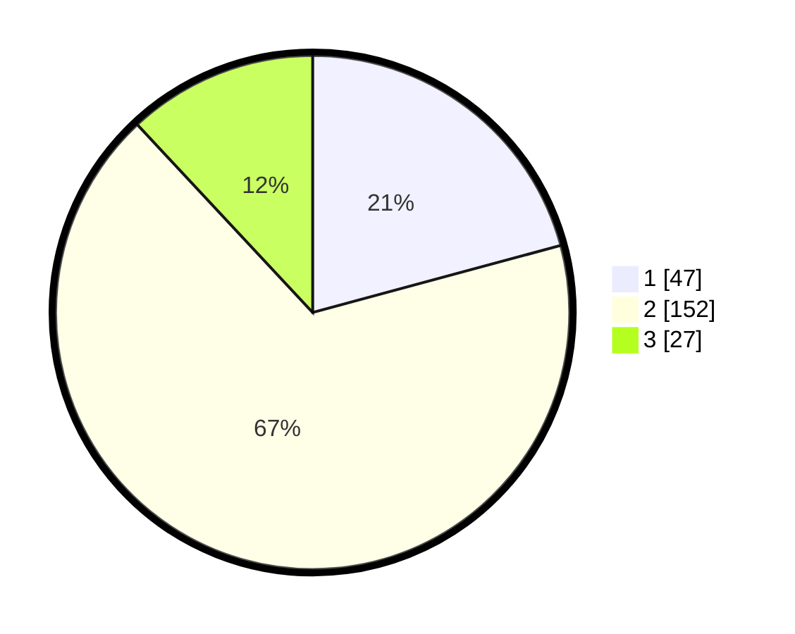

# Hasil

## Grafik

## Tabel

| No. | Nama Paslon    | Suara | Suara (raw) | Persentase |
|:--- |:-------------- | -----:| -----------:| ----------:|
| 1   | ANIES MUHAIMIN | 47    | [47][p-1]   | 20,80      |
| 2   | PRABOWO GIBRAN | 152   | [152][p-2]  | 67,26      |
| 3   | GANJAR MAHFUD  | 27    | [27][p-3]   | 11,95      |

[p-1]: https://github.com/gigit-pemilu/pemilu-2024/blob/main/pilpres/hitung-suara/sub/36-banten/sub/03-tangerang/sub/13-teluknaga/sub/2005-pangkalan/sub/031-tps/sub/paslon-1.txt
[p-2]: https://github.com/gigit-pemilu/pemilu-2024/blob/main/pilpres/hitung-suara/sub/36-banten/sub/03-tangerang/sub/13-teluknaga/sub/2005-pangkalan/sub/031-tps/sub/paslon-2.txt
[p-3]: https://github.com/gigit-pemilu/pemilu-2024/blob/main/pilpres/hitung-suara/sub/36-banten/sub/03-tangerang/sub/13-teluknaga/sub/2005-pangkalan/sub/031-tps/sub/paslon-3.txt

## Foto C Plano

https://sirekap-obj-formc.kpu.go.id/2233/pemilu/ppwp/36/03/13/20/05/3603132005031-20240217-163447--488c1d05-ac87-4c5b-a1fa-d6c7505c4507.jpg

https://sirekap-obj-formc.kpu.go.id/2233/pemilu/ppwp/36/03/13/20/05/3603132005031-20240217-163554--a9c01f3a-04f0-41a6-97bc-30009b6288f3.jpg

https://sirekap-obj-formc.kpu.go.id/2233/pemilu/ppwp/36/03/13/20/05/3603132005031-20240217-163618--eebd011c-7488-4b04-930e-96d90ee1dffc.jpg

## Metadata

| Key        | Value               |
| ---------- | ------------------- |
| Time Stamp | 2024-02-17 16:52:47 |

## DATA PEMILIH TETAP

Jumlah pemilih dalam DPT: **275**.
 * L: **738**.
 * P: **779**.

## DATA PENGGUNA HAK PILIH

Jumlah pengguna hak pilih dalam DPT: **230**.
 * L: **777**.
 * P: **772**.

Jumlah pengguna hak pilih dalam DPTb: **522**.
 * L: **785**.
 * P: **586**.

Jumlah pengguna hak pilih dalam DPK: **0**.
 * L: **20**.
 * P: **202**.

Jumlah pengguna hak pilih: **230**.
 * L: **80**.
 * P: **704**.

## JUMLAH SUARA SAH DAN TIDAK SAH

JUMLAH SELURUH SUARA SAH: **225**.

JUMLAH SUARA TIDAK SAH: **4**.

JUMLAH SELURUH SUARA SAH DAN SUARA TIDAK SAH: **230**.

