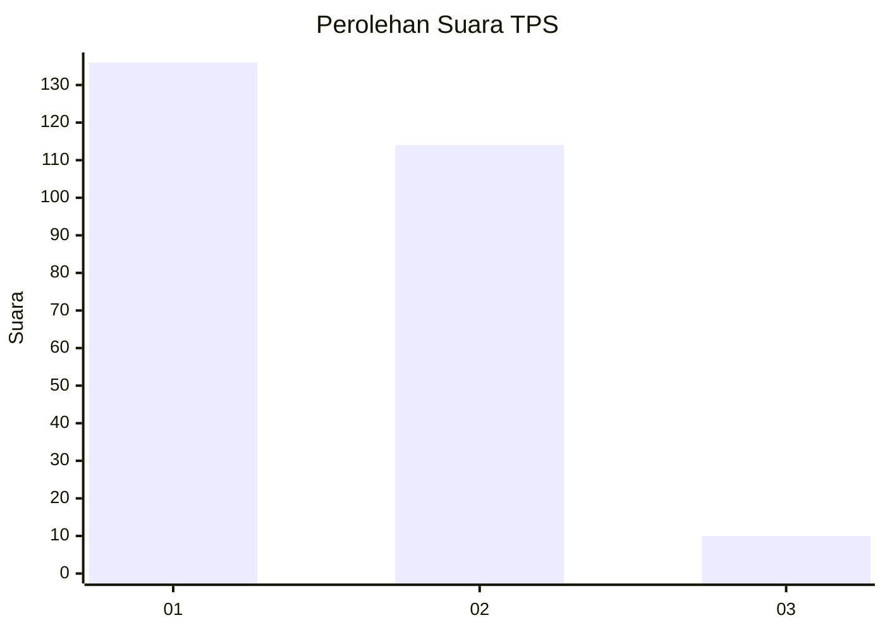
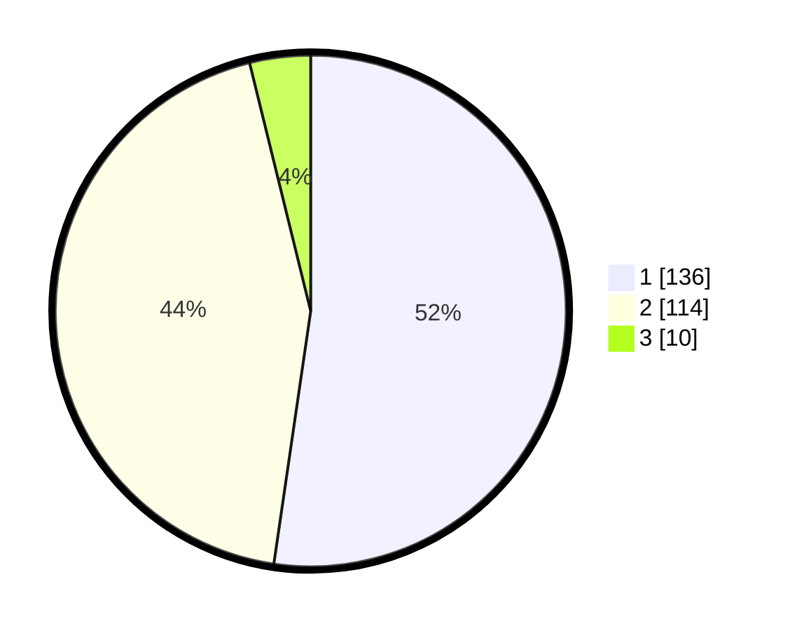

# Hasil

## Grafik

## Tabel

| No. | Nama Paslon    | Suara | Suara (raw) | Persentase |
|:--- |:-------------- | -----:| -----------:| ----------:|
| 1   | ANIES MUHAIMIN | 136   | [136][p-1]  | 52,31      |
| 2   | PRABOWO GIBRAN | 114   | [114][p-2]  | 43,85      |
| 3   | GANJAR MAHFUD  | 10    | [10][p-3]   | 3,85       |

[p-1]: https://github.com/gigit-pemilu/pemilu-2024/blob/main/pilpres/hitung-suara/sub/36-banten/sub/03-tangerang/sub/13-teluknaga/sub/2006-kmp-melayu-tim/sub/001-tps/sub/paslon-1.txt
[p-2]: https://github.com/gigit-pemilu/pemilu-2024/blob/main/pilpres/hitung-suara/sub/36-banten/sub/03-tangerang/sub/13-teluknaga/sub/2006-kmp-melayu-tim/sub/001-tps/sub/paslon-2.txt
[p-3]: https://github.com/gigit-pemilu/pemilu-2024/blob/main/pilpres/hitung-suara/sub/36-banten/sub/03-tangerang/sub/13-teluknaga/sub/2006-kmp-melayu-tim/sub/001-tps/sub/paslon-3.txt

## Foto C Plano

https://sirekap-obj-formc.kpu.go.id/3451/pemilu/ppwp/36/03/13/20/06/3603132006001-20240224-010647--4965d53c-37c5-4b24-8105-5603cacbb291.jpg

https://sirekap-obj-formc.kpu.go.id/3451/pemilu/ppwp/36/03/13/20/06/3603132006001-20240224-010735--7b4ef338-39ff-4ec5-b895-5f59b9635b86.jpg

https://sirekap-obj-formc.kpu.go.id/3451/pemilu/ppwp/36/03/13/20/06/3603132006001-20240224-010824--982ba090-9d1e-4123-95d6-8d30e1e14b83.jpg

## Metadata

| Key        | Value               |
| ---------- | ------------------- |
| Time Stamp | 2024-02-24 22:31:28 |

