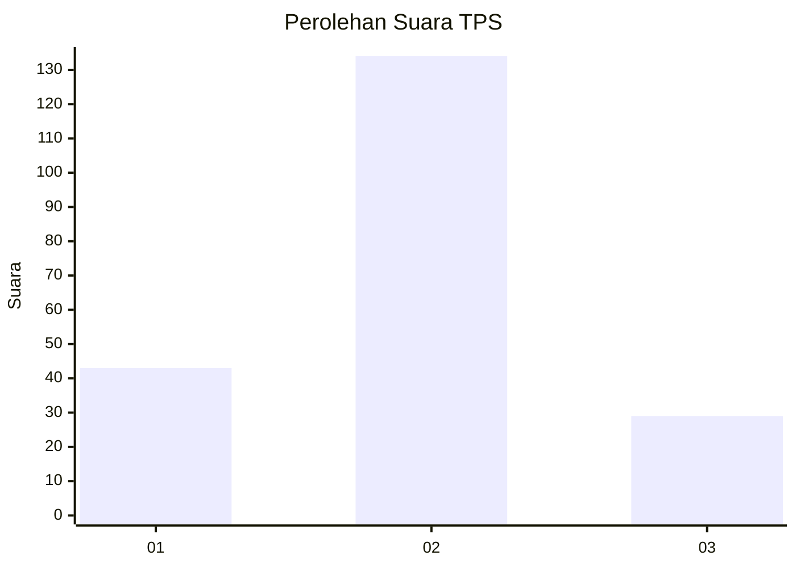
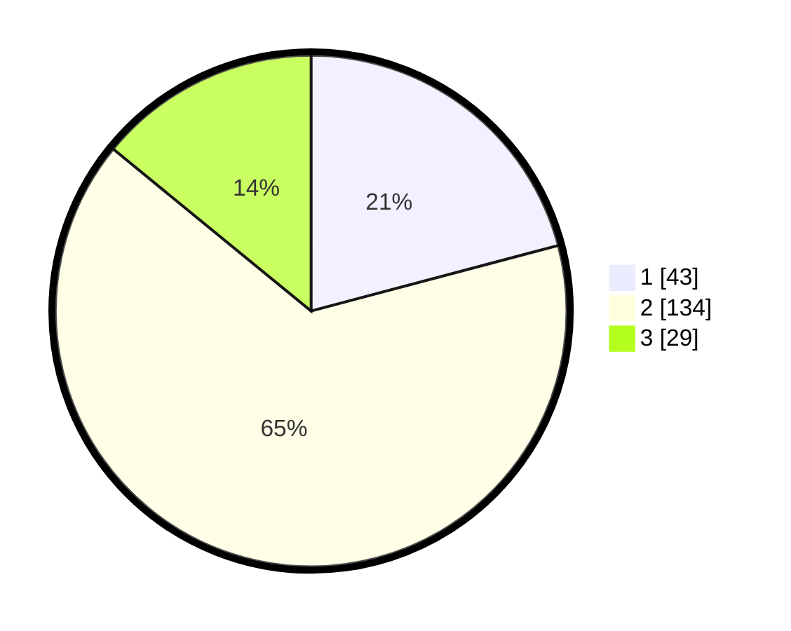

# Hasil

## Grafik

## Tabel

| No. | Nama Paslon    | Suara | Suara (raw) | Persentase |
|:--- |:-------------- | -----:| -----------:| ----------:|
| 1   | ANIES MUHAIMIN | 43    | [43][p-1]   | 20,87      |
| 2   | PRABOWO GIBRAN | 134   | [134][p-2]  | 65,05      |
| 3   | GANJAR MAHFUD  | 29    | [29][p-3]   | 14,08      |

[p-1]: https://github.com/gigit-pemilu/pemilu-2024/blob/main/pilpres/hitung-suara/sub/36-banten/sub/03-tangerang/sub/13-teluknaga/sub/2006-kmp-melayu-tim/sub/002-tps/sub/paslon-1.txt
[p-2]: https://github.com/gigit-pemilu/pemilu-2024/blob/main/pilpres/hitung-suara/sub/36-banten/sub/03-tangerang/sub/13-teluknaga/sub/2006-kmp-melayu-tim/sub/002-tps/sub/paslon-2.txt
[p-3]: https://github.com/gigit-pemilu/pemilu-2024/blob/main/pilpres/hitung-suara/sub/36-banten/sub/03-tangerang/sub/13-teluknaga/sub/2006-kmp-melayu-tim/sub/002-tps/sub/paslon-3.txt

## Foto C Plano

https://sirekap-obj-formc.kpu.go.id/2475/pemilu/ppwp/36/03/13/20/06/3603132006002-20240223-235411--8db305de-340b-402c-b9ec-eca80c1d256b.jpg

https://sirekap-obj-formc.kpu.go.id/2475/pemilu/ppwp/36/03/13/20/06/3603132006002-20240223-235431--31218c6f-3e9b-4bc2-9cab-798b607a9813.jpg

https://sirekap-obj-formc.kpu.go.id/2475/pemilu/ppwp/36/03/13/20/06/3603132006002-20240223-235515--00bcdcc5-4bf0-4e52-abcf-4b8b48a7def1.jpg

## Metadata

| Key        | Value               |
| ---------- | ------------------- |
| Time Stamp | 2024-02-24 22:31:28 |

