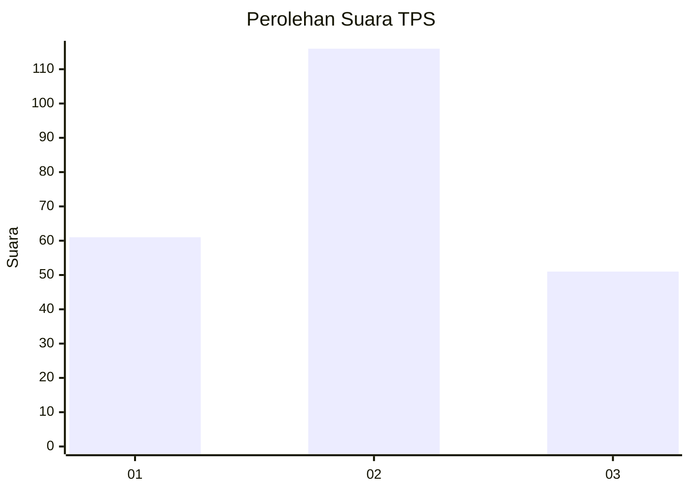
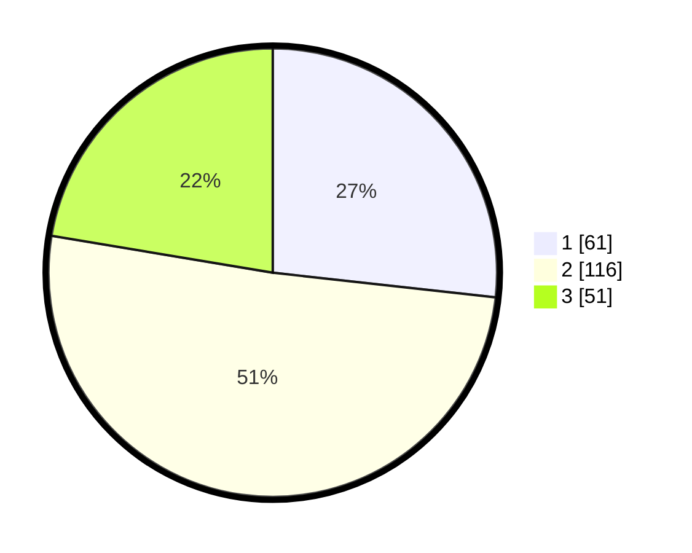

# Hasil

## Grafik

## Tabel

| No. | Nama Paslon    | Suara | Suara (raw) | Persentase |
|:--- |:-------------- | -----:| -----------:| ----------:|
| 1   | ANIES MUHAIMIN | 61    | [61][p-1]   | 26,75      |
| 2   | PRABOWO GIBRAN | 116   | [116][p-2]  | 50,88      |
| 3   | GANJAR MAHFUD  | 51    | [51][p-3]   | 22,37      |

[p-1]: https://github.com/gigit-pemilu/pemilu-2024/blob/main/pilpres/hitung-suara/sub/36-banten/sub/03-tangerang/sub/13-teluknaga/sub/2007-kmp-melayu-brt/sub/001-tps/sub/paslon-1.txt
[p-2]: https://github.com/gigit-pemilu/pemilu-2024/blob/main/pilpres/hitung-suara/sub/36-banten/sub/03-tangerang/sub/13-teluknaga/sub/2007-kmp-melayu-brt/sub/001-tps/sub/paslon-2.txt
[p-3]: https://github.com/gigit-pemilu/pemilu-2024/blob/main/pilpres/hitung-suara/sub/36-banten/sub/03-tangerang/sub/13-teluknaga/sub/2007-kmp-melayu-brt/sub/001-tps/sub/paslon-3.txt

## Foto C Plano

https://sirekap-obj-formc.kpu.go.id/8caf/pemilu/ppwp/36/03/13/20/07/3603132007001-20240229-003720--dc54d884-2a50-4d77-a7bb-9a54d1817af2.jpg

https://sirekap-obj-formc.kpu.go.id/8caf/pemilu/ppwp/36/03/13/20/07/3603132007001-20240229-003803--ae357306-7f07-4d3e-9336-e12f24de3669.jpg

https://sirekap-obj-formc.kpu.go.id/8caf/pemilu/ppwp/36/03/13/20/07/3603132007001-20240229-003850--c6d925a8-d04e-4db1-af47-8128fc4af135.jpg

## Metadata

| Key        | Value               |
| ---------- | ------------------- |
| Time Stamp | 2024-03-02 17:00:00 |

