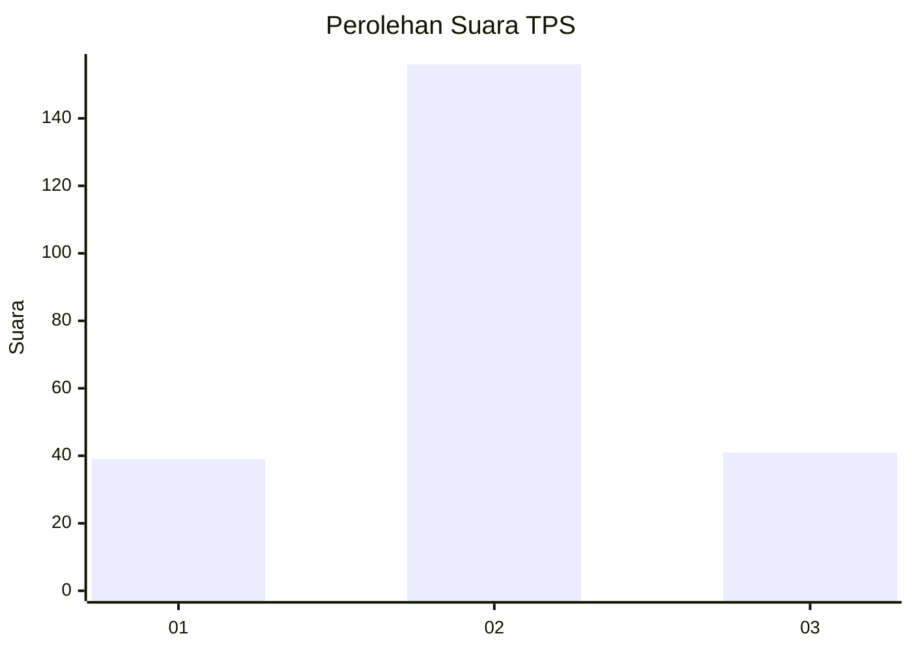
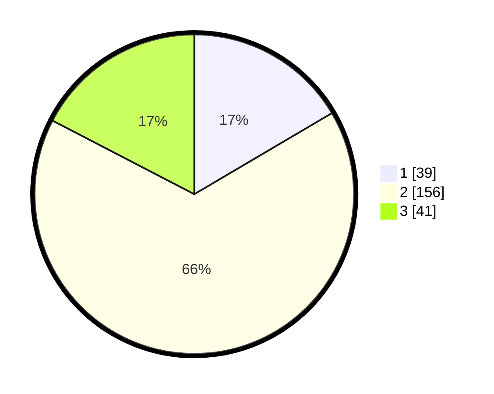

# Hasil

## Grafik

## Tabel

| No. | Nama Paslon    | Suara | Suara (raw) | Persentase |
|:--- |:-------------- | -----:| -----------:| ----------:|
| 1   | ANIES MUHAIMIN | 39    | [39][p-1]   | 16,53      |
| 2   | PRABOWO GIBRAN | 156   | [156][p-2]  | 66,10      |
| 3   | GANJAR MAHFUD  | 41    | [41][p-3]   | 17,37      |

[p-1]: https://github.com/gigit-pemilu/pemilu-2024/blob/main/pilpres/hitung-suara/sub/36-banten/sub/03-tangerang/sub/13-teluknaga/sub/2007-kmp-melayu-brt/sub/003-tps/sub/paslon-1.txt
[p-2]: https://github.com/gigit-pemilu/pemilu-2024/blob/main/pilpres/hitung-suara/sub/36-banten/sub/03-tangerang/sub/13-teluknaga/sub/2007-kmp-melayu-brt/sub/003-tps/sub/paslon-2.txt
[p-3]: https://github.com/gigit-pemilu/pemilu-2024/blob/main/pilpres/hitung-suara/sub/36-banten/sub/03-tangerang/sub/13-teluknaga/sub/2007-kmp-melayu-brt/sub/003-tps/sub/paslon-3.txt

## Foto C Plano

https://sirekap-obj-formc.kpu.go.id/6371/pemilu/ppwp/36/03/13/20/07/3603132007003-20240226-143120--a68b4f39-36fa-449c-9eb9-71dd4616dbbe.jpg

https://sirekap-obj-formc.kpu.go.id/6371/pemilu/ppwp/36/03/13/20/07/3603132007003-20240226-143159--cbe5fcbf-11d4-451a-b143-82140ff57945.jpg

https://sirekap-obj-formc.kpu.go.id/6371/pemilu/ppwp/36/03/13/20/07/3603132007003-20240226-143237--d17bb1dc-fbed-48a2-bbed-4a443b20374a.jpg

## Metadata

| Key        | Value               |
| ---------- | ------------------- |
| Time Stamp | 2024-02-29 10:00:00 |

