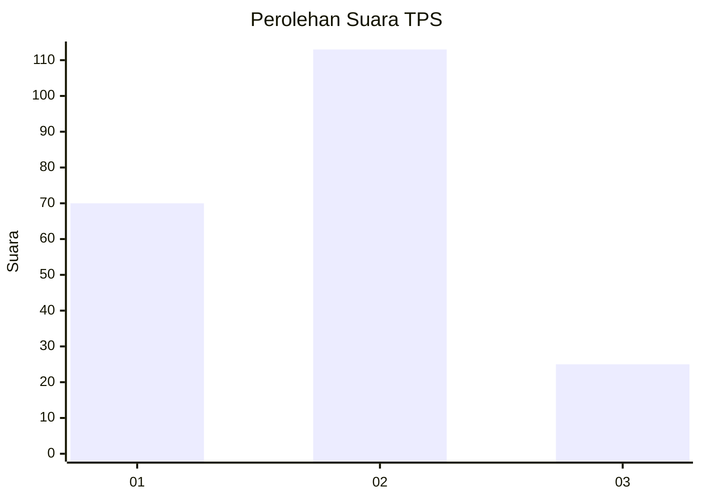
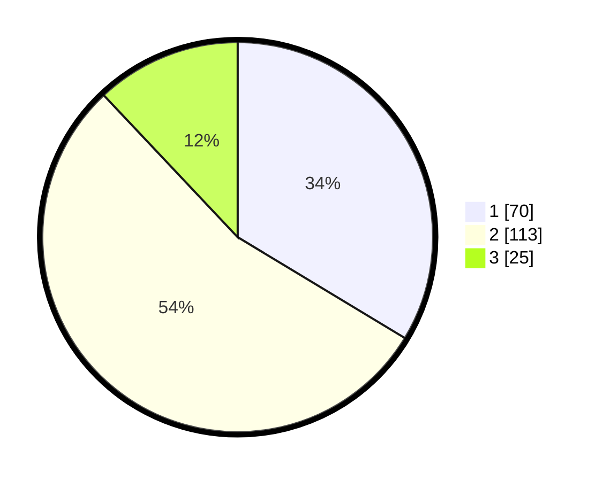

# Hasil

## Grafik

## Tabel

| No. | Nama Paslon    | Suara | Suara (raw) | Persentase |
|:--- |:-------------- | -----:| -----------:| ----------:|
| 1   | ANIES MUHAIMIN | 70    | [70][p-1]   | 33,65      |
| 2   | PRABOWO GIBRAN | 113   | [113][p-2]  | 54,33      |
| 3   | GANJAR MAHFUD  | 25    | [25][p-3]   | 12,02      |

[p-1]: https://github.com/gigit-pemilu/pemilu-2024/blob/main/pilpres/hitung-suara/sub/36-banten/sub/03-tangerang/sub/13-teluknaga/sub/2007-kmp-melayu-brt/sub/007-tps/sub/paslon-1.txt
[p-2]: https://github.com/gigit-pemilu/pemilu-2024/blob/main/pilpres/hitung-suara/sub/36-banten/sub/03-tangerang/sub/13-teluknaga/sub/2007-kmp-melayu-brt/sub/007-tps/sub/paslon-2.txt
[p-3]: https://github.com/gigit-pemilu/pemilu-2024/blob/main/pilpres/hitung-suara/sub/36-banten/sub/03-tangerang/sub/13-teluknaga/sub/2007-kmp-melayu-brt/sub/007-tps/sub/paslon-3.txt

## Foto C Plano

https://sirekap-obj-formc.kpu.go.id/e155/pemilu/ppwp/36/03/13/20/07/3603132007007-20240215-081640--cf268f52-a44d-4337-afa5-9f7cd19d91a0.jpg

https://sirekap-obj-formc.kpu.go.id/e155/pemilu/ppwp/36/03/13/20/07/3603132007007-20240215-082201--a0ecdf26-1de3-470f-85b7-c9bc2930c7e2.jpg

https://sirekap-obj-formc.kpu.go.id/e155/pemilu/ppwp/36/03/13/20/07/3603132007007-20240215-082315--5d070d7f-a784-4b02-8f28-d635ce8964d9.jpg

## Metadata

| Key        | Value               |
| ---------- | ------------------- |
| Time Stamp | 2024-02-24 22:31:28 |

