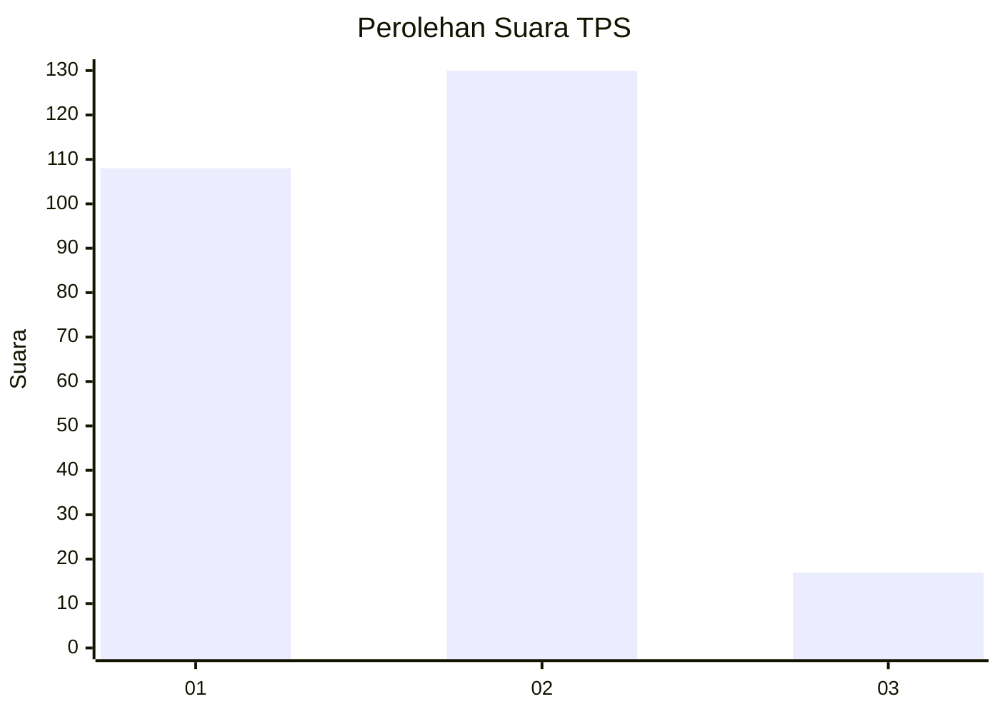
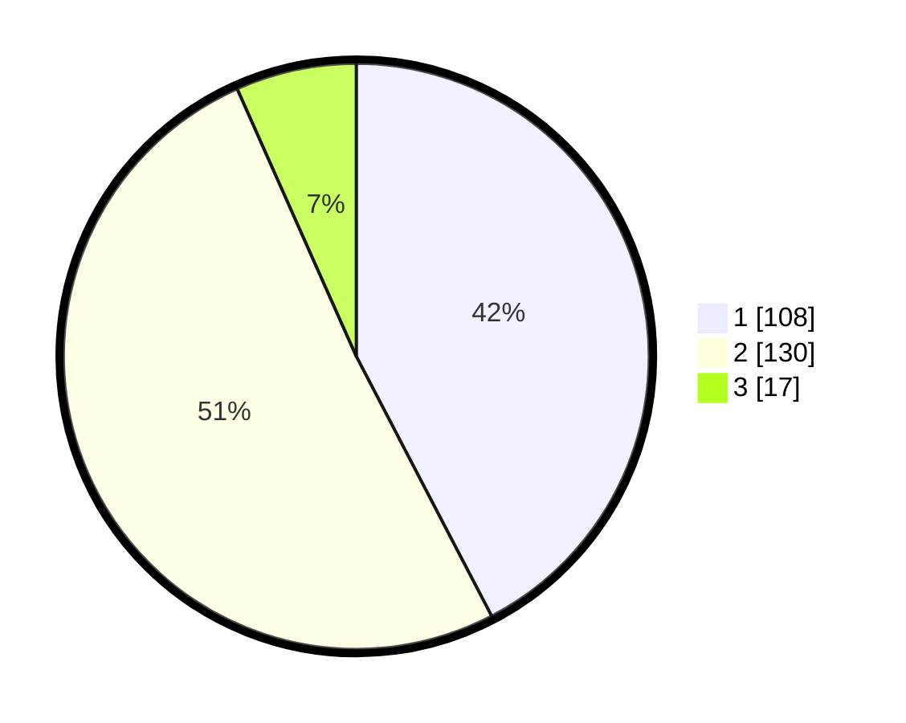

# Hasil

## Grafik

## Tabel

| No. | Nama Paslon    | Suara | Suara (raw) | Persentase |
|:--- |:-------------- | -----:| -----------:| ----------:|
| 1   | ANIES MUHAIMIN | 108   | [108][p-1]  | 42,35      |
| 2   | PRABOWO GIBRAN | 130   | [130][p-2]  | 50,98      |
| 3   | GANJAR MAHFUD  | 17    | [17][p-3]   | 6,67       |

[p-1]: https://github.com/gigit-pemilu/pemilu-2024/blob/main/pilpres/hitung-suara/sub/36-banten/sub/03-tangerang/sub/13-teluknaga/sub/2007-kmp-melayu-brt/sub/015-tps/sub/paslon-1.txt
[p-2]: https://github.com/gigit-pemilu/pemilu-2024/blob/main/pilpres/hitung-suara/sub/36-banten/sub/03-tangerang/sub/13-teluknaga/sub/2007-kmp-melayu-brt/sub/015-tps/sub/paslon-2.txt
[p-3]: https://github.com/gigit-pemilu/pemilu-2024/blob/main/pilpres/hitung-suara/sub/36-banten/sub/03-tangerang/sub/13-teluknaga/sub/2007-kmp-melayu-brt/sub/015-tps/sub/paslon-3.txt

## Foto C Plano

https://sirekap-obj-formc.kpu.go.id/59f2/pemilu/ppwp/36/03/13/20/07/3603132007015-20240226-203716--cc728a1d-61d4-4451-b95e-10bf0a555108.jpg

https://sirekap-obj-formc.kpu.go.id/59f2/pemilu/ppwp/36/03/13/20/07/3603132007015-20240226-203802--71482473-75c3-45c2-93b3-1940da27d82a.jpg

https://sirekap-obj-formc.kpu.go.id/59f2/pemilu/ppwp/36/03/13/20/07/3603132007015-20240226-203849--77ad67df-e70b-43cc-a4f0-a8f9f6b1b6f5.jpg

## Metadata

| Key        | Value               |
| ---------- | ------------------- |
| Time Stamp | 2024-02-28 20:00:00 |

