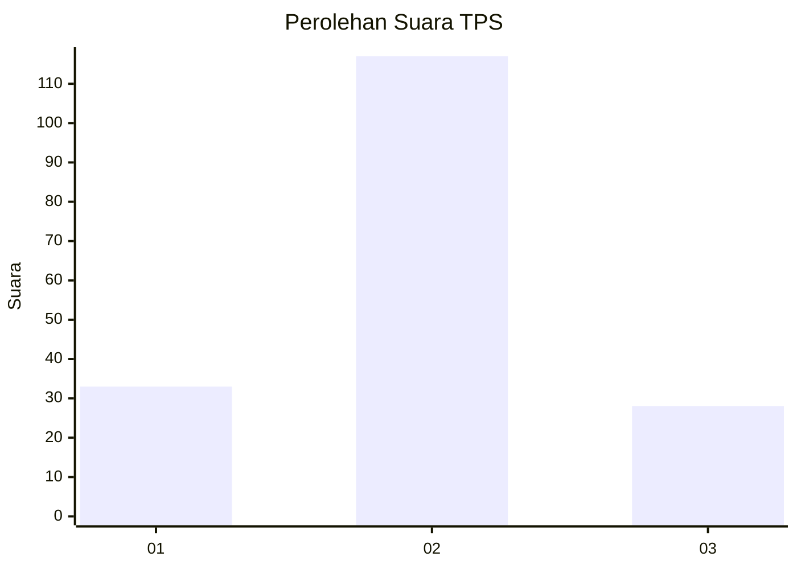
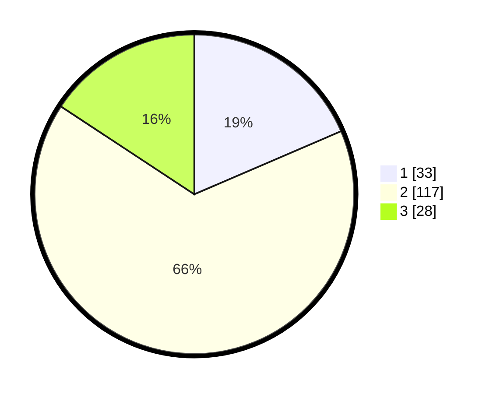

# Hasil

## Grafik

## Tabel

| No. | Nama Paslon    | Suara | Suara (raw) | Persentase |
|:--- |:-------------- | -----:| -----------:| ----------:|
| 1   | ANIES MUHAIMIN | 33    | [33][p-1]   | 18,54      |
| 2   | PRABOWO GIBRAN | 117   | [117][p-2]  | 65,73      |
| 3   | GANJAR MAHFUD  | 28    | [28][p-3]   | 15,73      |

[p-1]: https://github.com/gigit-pemilu/pemilu-2024-36-banten/blob/main/pilpres/hitung-suara/sub/36-banten/sub/03-tangerang/sub/14-kosambi/sub/1001-kosambi-barat/sub/001-tps/sub/paslon-1.txt
[p-2]: https://github.com/gigit-pemilu/pemilu-2024-36-banten/blob/main/pilpres/hitung-suara/sub/36-banten/sub/03-tangerang/sub/14-kosambi/sub/1001-kosambi-barat/sub/001-tps/sub/paslon-2.txt
[p-3]: https://github.com/gigit-pemilu/pemilu-2024-36-banten/blob/main/pilpres/hitung-suara/sub/36-banten/sub/03-tangerang/sub/14-kosambi/sub/1001-kosambi-barat/sub/001-tps/sub/paslon-3.txt

## Foto C Plano

https://sirekap-obj-formc.kpu.go.id/b656/pemilu/ppwp/36/03/14/10/01/3603141001001-20240224-141606--aa147ae2-0981-4c19-82f4-4031d343fe77.jpg

https://sirekap-obj-formc.kpu.go.id/b656/pemilu/ppwp/36/03/14/10/01/3603141001001-20240224-141631--63aba1c9-c0fd-4566-ab5b-64a79cb33d13.jpg

https://sirekap-obj-formc.kpu.go.id/b656/pemilu/ppwp/36/03/14/10/01/3603141001001-20240224-141656--21ce888a-22df-4dcd-81ab-4e86d4389f53.jpg

## Metadata

| Key        | Value               |
| ---------- | ------------------- |
| Time Stamp | 2024-02-28 19:00:00 |

