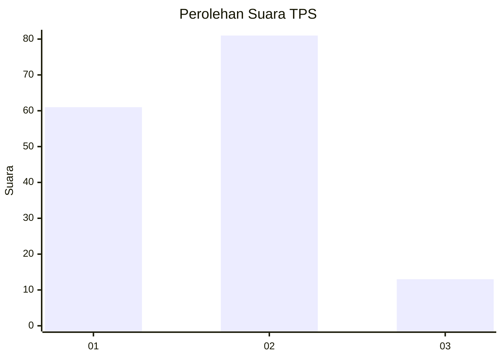

# Hasil

## Grafik

## Tabel

| No. | Nama Paslon    | Suara | Suara (raw) | Persentase |
|:--- |:-------------- | -----:| -----------:| ----------:|
| 1   | ANIES MUHAIMIN | 61    | [61][p-1]   | 39,35      |
| 2   | PRABOWO GIBRAN | 81    | [81][p-2]   | 52,26      |
| 3   | GANJAR MAHFUD  | 13    | [13][p-3]   | 8,39       |

[p-1]: https://github.com/gigit-pemilu/pemilu-2024-36-banten/blob/main/pilpres/hitung-suara/sub/36-banten/sub/03-tangerang/sub/14-kosambi/sub/1001-kosambi-barat/sub/002-tps/sub/paslon-1.txt
[p-2]: https://github.com/gigit-pemilu/pemilu-2024-36-banten/blob/main/pilpres/hitung-suara/sub/36-banten/sub/03-tangerang/sub/14-kosambi/sub/1001-kosambi-barat/sub/002-tps/sub/paslon-2.txt
[p-3]: https://github.com/gigit-pemilu/pemilu-2024-36-banten/blob/main/pilpres/hitung-suara/sub/36-banten/sub/03-tangerang/sub/14-kosambi/sub/1001-kosambi-barat/sub/002-tps/sub/paslon-3.txt

## Foto C Plano

https://sirekap-obj-formc.kpu.go.id/29af/pemilu/ppwp/36/03/14/10/01/3603141001002-20240224-145913--2b90ebe0-9fd0-4630-8693-8f7cd1d62830.jpg

https://sirekap-obj-formc.kpu.go.id/29af/pemilu/ppwp/36/03/14/10/01/3603141001002-20240224-145941--75632a6c-c8e4-46cf-8d68-060ef1979fb8.jpg

https://sirekap-obj-formc.kpu.go.id/29af/pemilu/ppwp/36/03/14/10/01/3603141001002-20240224-150018--1a5e0dac-8b80-4e0c-a91a-b2fec39873eb.jpg

## Metadata

| Key        | Value               |
| ---------- | ------------------- |
| Time Stamp | 2024-02-28 20:00:00 |

