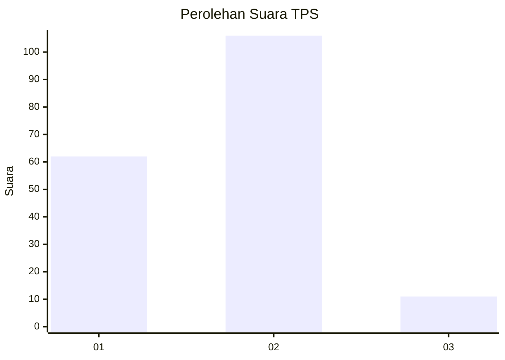
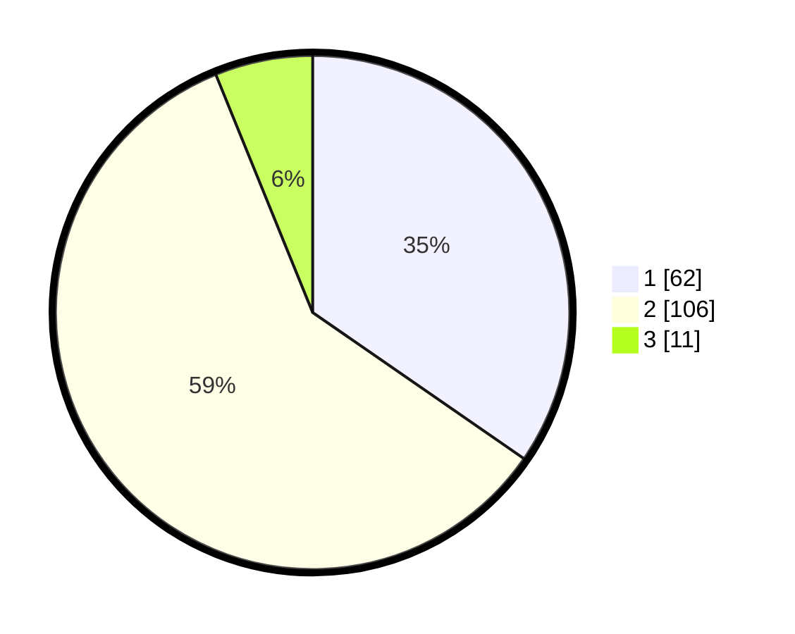

# Hasil

## Grafik

## Tabel

| No. | Nama Paslon    | Suara | Suara (raw) | Persentase |
|:--- |:-------------- | -----:| -----------:| ----------:|
| 1   | ANIES MUHAIMIN | 62    | [62][p-1]   | 34,64      |
| 2   | PRABOWO GIBRAN | 106   | [106][p-2]  | 59,22      |
| 3   | GANJAR MAHFUD  | 11    | [11][p-3]   | 6,15       |

[p-1]: https://github.com/gigit-pemilu/pemilu-2024-36-banten/blob/main/pilpres/hitung-suara/sub/36-banten/sub/03-tangerang/sub/14-kosambi/sub/1001-kosambi-barat/sub/003-tps/sub/paslon-1.txt
[p-2]: https://github.com/gigit-pemilu/pemilu-2024-36-banten/blob/main/pilpres/hitung-suara/sub/36-banten/sub/03-tangerang/sub/14-kosambi/sub/1001-kosambi-barat/sub/003-tps/sub/paslon-2.txt
[p-3]: https://github.com/gigit-pemilu/pemilu-2024-36-banten/blob/main/pilpres/hitung-suara/sub/36-banten/sub/03-tangerang/sub/14-kosambi/sub/1001-kosambi-barat/sub/003-tps/sub/paslon-3.txt

## Foto C Plano

https://sirekap-obj-formc.kpu.go.id/465d/pemilu/ppwp/36/03/14/10/01/3603141001003-20240224-145457--c3624f8d-0150-47cb-98a1-df573442a4a7.jpg

https://sirekap-obj-formc.kpu.go.id/465d/pemilu/ppwp/36/03/14/10/01/3603141001003-20240224-145525--e2badd65-1dc8-47c5-8903-89558013ec64.jpg

https://sirekap-obj-formc.kpu.go.id/465d/pemilu/ppwp/36/03/14/10/01/3603141001003-20240224-145551--8928f624-2963-4ef9-abe4-6f6dbe4da255.jpg

## Metadata

| Key        | Value               |
| ---------- | ------------------- |
| Time Stamp | 2024-02-28 19:00:00 |

