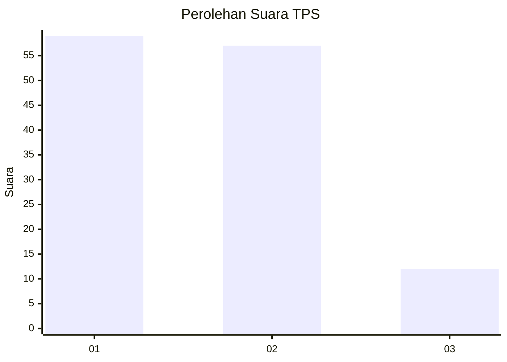
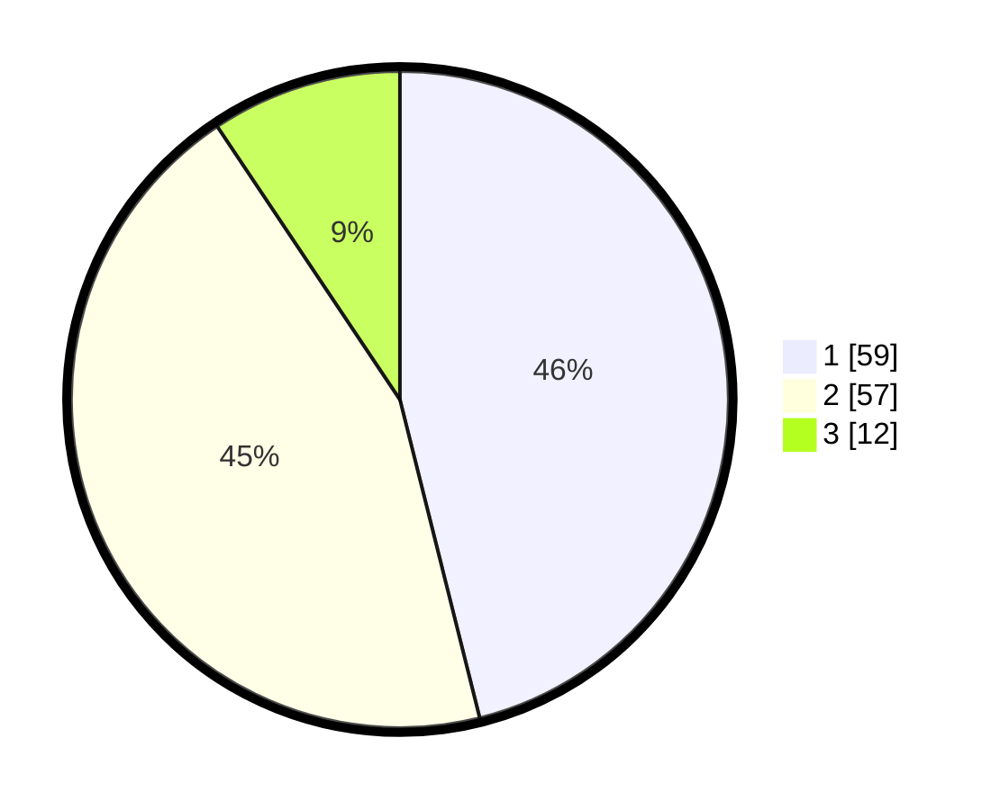

# Hasil

## Grafik

## Tabel

| No. | Nama Paslon    | Suara | Suara (raw) | Persentase |
|:--- |:-------------- | -----:| -----------:| ----------:|
| 1   | ANIES MUHAIMIN | 59    | [59][p-1]   | 46,09      |
| 2   | PRABOWO GIBRAN | 57    | [57][p-2]   | 44,53      |
| 3   | GANJAR MAHFUD  | 12    | [12][p-3]   | 9,38       |

[p-1]: https://github.com/gigit-pemilu/pemilu-2024/blob/main/pilpres/hitung-suara/sub/36-banten/sub/03-tangerang/sub/14-kosambi/sub/1001-kosambi-barat/sub/004-tps/sub/paslon-1.txt
[p-2]: https://github.com/gigit-pemilu/pemilu-2024/blob/main/pilpres/hitung-suara/sub/36-banten/sub/03-tangerang/sub/14-kosambi/sub/1001-kosambi-barat/sub/004-tps/sub/paslon-2.txt
[p-3]: https://github.com/gigit-pemilu/pemilu-2024/blob/main/pilpres/hitung-suara/sub/36-banten/sub/03-tangerang/sub/14-kosambi/sub/1001-kosambi-barat/sub/004-tps/sub/paslon-3.txt

## Foto C Plano

https://sirekap-obj-formc.kpu.go.id/5e37/pemilu/ppwp/36/03/14/10/01/3603141001004-20240224-144304--fc0c8c2a-fd6e-44c5-9018-a143209b43ea.jpg

https://sirekap-obj-formc.kpu.go.id/5e37/pemilu/ppwp/36/03/14/10/01/3603141001004-20240224-144338--ec17b008-b576-4f55-96ed-b8e4dbbad0b1.jpg

https://sirekap-obj-formc.kpu.go.id/5e37/pemilu/ppwp/36/03/14/10/01/3603141001004-20240224-144415--7f19c60f-9d71-4fa2-baf3-f8685b440b29.jpg

## Metadata

| Key        | Value               |
| ---------- | ------------------- |
| Time Stamp | 2024-02-25 11:00:00 |

