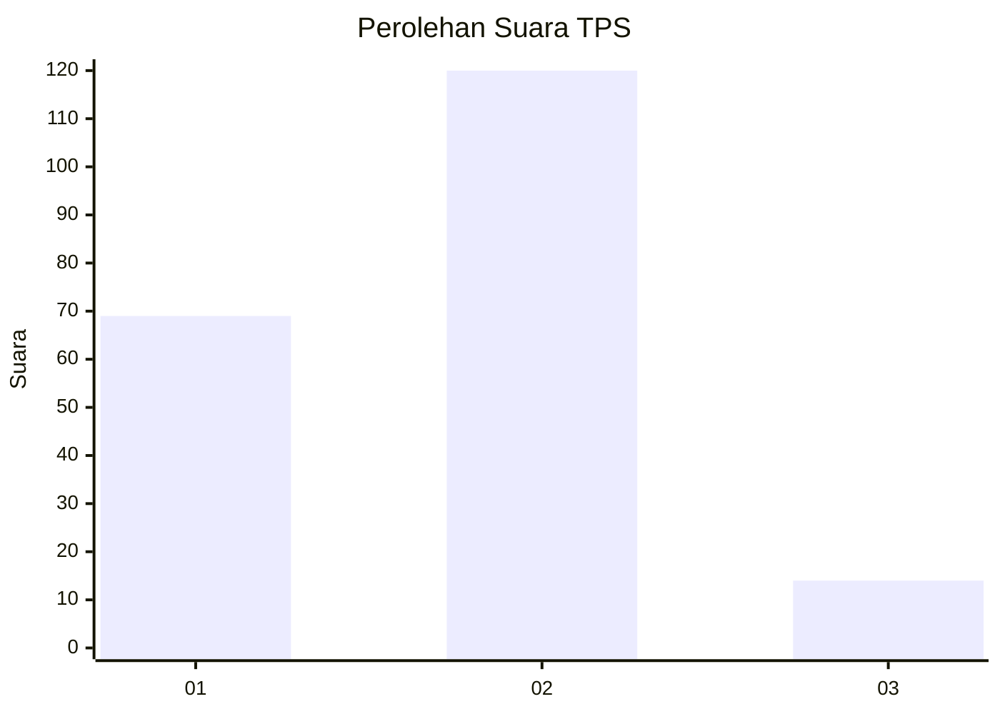
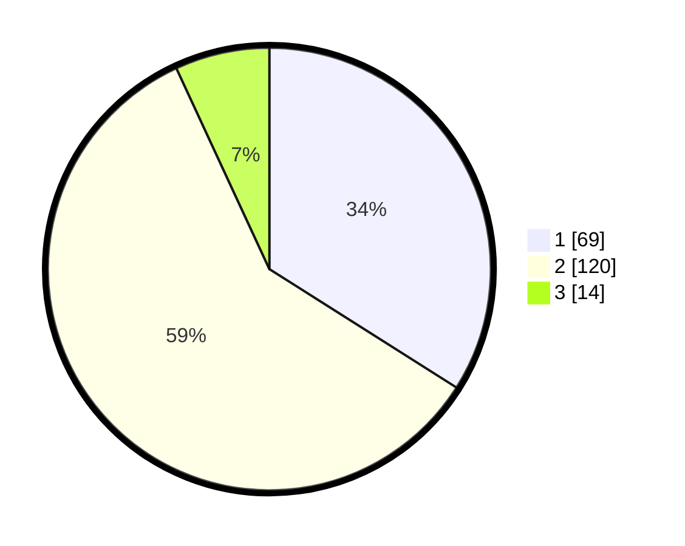

# Hasil

## Grafik

## Tabel

| No. | Nama Paslon    | Suara | Suara (raw) | Persentase |
|:--- |:-------------- | -----:| -----------:| ----------:|
| 1   | ANIES MUHAIMIN | 69    | [69][p-1]   | 33,99      |
| 2   | PRABOWO GIBRAN | 120   | [120][p-2]  | 59,11      |
| 3   | GANJAR MAHFUD  | 14    | [14][p-3]   | 6,90       |

[p-1]: https://github.com/gigit-pemilu/pemilu-2024/blob/main/pilpres/hitung-suara/sub/36-banten/sub/03-tangerang/sub/14-kosambi/sub/1001-kosambi-barat/sub/005-tps/sub/paslon-1.txt
[p-2]: https://github.com/gigit-pemilu/pemilu-2024/blob/main/pilpres/hitung-suara/sub/36-banten/sub/03-tangerang/sub/14-kosambi/sub/1001-kosambi-barat/sub/005-tps/sub/paslon-2.txt
[p-3]: https://github.com/gigit-pemilu/pemilu-2024/blob/main/pilpres/hitung-suara/sub/36-banten/sub/03-tangerang/sub/14-kosambi/sub/1001-kosambi-barat/sub/005-tps/sub/paslon-3.txt

## Foto C Plano

https://sirekap-obj-formc.kpu.go.id/1c01/pemilu/ppwp/36/03/14/10/01/3603141001005-20240214-234940--c5dbe02a-1334-4fad-b67e-cff26bee2125.jpg

https://sirekap-obj-formc.kpu.go.id/1c01/pemilu/ppwp/36/03/14/10/01/3603141001005-20240217-123212--00459ddb-c94d-45b8-8d6f-301c54ee9fa7.jpg

https://sirekap-obj-formc.kpu.go.id/1c01/pemilu/ppwp/36/03/14/10/01/3603141001005-20240217-123427--22ce3bcb-9228-4e5e-9684-3c5e5fd16f65.jpg

## Metadata

| Key        | Value               |
| ---------- | ------------------- |
| Time Stamp | 2024-02-20 13:00:00 |

