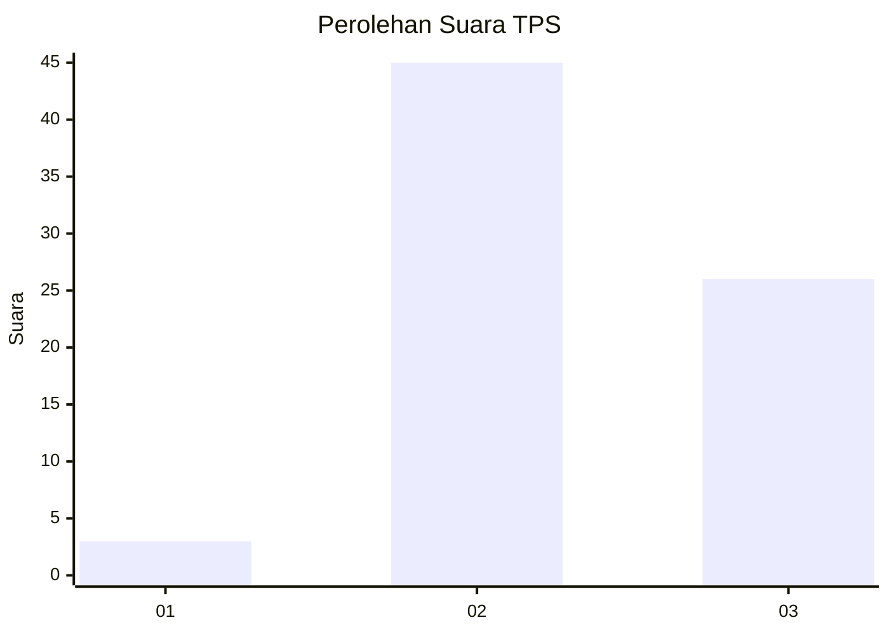
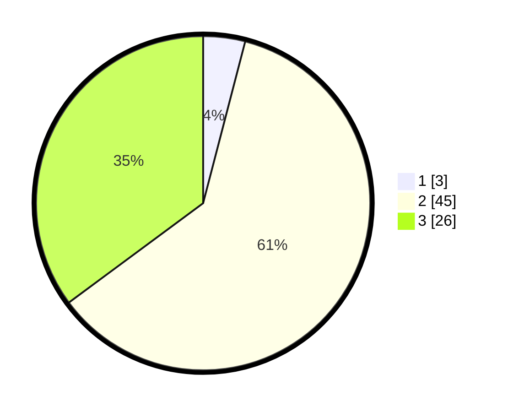

# Hasil

## Grafik

## Tabel

| No. | Nama Paslon    | Suara | Suara (raw) | Persentase |
|:--- |:-------------- | -----:| -----------:| ----------:|
| 1   | ANIES MUHAIMIN | 3     | [3][p-1]    | 4,05       |
| 2   | PRABOWO GIBRAN | 45    | [45][p-2]   | 60,81      |
| 3   | GANJAR MAHFUD  | 26    | [26][p-3]   | 35,14      |

[p-1]: https://github.com/gigit-pemilu/pemilu-2024/blob/main/pilpres/hitung-suara/sub/36-banten/sub/03-tangerang/sub/14-kosambi/sub/1001-kosambi-barat/sub/019-tps/sub/paslon-1.txt
[p-2]: https://github.com/gigit-pemilu/pemilu-2024/blob/main/pilpres/hitung-suara/sub/36-banten/sub/03-tangerang/sub/14-kosambi/sub/1001-kosambi-barat/sub/019-tps/sub/paslon-2.txt
[p-3]: https://github.com/gigit-pemilu/pemilu-2024/blob/main/pilpres/hitung-suara/sub/36-banten/sub/03-tangerang/sub/14-kosambi/sub/1001-kosambi-barat/sub/019-tps/sub/paslon-3.txt

## Foto C Plano

https://sirekap-obj-formc.kpu.go.id/b1b7/pemilu/ppwp/36/03/14/10/01/3603141001019-20240224-141414--781411af-1449-4543-a0fc-56dd3a3e730c.jpg

https://sirekap-obj-formc.kpu.go.id/b1b7/pemilu/ppwp/36/03/14/10/01/3603141001019-20240224-141441--319ce18a-8ea3-48b9-a7e7-9a42fe69c939.jpg

https://sirekap-obj-formc.kpu.go.id/b1b7/pemilu/ppwp/36/03/14/10/01/3603141001019-20240224-141505--1224e61d-7eab-47e6-bfc4-5a51b0000594.jpg

## Metadata

| Key        | Value               |
| ---------- | ------------------- |
| Time Stamp | 2024-02-24 22:31:28 |

