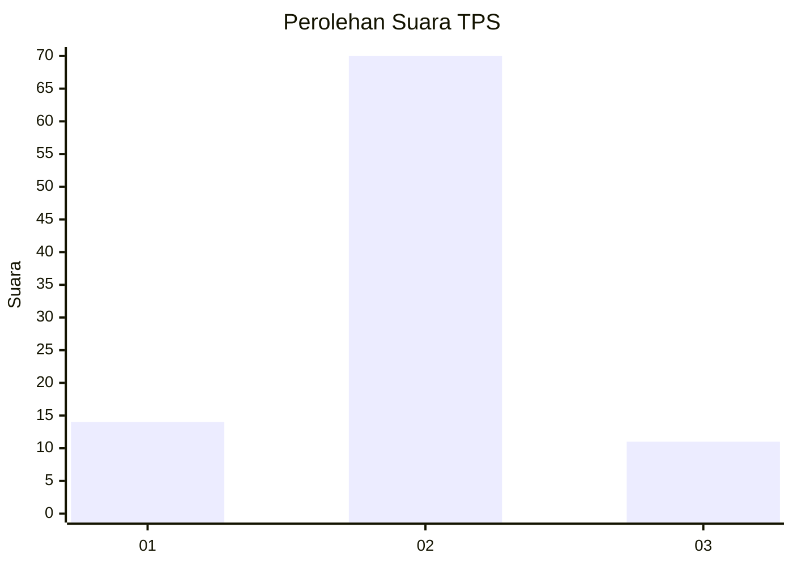
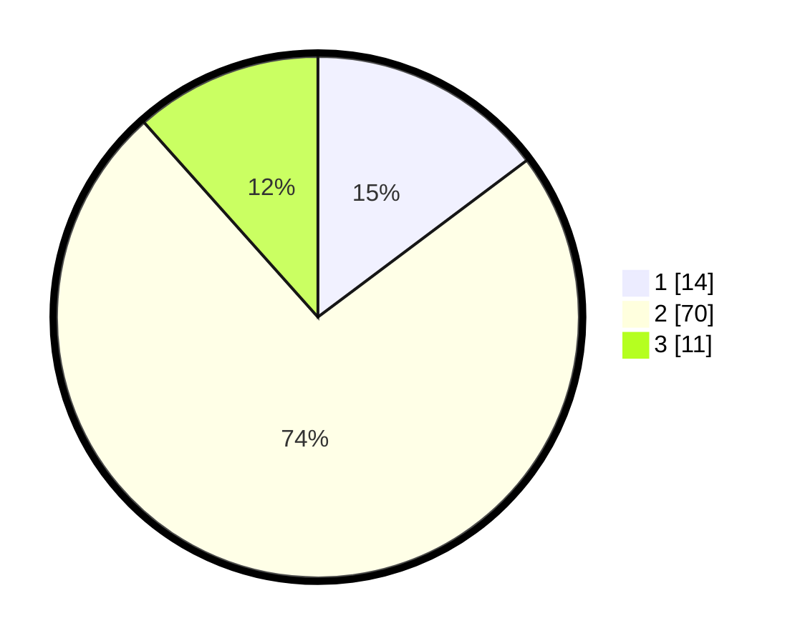

# Hasil

## Grafik

## Tabel

| No. | Nama Paslon    | Suara | Suara (raw) | Persentase |
|:--- |:-------------- | -----:| -----------:| ----------:|
| 1   | ANIES MUHAIMIN | 14    | [14][p-1]   | 14,74      |
| 2   | PRABOWO GIBRAN | 70    | [70][p-2]   | 73,68      |
| 3   | GANJAR MAHFUD  | 11    | [11][p-3]   | 11,58      |

[p-1]: https://github.com/gigit-pemilu/pemilu-2024-36-banten/blob/main/pilpres/hitung-suara/sub/36-banten/sub/03-tangerang/sub/14-kosambi/sub/1003-salembaran-jaya/sub/016-tps/sub/paslon-1.txt
[p-2]: https://github.com/gigit-pemilu/pemilu-2024-36-banten/blob/main/pilpres/hitung-suara/sub/36-banten/sub/03-tangerang/sub/14-kosambi/sub/1003-salembaran-jaya/sub/016-tps/sub/paslon-2.txt
[p-3]: https://github.com/gigit-pemilu/pemilu-2024-36-banten/blob/main/pilpres/hitung-suara/sub/36-banten/sub/03-tangerang/sub/14-kosambi/sub/1003-salembaran-jaya/sub/016-tps/sub/paslon-3.txt

## Foto C Plano

https://sirekap-obj-formc.kpu.go.id/fe4a/pemilu/ppwp/36/03/14/10/03/3603141003016-20240215-013642--a1805e22-4eca-401e-9a3f-c2eb0c191343.jpg

https://sirekap-obj-formc.kpu.go.id/fe4a/pemilu/ppwp/36/03/14/10/03/3603141003016-20240215-013824--d640f874-17dd-4a16-bcc1-1a59f08cd6f7.jpg

https://sirekap-obj-formc.kpu.go.id/fe4a/pemilu/ppwp/36/03/14/10/03/3603141003016-20240215-014024--c4e4a93b-940c-46a6-9bc9-b1363de9038b.jpg

## Metadata

| Key        | Value               |
| ---------- | ------------------- |
| Time Stamp | 2024-02-24 22:31:28 |

