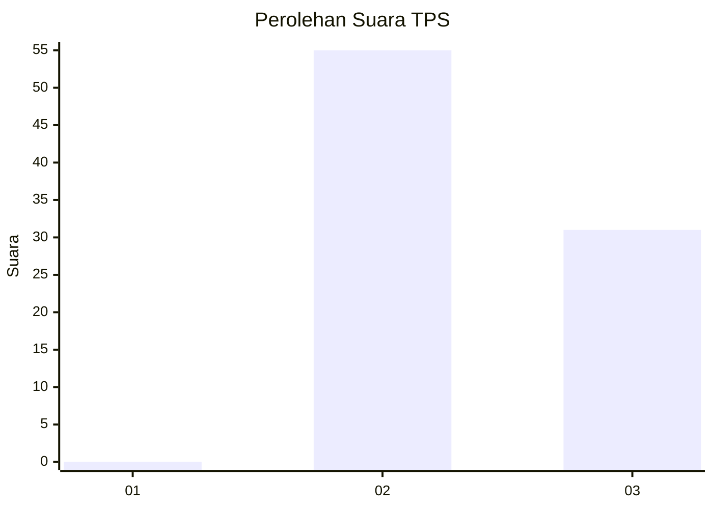
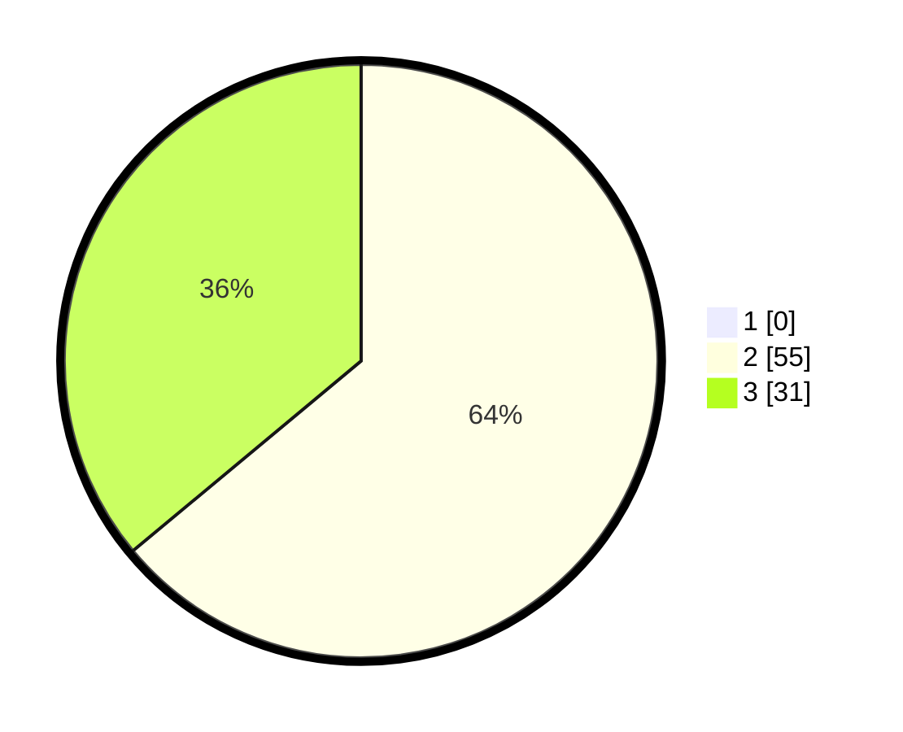

# Hasil

## Grafik

## Tabel

| No. | Nama Paslon    | Suara | Suara (raw) | Persentase |
|:--- |:-------------- | -----:| -----------:| ----------:|
| 1   | ANIES MUHAIMIN | 0     | [0][p-1]    | 0,00       |
| 2   | PRABOWO GIBRAN | 55    | [55][p-2]   | 63,95      |
| 3   | GANJAR MAHFUD  | 31    | [31][p-3]   | 36,05      |

[p-1]: https://github.com/gigit-pemilu/pemilu-2024-36-banten/blob/main/pilpres/hitung-suara/sub/36-banten/sub/03-tangerang/sub/14-kosambi/sub/1010-dadap/sub/047-tps/sub/paslon-1.txt
[p-2]: https://github.com/gigit-pemilu/pemilu-2024-36-banten/blob/main/pilpres/hitung-suara/sub/36-banten/sub/03-tangerang/sub/14-kosambi/sub/1010-dadap/sub/047-tps/sub/paslon-2.txt
[p-3]: https://github.com/gigit-pemilu/pemilu-2024-36-banten/blob/main/pilpres/hitung-suara/sub/36-banten/sub/03-tangerang/sub/14-kosambi/sub/1010-dadap/sub/047-tps/sub/paslon-3.txt

## Foto C Plano

https://sirekap-obj-formc.kpu.go.id/f93e/pemilu/ppwp/36/03/14/10/10/3603141010047-20240214-221547--479b8884-b37c-4403-9883-c4a688e94835.jpg

https://sirekap-obj-formc.kpu.go.id/f93e/pemilu/ppwp/36/03/14/10/10/3603141010047-20240214-221219--8e4e7de4-9da8-43fb-80ff-73c4333be9f7.jpg

https://sirekap-obj-formc.kpu.go.id/f93e/pemilu/ppwp/36/03/14/10/10/3603141010047-20240214-221452--0301b0fe-14ad-4b1d-aaa9-0ba058d5be60.jpg

## Metadata

| Key        | Value               |
| ---------- | ------------------- |
| Time Stamp | 2024-02-24 22:31:28 |

