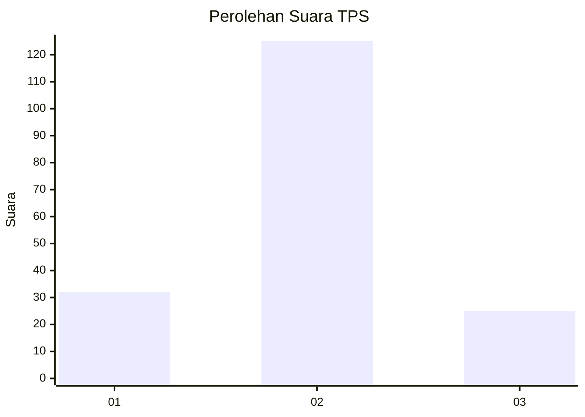
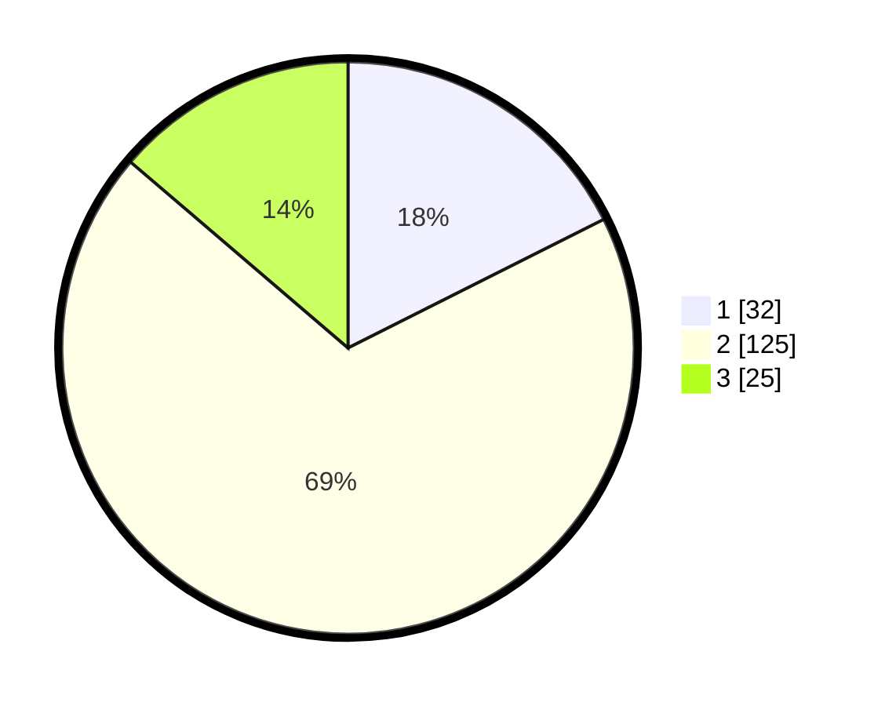

# Hasil

## Grafik

## Tabel

| No. | Nama Paslon    | Suara | Suara (raw) | Persentase |
|:--- |:-------------- | -----:| -----------:| ----------:|
| 1   | ANIES MUHAIMIN | 32    | [32][p-1]   | 17,58      |
| 2   | PRABOWO GIBRAN | 125   | [125][p-2]  | 68,68      |
| 3   | GANJAR MAHFUD  | 25    | [25][p-3]   | 13,74      |

[p-1]: https://github.com/gigit-pemilu/pemilu-2024/blob/main/pilpres/hitung-suara/sub/36-banten/sub/03-tangerang/sub/14-kosambi/sub/2002-kosambi-timur/sub/006-tps/sub/paslon-1.txt
[p-2]: https://github.com/gigit-pemilu/pemilu-2024/blob/main/pilpres/hitung-suara/sub/36-banten/sub/03-tangerang/sub/14-kosambi/sub/2002-kosambi-timur/sub/006-tps/sub/paslon-2.txt
[p-3]: https://github.com/gigit-pemilu/pemilu-2024/blob/main/pilpres/hitung-suara/sub/36-banten/sub/03-tangerang/sub/14-kosambi/sub/2002-kosambi-timur/sub/006-tps/sub/paslon-3.txt

## Foto C Plano

https://sirekap-obj-formc.kpu.go.id/ea43/pemilu/ppwp/36/03/14/20/02/3603142002006-20240222-111536--c6982da6-fbe2-40cb-bec7-b0a00c096018.jpg

https://sirekap-obj-formc.kpu.go.id/ea43/pemilu/ppwp/36/03/14/20/02/3603142002006-20240222-111551--65573f7b-5117-4e6d-ab78-b6043a0e64dc.jpg

https://sirekap-obj-formc.kpu.go.id/ea43/pemilu/ppwp/36/03/14/20/02/3603142002006-20240222-111602--6e444540-23c4-46c6-9f85-6f2308754ca3.jpg

## Metadata

| Key        | Value               |
| ---------- | ------------------- |
| Time Stamp | 2024-02-24 22:31:28 |

