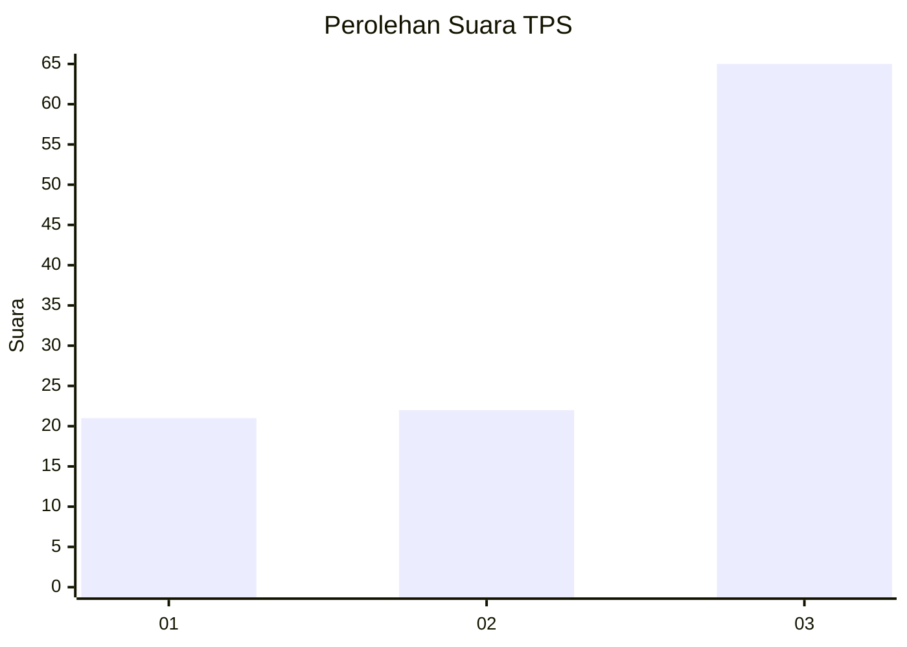
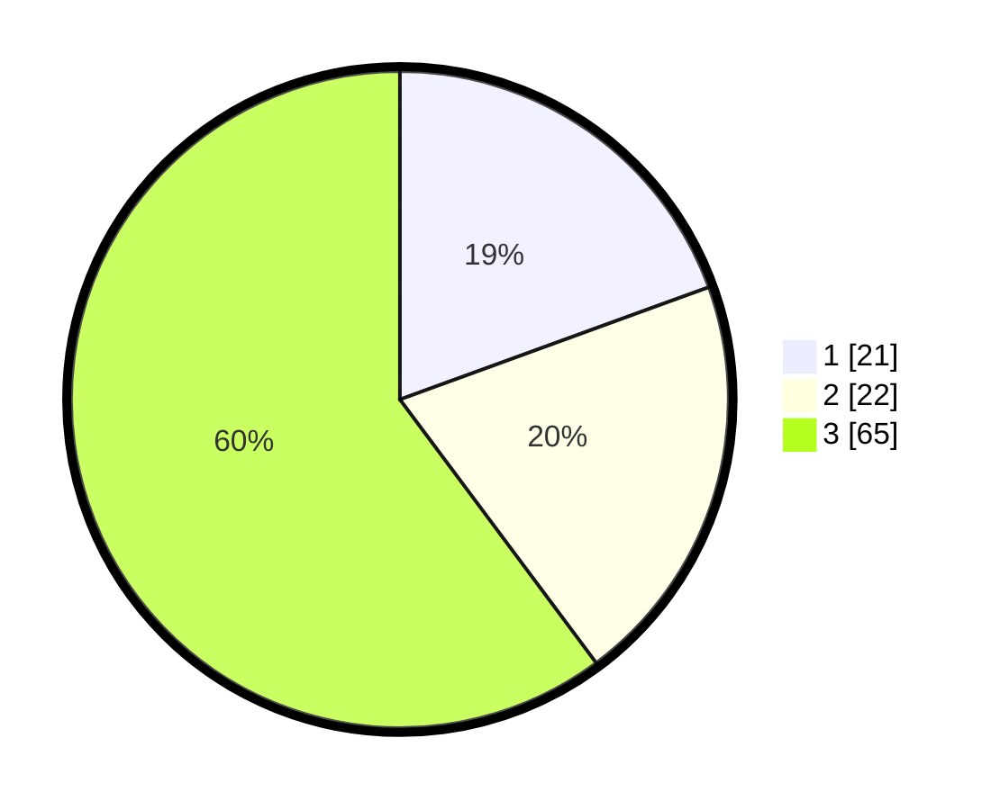

# Hasil

## Grafik

## Tabel

| No. | Nama Paslon    | Suara | Suara (raw) | Persentase |
|:--- |:-------------- | -----:| -----------:| ----------:|
| 1   | ANIES MUHAIMIN | 21    | [21][p-1]   | 19,44      |
| 2   | PRABOWO GIBRAN | 22    | [22][p-2]   | 20,37      |
| 3   | GANJAR MAHFUD  | 65    | [65][p-3]   | 60,19      |

[p-1]: https://github.com/gigit-pemilu/pemilu-2024/blob/main/pilpres/hitung-suara/sub/36-banten/sub/03-tangerang/sub/14-kosambi/sub/2007-cengklong/sub/027-tps/sub/paslon-1.txt
[p-2]: https://github.com/gigit-pemilu/pemilu-2024/blob/main/pilpres/hitung-suara/sub/36-banten/sub/03-tangerang/sub/14-kosambi/sub/2007-cengklong/sub/027-tps/sub/paslon-2.txt
[p-3]: https://github.com/gigit-pemilu/pemilu-2024/blob/main/pilpres/hitung-suara/sub/36-banten/sub/03-tangerang/sub/14-kosambi/sub/2007-cengklong/sub/027-tps/sub/paslon-3.txt

## Foto C Plano

https://sirekap-obj-formc.kpu.go.id/3578/pemilu/ppwp/36/03/14/20/07/3603142007027-20240224-225604--1de065a2-bd38-4729-8f7c-0d5ac2537688.jpg

https://sirekap-obj-formc.kpu.go.id/3578/pemilu/ppwp/36/03/14/20/07/3603142007027-20240224-225625--9a1dd749-eabb-47ae-989e-94054db5ff67.jpg

https://sirekap-obj-formc.kpu.go.id/3578/pemilu/ppwp/36/03/14/20/07/3603142007027-20240224-225651--9dc068de-ebe3-4ba5-b261-aa2177c0f411.jpg

## Metadata

| Key        | Value               |
| ---------- | ------------------- |
| Time Stamp | 2024-02-28 19:00:00 |

