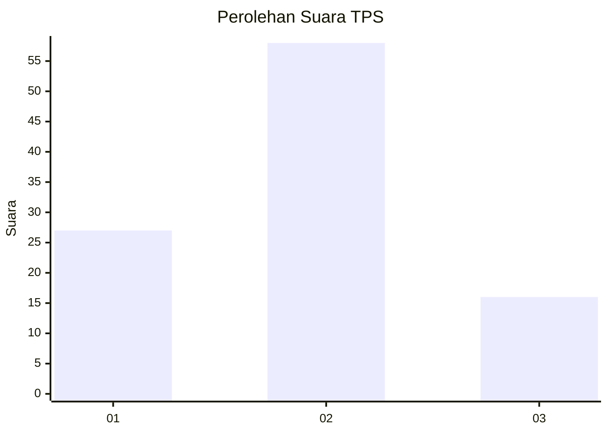
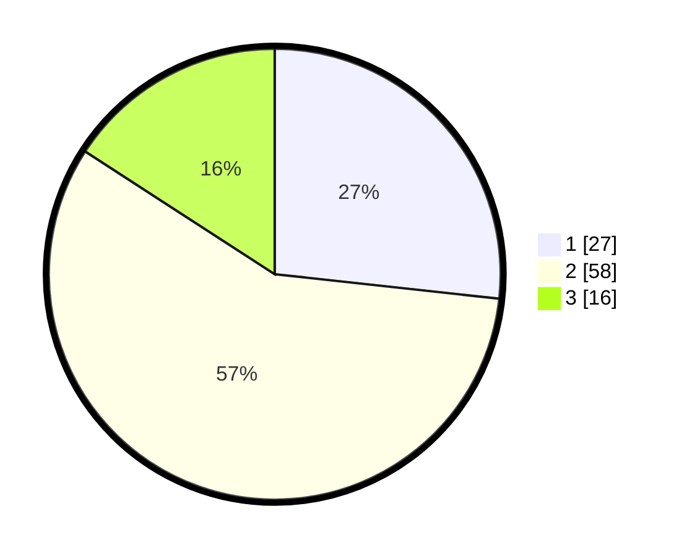

# Hasil

## Grafik

## Tabel

| No. | Nama Paslon    | Suara | Suara (raw) | Persentase |
|:--- |:-------------- | -----:| -----------:| ----------:|
| 1   | ANIES MUHAIMIN | 27    | [27][p-1]   | 26,73      |
| 2   | PRABOWO GIBRAN | 58    | [58][p-2]   | 57,43      |
| 3   | GANJAR MAHFUD  | 16    | [16][p-3]   | 15,84      |

[p-1]: https://github.com/gigit-pemilu/pemilu-2024-36-banten/blob/main/pilpres/hitung-suara/sub/36-banten/sub/03-tangerang/sub/14-kosambi/sub/2009-jati-mulya/sub/017-tps/sub/paslon-1.txt
[p-2]: https://github.com/gigit-pemilu/pemilu-2024-36-banten/blob/main/pilpres/hitung-suara/sub/36-banten/sub/03-tangerang/sub/14-kosambi/sub/2009-jati-mulya/sub/017-tps/sub/paslon-2.txt
[p-3]: https://github.com/gigit-pemilu/pemilu-2024-36-banten/blob/main/pilpres/hitung-suara/sub/36-banten/sub/03-tangerang/sub/14-kosambi/sub/2009-jati-mulya/sub/017-tps/sub/paslon-3.txt

## Foto C Plano

https://sirekap-obj-formc.kpu.go.id/0f30/pemilu/ppwp/36/03/14/20/09/3603142009017-20240225-160700--e8ccf1a2-03e5-4dbd-b1ca-6f8ffb13b350.jpg

https://sirekap-obj-formc.kpu.go.id/0f30/pemilu/ppwp/36/03/14/20/09/3603142009017-20240225-160727--015bb8f1-c587-4b4a-8913-0f98a1778978.jpg

https://sirekap-obj-formc.kpu.go.id/0f30/pemilu/ppwp/36/03/14/20/09/3603142009017-20240225-160945--08c922ab-3604-4c9b-8a9b-da4728e40172.jpg

## Metadata

| Key        | Value               |
| ---------- | ------------------- |
| Time Stamp | 2024-02-28 20:00:00 |

