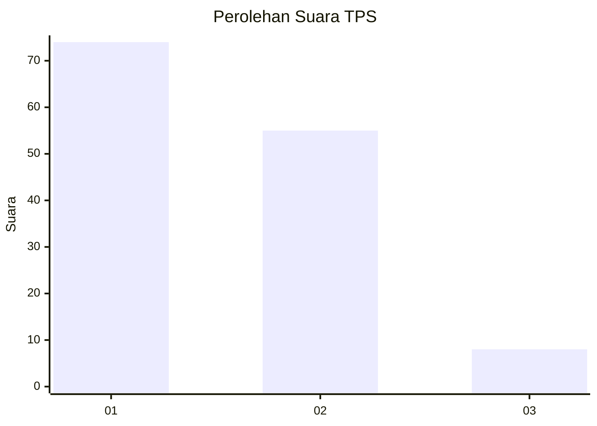
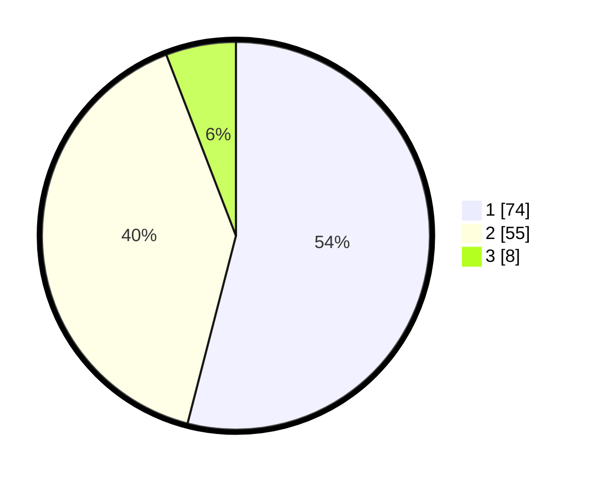

# Hasil

## Grafik

## Tabel

| No. | Nama Paslon    | Suara | Suara (raw) | Persentase |
|:--- |:-------------- | -----:| -----------:| ----------:|
| 1   | ANIES MUHAIMIN | 74    | [74][p-1]   | 54,01      |
| 2   | PRABOWO GIBRAN | 55    | [55][p-2]   | 40,15      |
| 3   | GANJAR MAHFUD  | 8     | [8][p-3]    | 5,84       |

[p-1]: https://github.com/gigit-pemilu/pemilu-2024-36-banten/blob/main/pilpres/hitung-suara/sub/36-banten/sub/03-tangerang/sub/15-pakuhaji/sub/2002-paku-alam/sub/005-tps/sub/paslon-1.txt
[p-2]: https://github.com/gigit-pemilu/pemilu-2024-36-banten/blob/main/pilpres/hitung-suara/sub/36-banten/sub/03-tangerang/sub/15-pakuhaji/sub/2002-paku-alam/sub/005-tps/sub/paslon-2.txt
[p-3]: https://github.com/gigit-pemilu/pemilu-2024-36-banten/blob/main/pilpres/hitung-suara/sub/36-banten/sub/03-tangerang/sub/15-pakuhaji/sub/2002-paku-alam/sub/005-tps/sub/paslon-3.txt

## Foto C Plano

https://sirekap-obj-formc.kpu.go.id/e7a9/pemilu/ppwp/36/03/15/20/02/3603152002005-20240221-130741--3e4aac31-cf68-4805-8525-a5a93af573fa.jpg

https://sirekap-obj-formc.kpu.go.id/e7a9/pemilu/ppwp/36/03/15/20/02/3603152002005-20240221-130856--3f17f992-14f9-4f37-84ad-e72235a77abd.jpg

https://sirekap-obj-formc.kpu.go.id/e7a9/pemilu/ppwp/36/03/15/20/02/3603152002005-20240221-131049--295bc888-315a-4072-a69a-a47f630ae6b0.jpg

## Metadata

| Key        | Value               |
| ---------- | ------------------- |
| Time Stamp | 2024-02-21 14:00:00 |

## DATA PEMILIH TETAP

Jumlah pemilih dalam DPT: **222**.
 * L: **882**.
 * P: **420**.

## DATA PENGGUNA HAK PILIH

Jumlah pengguna hak pilih dalam DPT: **425**.
 * L: **203**.
 * P: **822**.

Jumlah pengguna hak pilih dalam DPTb: **888**.
 * L: **528**.
 * P: **878**.

Jumlah pengguna hak pilih dalam DPK: **881**.
 * L: **882**.
 * P: **888**.

Jumlah pengguna hak pilih: **197**.
 * L: **104**.
 * P: **852**.

## JUMLAH SUARA SAH DAN TIDAK SAH

JUMLAH SELURUH SUARA SAH: **187**.

JUMLAH SUARA TIDAK SAH: **810**.

JUMLAH SELURUH SUARA SAH DAN SUARA TIDAK SAH: **197**.

