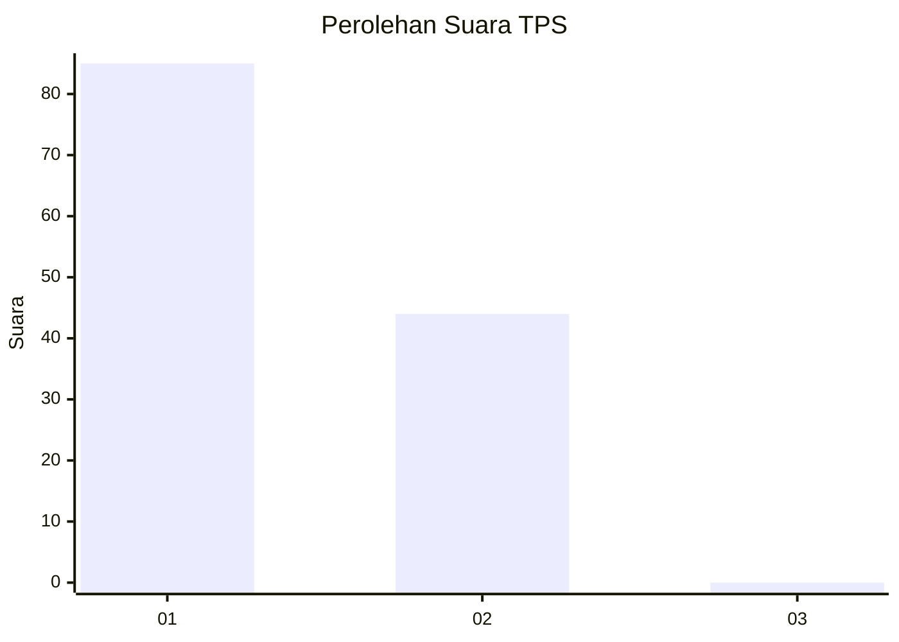
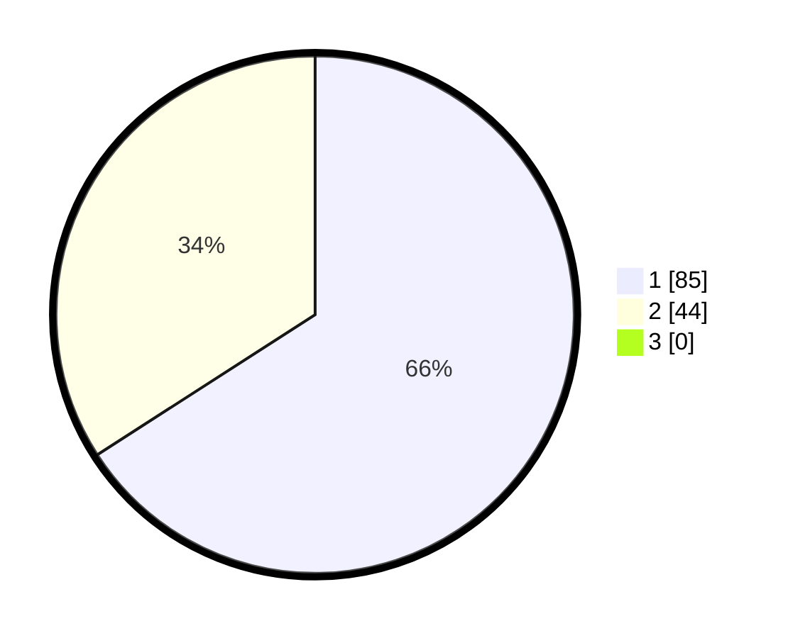

# Hasil

## Grafik

## Tabel

| No. | Nama Paslon    | Suara | Suara (raw) | Persentase |
|:--- |:-------------- | -----:| -----------:| ----------:|
| 1   | ANIES MUHAIMIN | 85    | [85][p-1]   | 65,89      |
| 2   | PRABOWO GIBRAN | 44    | [44][p-2]   | 34,11      |
| 3   | GANJAR MAHFUD  | 0     | [0][p-3]    | 0,00       |

[p-1]: https://github.com/gigit-pemilu/pemilu-2024-36-banten/blob/main/pilpres/hitung-suara/sub/36-banten/sub/03-tangerang/sub/15-pakuhaji/sub/2002-paku-alam/sub/024-tps/sub/paslon-1.txt
[p-2]: https://github.com/gigit-pemilu/pemilu-2024-36-banten/blob/main/pilpres/hitung-suara/sub/36-banten/sub/03-tangerang/sub/15-pakuhaji/sub/2002-paku-alam/sub/024-tps/sub/paslon-2.txt
[p-3]: https://github.com/gigit-pemilu/pemilu-2024-36-banten/blob/main/pilpres/hitung-suara/sub/36-banten/sub/03-tangerang/sub/15-pakuhaji/sub/2002-paku-alam/sub/024-tps/sub/paslon-3.txt

## Foto C Plano

https://sirekap-obj-formc.kpu.go.id/6572/pemilu/ppwp/36/03/15/20/02/3603152002024-20240221-131502--d7c2b397-deb8-473d-b071-628859a2e485.jpg

https://sirekap-obj-formc.kpu.go.id/6572/pemilu/ppwp/36/03/15/20/02/3603152002024-20240221-131621--b9259013-532e-43c5-a4cd-4d84a7eb85c8.jpg

https://sirekap-obj-formc.kpu.go.id/6572/pemilu/ppwp/36/03/15/20/02/3603152002024-20240221-131715--476e905b-6f45-4f70-99d1-1513c96b445f.jpg

## Metadata

| Key        | Value               |
| ---------- | ------------------- |
| Time Stamp | 2024-02-21 14:00:00 |

## DATA PEMILIH TETAP

Jumlah pemilih dalam DPT: **232**.
 * L: **513**.
 * P: **899**.

## DATA PENGGUNA HAK PILIH

Jumlah pengguna hak pilih dalam DPT: **133**.
 * L: **899**.
 * P: **94**.

Jumlah pengguna hak pilih dalam DPTb: **10**.
 * L: **82**.
 * P: **888**.

Jumlah pengguna hak pilih dalam DPK: **882**.
 * L: **885**.
 * P: **881**.

Jumlah pengguna hak pilih: **205**.
 * L: **602**.
 * P: **103**.

## JUMLAH SUARA SAH DAN TIDAK SAH

JUMLAH SELURUH SUARA SAH: **197**.

JUMLAH SUARA TIDAK SAH: **888**.

JUMLAH SELURUH SUARA SAH DAN SUARA TIDAK SAH: **207**.

