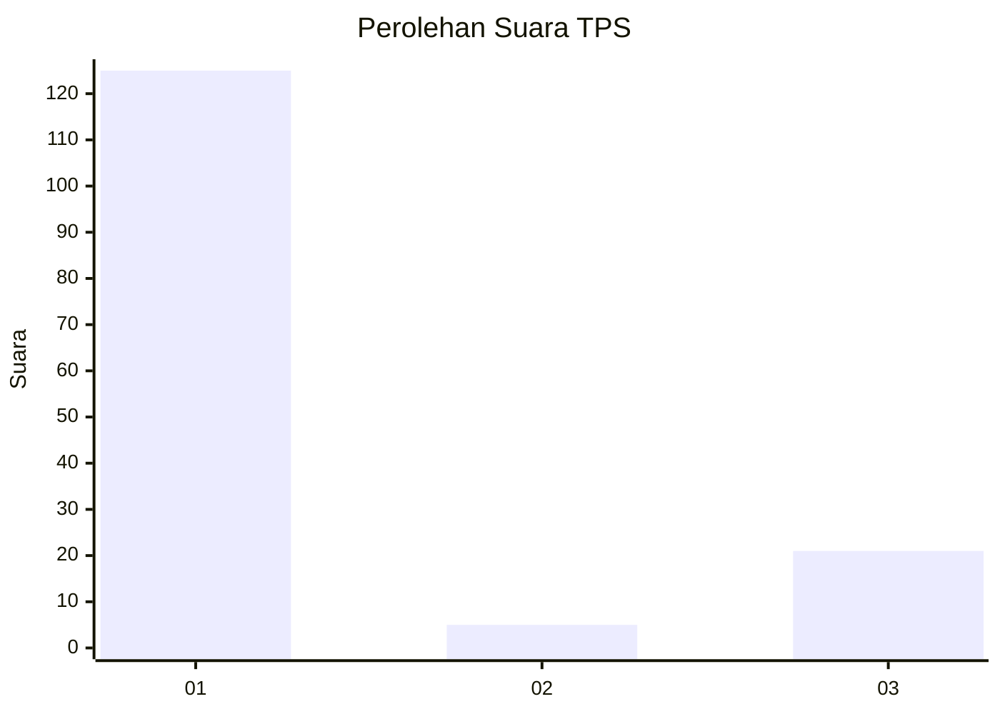
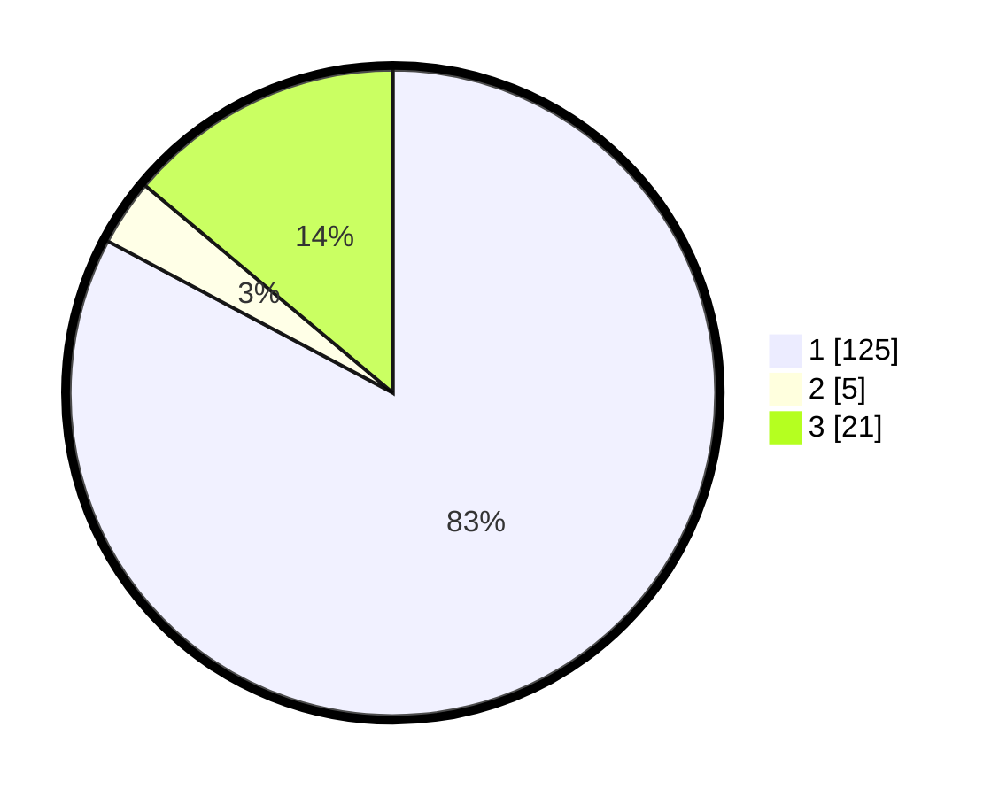

# Hasil

## Grafik

## Tabel

| No. | Nama Paslon    | Suara | Suara (raw) | Persentase |
|:--- |:-------------- | -----:| -----------:| ----------:|
| 1   | ANIES MUHAIMIN | 125   | [125][p-1]  | 82,78      |
| 2   | PRABOWO GIBRAN | 5     | [5][p-2]    | 3,31       |
| 3   | GANJAR MAHFUD  | 21    | [21][p-3]   | 13,91      |

[p-1]: https://github.com/gigit-pemilu/pemilu-2024/blob/main/pilpres/hitung-suara/sub/36-banten/sub/03-tangerang/sub/15-pakuhaji/sub/2004-rawa-boni/sub/012-tps/sub/paslon-1.txt
[p-2]: https://github.com/gigit-pemilu/pemilu-2024/blob/main/pilpres/hitung-suara/sub/36-banten/sub/03-tangerang/sub/15-pakuhaji/sub/2004-rawa-boni/sub/012-tps/sub/paslon-2.txt
[p-3]: https://github.com/gigit-pemilu/pemilu-2024/blob/main/pilpres/hitung-suara/sub/36-banten/sub/03-tangerang/sub/15-pakuhaji/sub/2004-rawa-boni/sub/012-tps/sub/paslon-3.txt

## Foto C Plano

https://sirekap-obj-formc.kpu.go.id/e583/pemilu/ppwp/36/03/15/20/04/3603152004012-20240223-144515--55af2ca9-c10c-4192-9e26-4db28832667a.jpg

https://sirekap-obj-formc.kpu.go.id/e583/pemilu/ppwp/36/03/15/20/04/3603152004012-20240223-144601--39633444-fb29-4f1f-a7c1-7acdf42a215f.jpg

https://sirekap-obj-formc.kpu.go.id/e583/pemilu/ppwp/36/03/15/20/04/3603152004012-20240223-144633--d98bf5ba-7e12-4f9d-bf99-4da7b465473c.jpg

## Metadata

| Key        | Value               |
| ---------- | ------------------- |
| Time Stamp | 2024-02-24 22:31:28 |

## DATA PEMILIH TETAP

Jumlah pemilih dalam DPT: **234**.
 * L: **825**.
 * P: **114**.

## DATA PENGGUNA HAK PILIH

Jumlah pengguna hak pilih dalam DPT: **223**.
 * L: **118**.
 * P: **109**.

Jumlah pengguna hak pilih dalam DPTb: **83**.
 * L: **481**.
 * P: **882**.

Jumlah pengguna hak pilih dalam DPK: **84**.
 * L: **800**.
 * P: **0**.

Jumlah pengguna hak pilih: **230**.
 * L: **719**.
 * P: **111**.

## JUMLAH SUARA SAH DAN TIDAK SAH

JUMLAH SELURUH SUARA SAH: **220**.

JUMLAH SUARA TIDAK SAH: **10**.

JUMLAH SELURUH SUARA SAH DAN SUARA TIDAK SAH: **230**.

