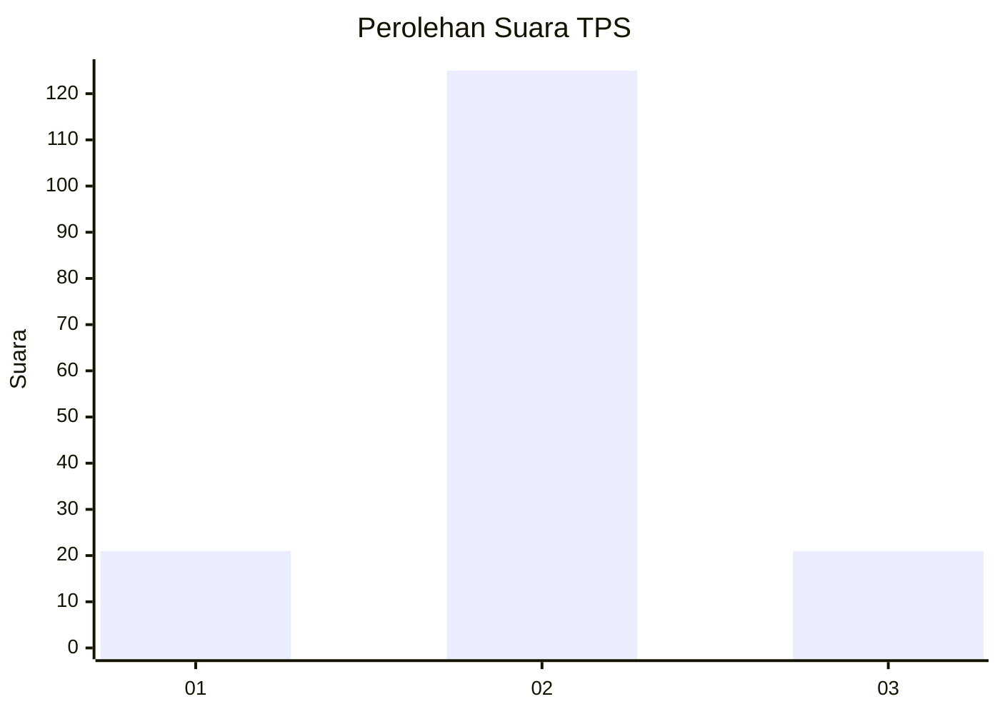
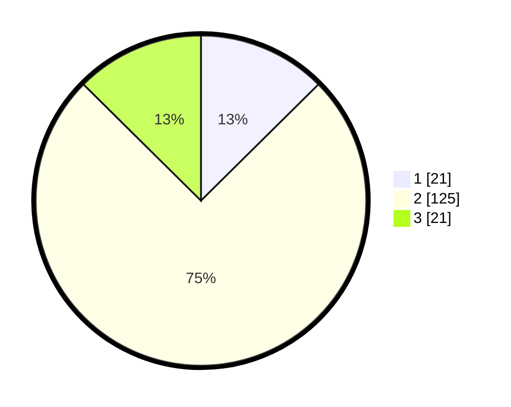

# Hasil

## Grafik

## Tabel

| No. | Nama Paslon    | Suara | Suara (raw) | Persentase |
|:--- |:-------------- | -----:| -----------:| ----------:|
| 1   | ANIES MUHAIMIN | 21    | [21][p-1]   | 12,57      |
| 2   | PRABOWO GIBRAN | 125   | [125][p-2]  | 74,85      |
| 3   | GANJAR MAHFUD  | 21    | [21][p-3]   | 12,57      |

[p-1]: https://github.com/gigit-pemilu/pemilu-2024-36-banten/blob/main/pilpres/hitung-suara/sub/36-banten/sub/03-tangerang/sub/15-pakuhaji/sub/2004-rawa-boni/sub/013-tps/sub/paslon-1.txt
[p-2]: https://github.com/gigit-pemilu/pemilu-2024-36-banten/blob/main/pilpres/hitung-suara/sub/36-banten/sub/03-tangerang/sub/15-pakuhaji/sub/2004-rawa-boni/sub/013-tps/sub/paslon-2.txt
[p-3]: https://github.com/gigit-pemilu/pemilu-2024-36-banten/blob/main/pilpres/hitung-suara/sub/36-banten/sub/03-tangerang/sub/15-pakuhaji/sub/2004-rawa-boni/sub/013-tps/sub/paslon-3.txt

## Foto C Plano

https://sirekap-obj-formc.kpu.go.id/4bc4/pemilu/ppwp/36/03/15/20/04/3603152004013-20240222-131448--49c954e8-07d5-48a6-8689-0c591753d1b0.jpg

https://sirekap-obj-formc.kpu.go.id/4bc4/pemilu/ppwp/36/03/15/20/04/3603152004013-20240222-131518--e336b2d1-cc19-430f-a9f7-8eabbdd809d3.jpg

https://sirekap-obj-formc.kpu.go.id/4bc4/pemilu/ppwp/36/03/15/20/04/3603152004013-20240222-131551--144eb3a0-94a7-42cc-966f-4ede66e2c785.jpg

## Metadata

| Key        | Value               |
| ---------- | ------------------- |
| Time Stamp | 2024-02-22 14:00:00 |

## DATA PEMILIH TETAP

Jumlah pemilih dalam DPT: **593**.
 * L: **805**.
 * P: **885**.

## DATA PENGGUNA HAK PILIH

Jumlah pengguna hak pilih dalam DPT: **232**.
 * L: **593**.
 * P: **293**.

Jumlah pengguna hak pilih dalam DPTb: **247**.
 * L: **580**.
 * P: **442**.

Jumlah pengguna hak pilih dalam DPK: **288**.
 * L: **583**.
 * P: **754**.

Jumlah pengguna hak pilih: **136**.
 * L: **88**.
 * P: **328**.

## JUMLAH SUARA SAH DAN TIDAK SAH

JUMLAH SELURUH SUARA SAH: **174**.

JUMLAH SUARA TIDAK SAH: **532**.

JUMLAH SELURUH SUARA SAH DAN SUARA TIDAK SAH: **375**.

