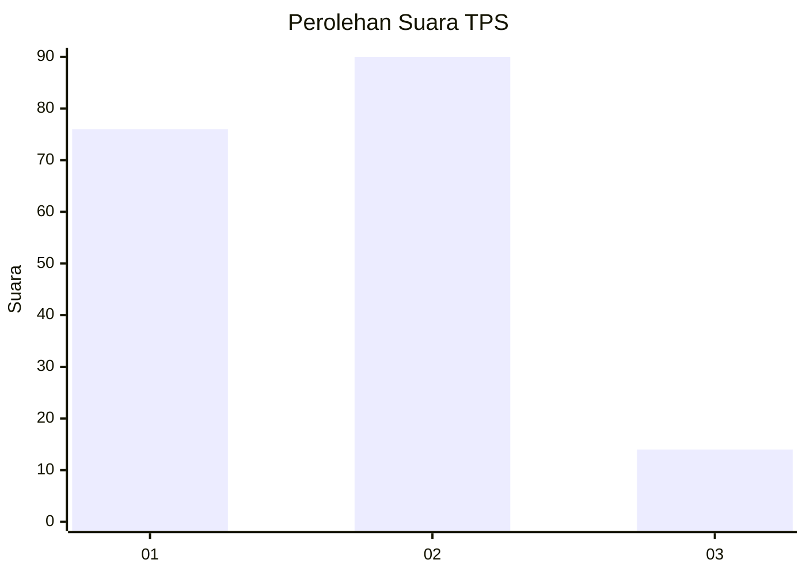
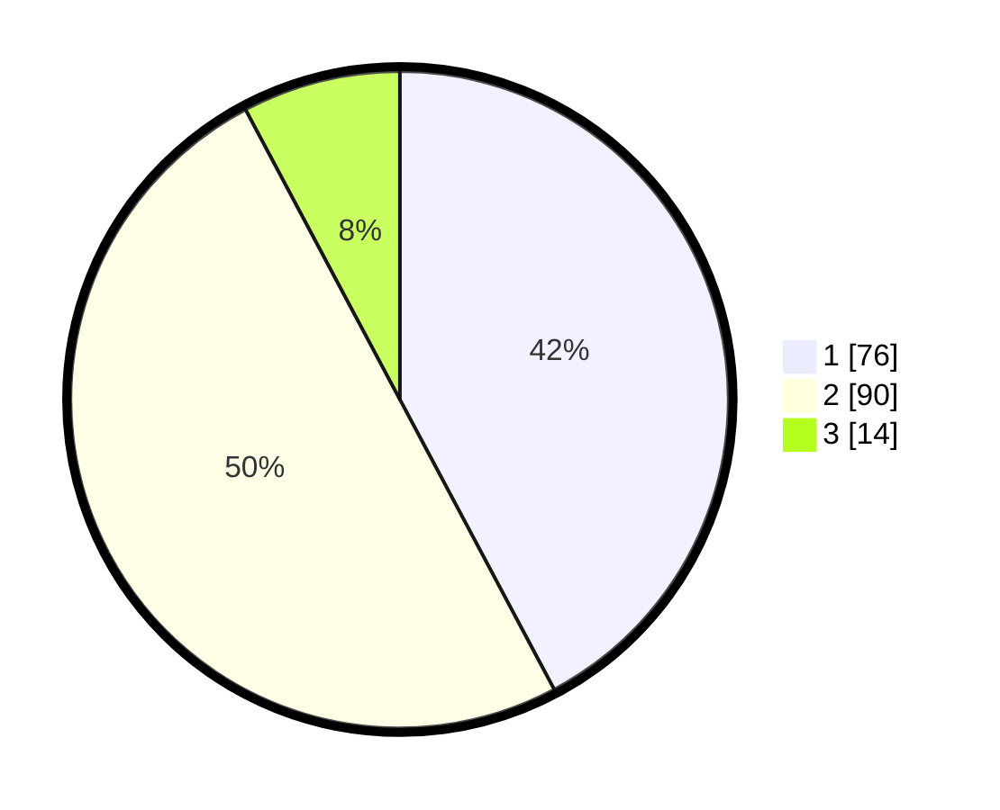

# Hasil

## Grafik

## Tabel

| No. | Nama Paslon    | Suara | Suara (raw) | Persentase |
|:--- |:-------------- | -----:| -----------:| ----------:|
| 1   | ANIES MUHAIMIN | 76    | [76][p-1]   | 42,22      |
| 2   | PRABOWO GIBRAN | 90    | [90][p-2]   | 50,00      |
| 3   | GANJAR MAHFUD  | 14    | [14][p-3]   | 7,78       |

[p-1]: https://github.com/gigit-pemilu/pemilu-2024/blob/main/pilpres/hitung-suara/sub/36-banten/sub/03-tangerang/sub/15-pakuhaji/sub/2005-buaran-mangga/sub/002-tps/sub/paslon-1.txt
[p-2]: https://github.com/gigit-pemilu/pemilu-2024/blob/main/pilpres/hitung-suara/sub/36-banten/sub/03-tangerang/sub/15-pakuhaji/sub/2005-buaran-mangga/sub/002-tps/sub/paslon-2.txt
[p-3]: https://github.com/gigit-pemilu/pemilu-2024/blob/main/pilpres/hitung-suara/sub/36-banten/sub/03-tangerang/sub/15-pakuhaji/sub/2005-buaran-mangga/sub/002-tps/sub/paslon-3.txt

## Foto C Plano

https://sirekap-obj-formc.kpu.go.id/b2d8/pemilu/ppwp/36/03/15/20/05/3603152005002-20240215-014601--92bdb6b8-4cbe-47b1-a333-585b6c5f1612.jpg

https://sirekap-obj-formc.kpu.go.id/b2d8/pemilu/ppwp/36/03/15/20/05/3603152005002-20240215-014800--b062e2e5-1002-4af3-acd0-69c58a43e338.jpg

https://sirekap-obj-formc.kpu.go.id/b2d8/pemilu/ppwp/36/03/15/20/05/3603152005002-20240215-014953--ebedb3b7-d604-4188-b04f-d78bb50d31f7.jpg

## Metadata

| Key        | Value               |
| ---------- | ------------------- |
| Time Stamp | 2024-02-19 17:00:00 |

