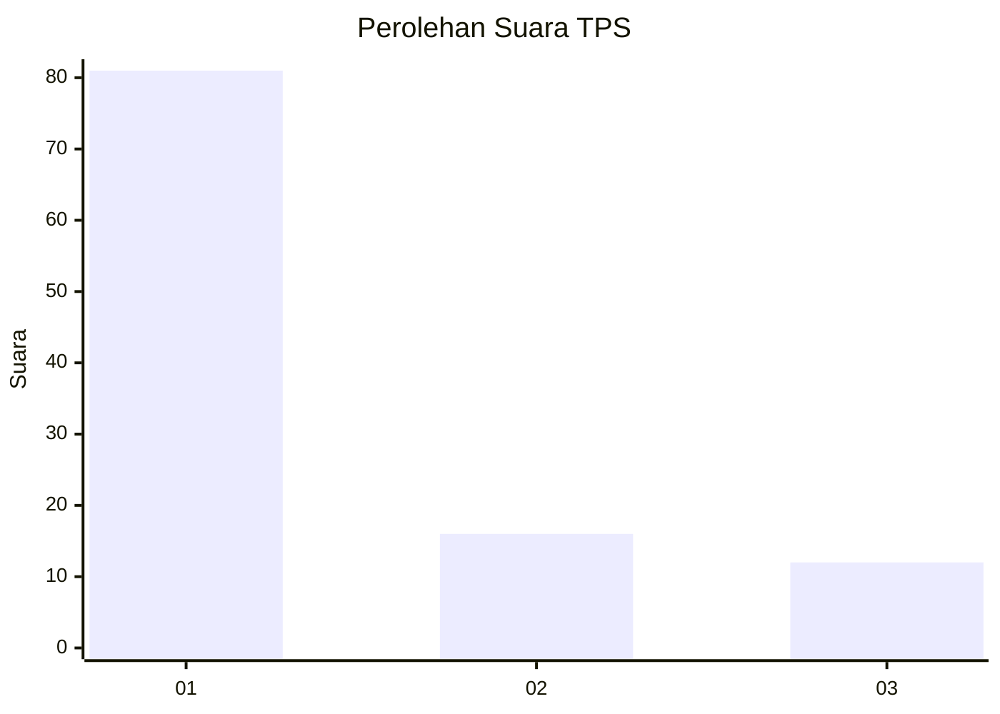
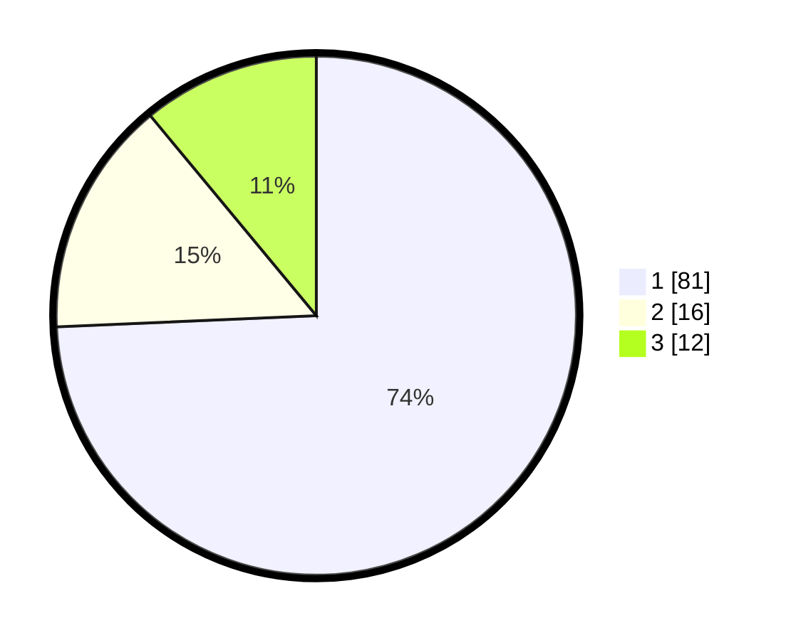

# Hasil

## Grafik

## Tabel

| No. | Nama Paslon    | Suara | Suara (raw) | Persentase |
|:--- |:-------------- | -----:| -----------:| ----------:|
| 1   | ANIES MUHAIMIN | 81    | [81][p-1]   | 74,31      |
| 2   | PRABOWO GIBRAN | 16    | [16][p-2]   | 14,68      |
| 3   | GANJAR MAHFUD  | 12    | [12][p-3]   | 11,01      |

[p-1]: https://github.com/gigit-pemilu/pemilu-2024-36-banten/blob/main/pilpres/hitung-suara/sub/36-banten/sub/03-tangerang/sub/15-pakuhaji/sub/2005-buaran-mangga/sub/004-tps/sub/paslon-1.txt
[p-2]: https://github.com/gigit-pemilu/pemilu-2024-36-banten/blob/main/pilpres/hitung-suara/sub/36-banten/sub/03-tangerang/sub/15-pakuhaji/sub/2005-buaran-mangga/sub/004-tps/sub/paslon-2.txt
[p-3]: https://github.com/gigit-pemilu/pemilu-2024-36-banten/blob/main/pilpres/hitung-suara/sub/36-banten/sub/03-tangerang/sub/15-pakuhaji/sub/2005-buaran-mangga/sub/004-tps/sub/paslon-3.txt

## Foto C Plano

https://sirekap-obj-formc.kpu.go.id/fbda/pemilu/ppwp/36/03/15/20/05/3603152005004-20240214-233702--31c0fe09-1b0f-4599-ba96-18c3b31c934d.jpg

https://sirekap-obj-formc.kpu.go.id/fbda/pemilu/ppwp/36/03/15/20/05/3603152005004-20240214-233811--7bf8e720-af7f-489e-ba5f-65400299aa27.jpg

https://sirekap-obj-formc.kpu.go.id/fbda/pemilu/ppwp/36/03/15/20/05/3603152005004-20240214-233927--d3a959b7-ac84-49a4-a97a-e54f5a2ce593.jpg

## Metadata

| Key        | Value               |
| ---------- | ------------------- |
| Time Stamp | 2024-02-19 12:00:00 |

