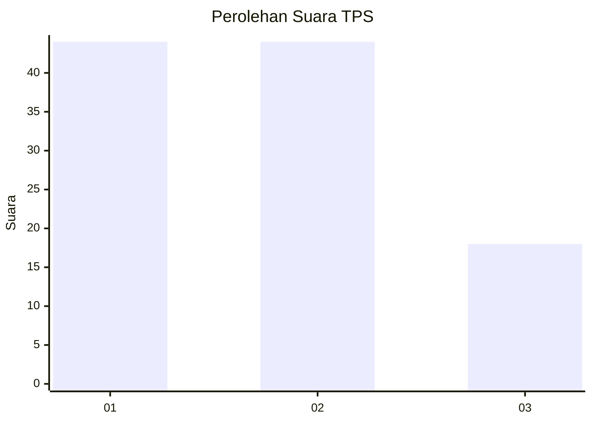
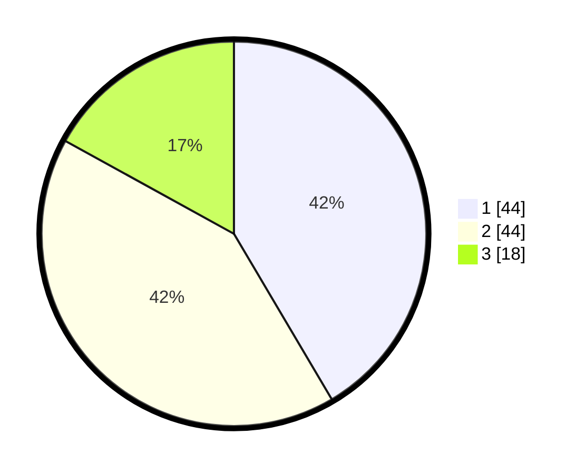

# Hasil

## Grafik

## Tabel

| No. | Nama Paslon    | Suara | Suara (raw) | Persentase |
|:--- |:-------------- | -----:| -----------:| ----------:|
| 1   | ANIES MUHAIMIN | 44    | [44][p-1]   | 41,51      |
| 2   | PRABOWO GIBRAN | 44    | [44][p-2]   | 41,51      |
| 3   | GANJAR MAHFUD  | 18    | [18][p-3]   | 16,98      |

[p-1]: https://github.com/gigit-pemilu/pemilu-2024-36-banten/blob/main/pilpres/hitung-suara/sub/36-banten/sub/03-tangerang/sub/15-pakuhaji/sub/2011-surya-bahari/sub/003-tps/sub/paslon-1.txt
[p-2]: https://github.com/gigit-pemilu/pemilu-2024-36-banten/blob/main/pilpres/hitung-suara/sub/36-banten/sub/03-tangerang/sub/15-pakuhaji/sub/2011-surya-bahari/sub/003-tps/sub/paslon-2.txt
[p-3]: https://github.com/gigit-pemilu/pemilu-2024-36-banten/blob/main/pilpres/hitung-suara/sub/36-banten/sub/03-tangerang/sub/15-pakuhaji/sub/2011-surya-bahari/sub/003-tps/sub/paslon-3.txt

## Foto C Plano

https://sirekap-obj-formc.kpu.go.id/2714/pemilu/ppwp/36/03/15/20/11/3603152011003-20240226-165824--48aa82d8-9072-4f45-9b88-6da814c5f1be.jpg

https://sirekap-obj-formc.kpu.go.id/2714/pemilu/ppwp/36/03/15/20/11/3603152011003-20240223-215204--cfe5ab30-13d0-4ce5-8f71-3a96bcfd7c2c.jpg

https://sirekap-obj-formc.kpu.go.id/2714/pemilu/ppwp/36/03/15/20/11/3603152011003-20240223-215312--febce77c-52c3-4b1a-a157-34edf76fe4b5.jpg

## Metadata

| Key        | Value               |
| ---------- | ------------------- |
| Time Stamp | 2024-02-26 17:00:04 |

