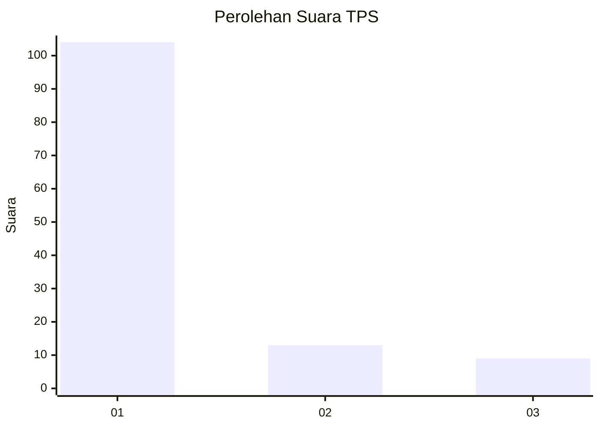
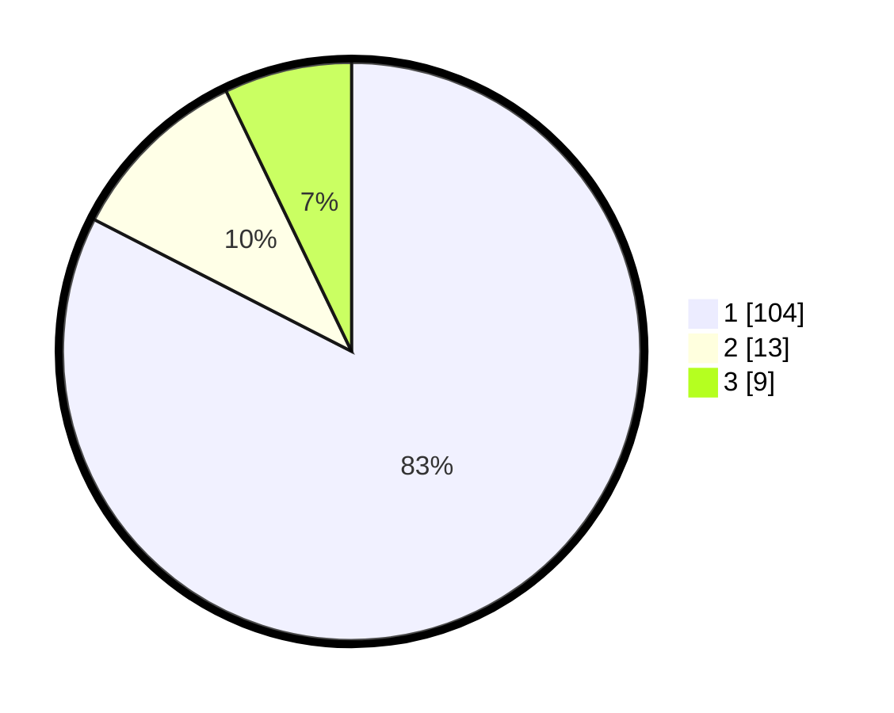

# Hasil

## Grafik

## Tabel

| No. | Nama Paslon    | Suara | Suara (raw) | Persentase |
|:--- |:-------------- | -----:| -----------:| ----------:|
| 1   | ANIES MUHAIMIN | 104   | [104][p-1]  | 82,54      |
| 2   | PRABOWO GIBRAN | 13    | [13][p-2]   | 10,32      |
| 3   | GANJAR MAHFUD  | 9     | [9][p-3]    | 7,14       |

[p-1]: https://github.com/gigit-pemilu/pemilu-2024-36-banten/blob/main/pilpres/hitung-suara/sub/36-banten/sub/03-tangerang/sub/15-pakuhaji/sub/2012-kiara-payung/sub/004-tps/sub/paslon-1.txt
[p-2]: https://github.com/gigit-pemilu/pemilu-2024-36-banten/blob/main/pilpres/hitung-suara/sub/36-banten/sub/03-tangerang/sub/15-pakuhaji/sub/2012-kiara-payung/sub/004-tps/sub/paslon-2.txt
[p-3]: https://github.com/gigit-pemilu/pemilu-2024-36-banten/blob/main/pilpres/hitung-suara/sub/36-banten/sub/03-tangerang/sub/15-pakuhaji/sub/2012-kiara-payung/sub/004-tps/sub/paslon-3.txt

## Foto C Plano

https://sirekap-obj-formc.kpu.go.id/bd63/pemilu/ppwp/36/03/15/20/12/3603152012004-20240220-102104--42e63b9e-46f9-4c21-9f45-c0368bbf77e0.jpg

https://sirekap-obj-formc.kpu.go.id/bd63/pemilu/ppwp/36/03/15/20/12/3603152012004-20240220-101821--c0c21319-8fff-4b66-a8df-3cb432607dfa.jpg

https://sirekap-obj-formc.kpu.go.id/bd63/pemilu/ppwp/36/03/15/20/12/3603152012004-20240220-101853--2afaadf1-12cf-43c2-a265-5fe293037456.jpg

## Metadata

| Key        | Value               |
| ---------- | ------------------- |
| Time Stamp | 2024-02-20 11:00:00 |

