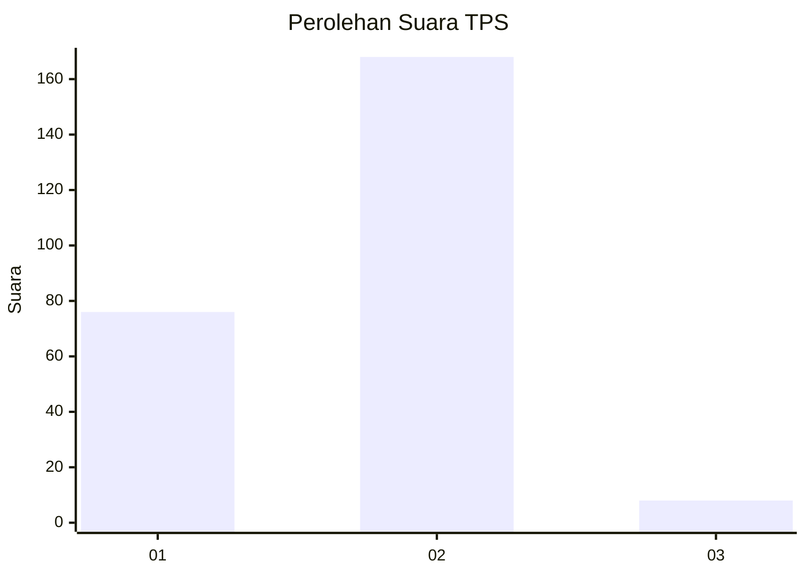
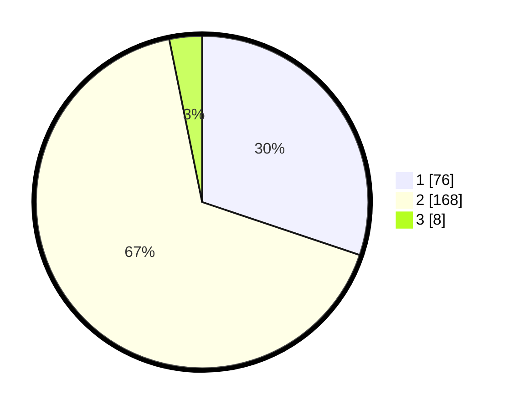

# Hasil

## Grafik

## Tabel

| No. | Nama Paslon    | Suara | Suara (raw) | Persentase |
|:--- |:-------------- | -----:| -----------:| ----------:|
| 1   | ANIES MUHAIMIN | 76    | [76][p-1]   | 30,16      |
| 2   | PRABOWO GIBRAN | 168   | [168][p-2]  | 66,67      |
| 3   | GANJAR MAHFUD  | 8     | [8][p-3]    | 3,17       |

[p-1]: https://github.com/gigit-pemilu/pemilu-2024/blob/main/pilpres/hitung-suara/sub/36-banten/sub/03-tangerang/sub/16-sepatan/sub/1001-sepatan/sub/004-tps/sub/paslon-1.txt
[p-2]: https://github.com/gigit-pemilu/pemilu-2024/blob/main/pilpres/hitung-suara/sub/36-banten/sub/03-tangerang/sub/16-sepatan/sub/1001-sepatan/sub/004-tps/sub/paslon-2.txt
[p-3]: https://github.com/gigit-pemilu/pemilu-2024/blob/main/pilpres/hitung-suara/sub/36-banten/sub/03-tangerang/sub/16-sepatan/sub/1001-sepatan/sub/004-tps/sub/paslon-3.txt

## Foto C Plano

https://sirekap-obj-formc.kpu.go.id/4982/pemilu/ppwp/36/03/16/10/01/3603161001004-20240225-143326--62af680c-fa6d-4707-9e81-7f365217cf09.jpg

https://sirekap-obj-formc.kpu.go.id/4982/pemilu/ppwp/36/03/16/10/01/3603161001004-20240225-143454--b77bd6e6-2e02-49dd-9f7f-677666252271.jpg

https://sirekap-obj-formc.kpu.go.id/4982/pemilu/ppwp/36/03/16/10/01/3603161001004-20240225-143556--9d1f7b79-af96-47a1-b52a-0c82650f6f09.jpg

## Metadata

| Key        | Value               |
| ---------- | ------------------- |
| Time Stamp | 2024-02-25 17:00:00 |

## DATA PEMILIH TETAP

Jumlah pemilih dalam DPT: **285**.
 * L: **248**.
 * P: **177**.

## DATA PENGGUNA HAK PILIH

Jumlah pengguna hak pilih dalam DPT: **222**.
 * L: **733**.
 * P: **819**.

Jumlah pengguna hak pilih dalam DPTb: **853**.
 * L: **402**.
 * P: **888**.

Jumlah pengguna hak pilih dalam DPK: **874**.
 * L: **782**.
 * P: **2**.

Jumlah pengguna hak pilih: **255**.
 * L: **135**.
 * P: **601**.

## JUMLAH SUARA SAH DAN TIDAK SAH

JUMLAH SELURUH SUARA SAH: **252**.

JUMLAH SUARA TIDAK SAH: **4**.

JUMLAH SELURUH SUARA SAH DAN SUARA TIDAK SAH: **256**.

