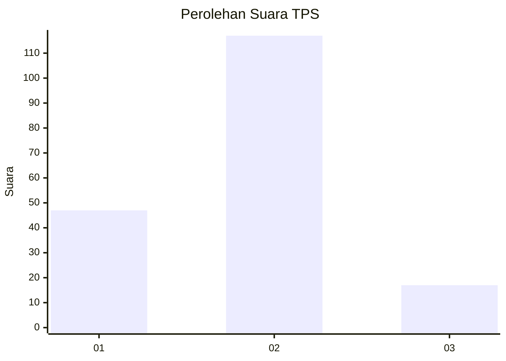
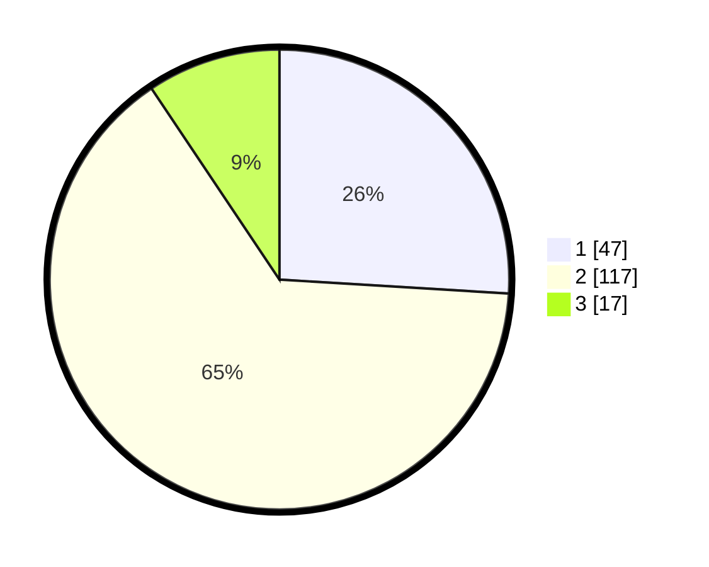

# Hasil

## Grafik

## Tabel

| No. | Nama Paslon    | Suara | Suara (raw) | Persentase |
|:--- |:-------------- | -----:| -----------:| ----------:|
| 1   | ANIES MUHAIMIN | 47    | [47][p-1]   | 25,97      |
| 2   | PRABOWO GIBRAN | 117   | [117][p-2]  | 64,64      |
| 3   | GANJAR MAHFUD  | 17    | [17][p-3]   | 9,39       |

[p-1]: https://github.com/gigit-pemilu/pemilu-2024-36-banten/blob/main/pilpres/hitung-suara/sub/36-banten/sub/03-tangerang/sub/16-sepatan/sub/1001-sepatan/sub/013-tps/sub/paslon-1.txt
[p-2]: https://github.com/gigit-pemilu/pemilu-2024-36-banten/blob/main/pilpres/hitung-suara/sub/36-banten/sub/03-tangerang/sub/16-sepatan/sub/1001-sepatan/sub/013-tps/sub/paslon-2.txt
[p-3]: https://github.com/gigit-pemilu/pemilu-2024-36-banten/blob/main/pilpres/hitung-suara/sub/36-banten/sub/03-tangerang/sub/16-sepatan/sub/1001-sepatan/sub/013-tps/sub/paslon-3.txt

## Foto C Plano

https://sirekap-obj-formc.kpu.go.id/262b/pemilu/ppwp/36/03/16/10/01/3603161001013-20240222-165552--66a9cda1-48e7-48b3-8428-e91d8a3efd6c.jpg

https://sirekap-obj-formc.kpu.go.id/262b/pemilu/ppwp/36/03/16/10/01/3603161001013-20240226-162842--b884b7f8-44d8-4a02-aea4-60a97e644558.jpg

https://sirekap-obj-formc.kpu.go.id/262b/pemilu/ppwp/36/03/16/10/01/3603161001013-20240226-163049--c8b6b94f-81a2-4aa2-ae4c-d6b741b20a83.jpg

## Metadata

| Key        | Value               |
| ---------- | ------------------- |
| Time Stamp | 2024-02-26 22:00:00 |

## DATA PEMILIH TETAP

Jumlah pemilih dalam DPT: **219**.
 * L: **712**.
 * P: **107**.

## DATA PENGGUNA HAK PILIH

Jumlah pengguna hak pilih dalam DPT: **799**.
 * L: **99**.
 * P: **100**.

Jumlah pengguna hak pilih dalam DPTb: **757**.
 * L: **55**.
 * P: **558**.

Jumlah pengguna hak pilih dalam DPK: **1**.
 * L: **320**.
 * P: **281**.

Jumlah pengguna hak pilih: **200**.
 * L: **499**.
 * P: **101**.

## JUMLAH SUARA SAH DAN TIDAK SAH

JUMLAH SELURUH SUARA SAH: **181**.

JUMLAH SUARA TIDAK SAH: **2**.

JUMLAH SELURUH SUARA SAH DAN SUARA TIDAK SAH: **183**.

