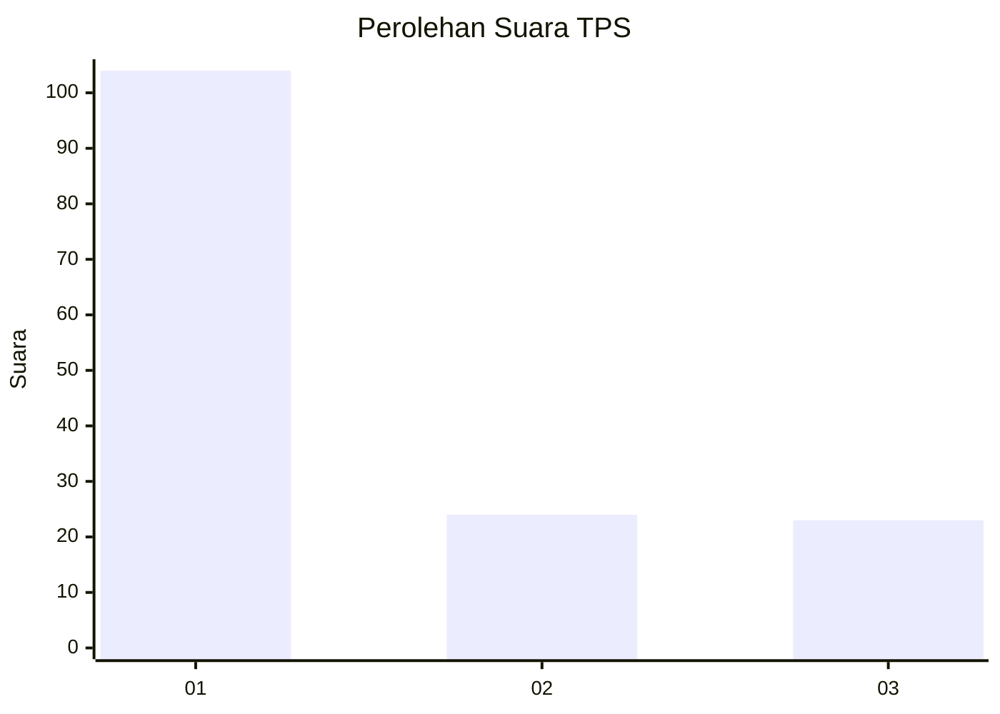
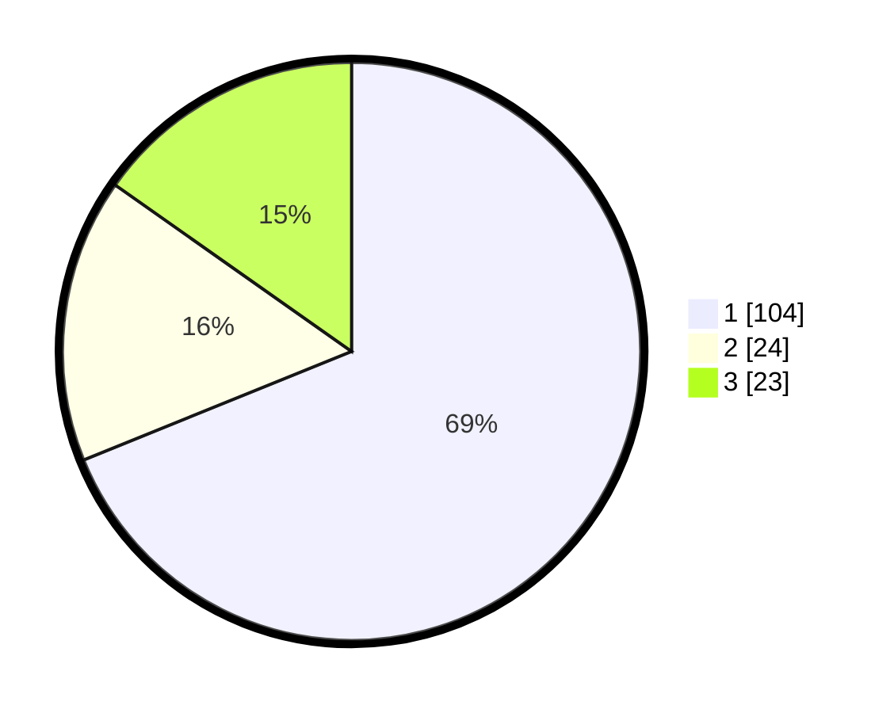

# Hasil

## Grafik

## Tabel

| No. | Nama Paslon    | Suara | Suara (raw) | Persentase |
|:--- |:-------------- | -----:| -----------:| ----------:|
| 1   | ANIES MUHAIMIN | 104   | [104][p-1]  | 68,87      |
| 2   | PRABOWO GIBRAN | 24    | [24][p-2]   | 15,89      |
| 3   | GANJAR MAHFUD  | 23    | [23][p-3]   | 15,23      |

[p-1]: https://github.com/gigit-pemilu/pemilu-2024-36-banten/blob/main/pilpres/hitung-suara/sub/36-banten/sub/03-tangerang/sub/16-sepatan/sub/2004-kayu-bongkok/sub/009-tps/sub/paslon-1.txt
[p-2]: https://github.com/gigit-pemilu/pemilu-2024-36-banten/blob/main/pilpres/hitung-suara/sub/36-banten/sub/03-tangerang/sub/16-sepatan/sub/2004-kayu-bongkok/sub/009-tps/sub/paslon-2.txt
[p-3]: https://github.com/gigit-pemilu/pemilu-2024-36-banten/blob/main/pilpres/hitung-suara/sub/36-banten/sub/03-tangerang/sub/16-sepatan/sub/2004-kayu-bongkok/sub/009-tps/sub/paslon-3.txt

## Foto C Plano

https://sirekap-obj-formc.kpu.go.id/871d/pemilu/ppwp/36/03/16/20/04/3603162004009-20240222-183523--a7c194b7-078d-4196-ac73-15f85c105826.jpg

https://sirekap-obj-formc.kpu.go.id/871d/pemilu/ppwp/36/03/16/20/04/3603162004009-20240222-183949--b915591d-e4a8-4e14-9681-d23947aefa31.jpg

https://sirekap-obj-formc.kpu.go.id/871d/pemilu/ppwp/36/03/16/20/04/3603162004009-20240222-184104--e61e4491-335c-457e-ad9b-e74cfc567291.jpg

## Metadata

| Key        | Value               |
| ---------- | ------------------- |
| Time Stamp | 2024-02-22 19:00:00 |

## DATA PEMILIH TETAP

Jumlah pemilih dalam DPT: **284**.
 * L: **143**.
 * P: **141**.

## DATA PENGGUNA HAK PILIH

Jumlah pengguna hak pilih dalam DPT: **274**.
 * L: **123**.
 * P: **135**.

Jumlah pengguna hak pilih dalam DPTb: **58**.
 * L: **877**.
 * P: **28**.

Jumlah pengguna hak pilih dalam DPK: **0**.
 * L: **8**.
 * P: **2**.

Jumlah pengguna hak pilih: **222**.
 * L: **123**.
 * P: **425**.

## JUMLAH SUARA SAH DAN TIDAK SAH

JUMLAH SELURUH SUARA SAH: **241**.

JUMLAH SUARA TIDAK SAH: **13**.

JUMLAH SELURUH SUARA SAH DAN SUARA TIDAK SAH: **254**.

