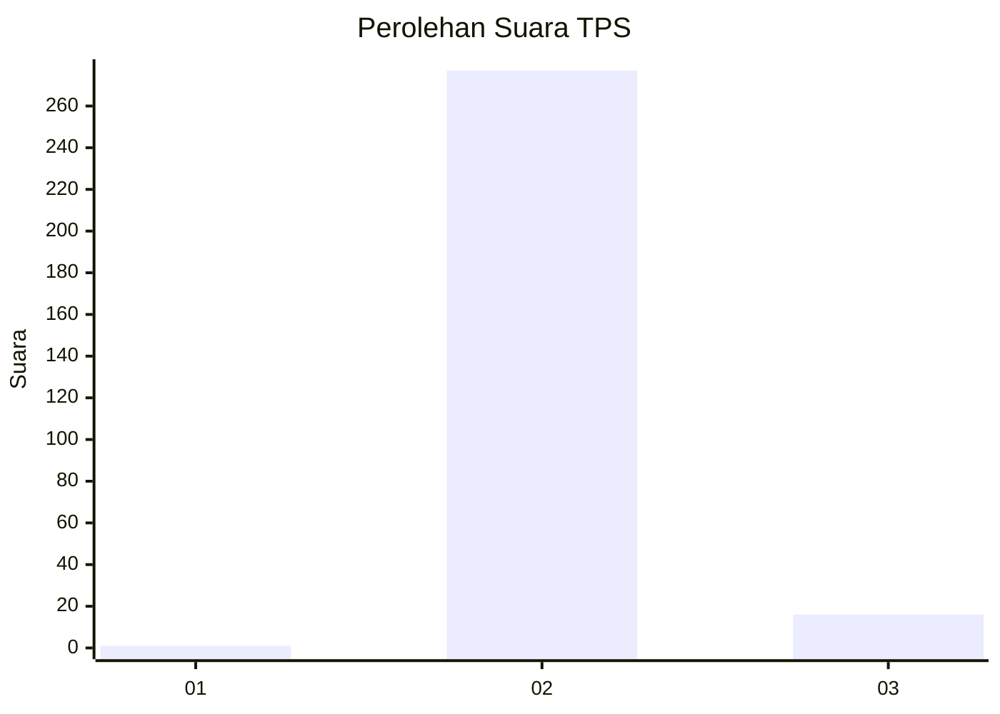
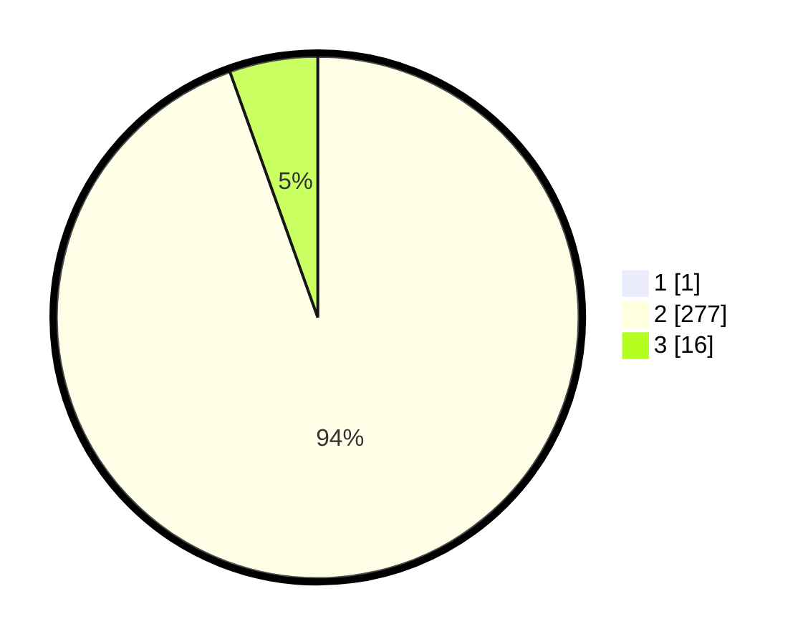

# Hasil

## Grafik

## Tabel

| No. | Nama Paslon    | Suara | Suara (raw) | Persentase |
|:--- |:-------------- | -----:| -----------:| ----------:|
| 1   | ANIES MUHAIMIN | 1     | [1][p-1]    | 0,34       |
| 2   | PRABOWO GIBRAN | 277   | [277][p-2]  | 94,22      |
| 3   | GANJAR MAHFUD  | 16    | [16][p-3]   | 5,44       |

[p-1]: https://github.com/gigit-pemilu/pemilu-2024/blob/main/pilpres/hitung-suara/sub/36-banten/sub/03-tangerang/sub/16-sepatan/sub/2012-mekar-jaya/sub/009-tps/sub/paslon-1.txt
[p-2]: https://github.com/gigit-pemilu/pemilu-2024/blob/main/pilpres/hitung-suara/sub/36-banten/sub/03-tangerang/sub/16-sepatan/sub/2012-mekar-jaya/sub/009-tps/sub/paslon-2.txt
[p-3]: https://github.com/gigit-pemilu/pemilu-2024/blob/main/pilpres/hitung-suara/sub/36-banten/sub/03-tangerang/sub/16-sepatan/sub/2012-mekar-jaya/sub/009-tps/sub/paslon-3.txt

## Foto C Plano

https://sirekap-obj-formc.kpu.go.id/8281/pemilu/ppwp/36/03/16/20/12/3603162012009-20240223-203325--4577546b-ffd2-4e08-879d-470422beee6c.jpg

https://sirekap-obj-formc.kpu.go.id/8281/pemilu/ppwp/36/03/16/20/12/3603162012009-20240223-203548--3c24907e-ddd6-476f-9696-7c5152fbc6d3.jpg

https://sirekap-obj-formc.kpu.go.id/8281/pemilu/ppwp/36/03/16/20/12/3603162012009-20240223-203715--faf60e89-3361-424f-aefb-f04d0e0eb409.jpg

## Metadata

| Key        | Value               |
| ---------- | ------------------- |
| Time Stamp | 2024-02-24 22:31:28 |

## DATA PEMILIH TETAP

Jumlah pemilih dalam DPT: **277**.
 * L: **177**.
 * P: **170**.

## DATA PENGGUNA HAK PILIH

Jumlah pengguna hak pilih dalam DPT: **254**.
 * L: **170**.
 * P: **124**.

Jumlah pengguna hak pilih dalam DPTb: **834**.
 * L: **855**.
 * P: **847**.

Jumlah pengguna hak pilih dalam DPK: **408**.
 * L: **748**.
 * P: **400**.

Jumlah pengguna hak pilih: **259**.
 * L: **170**.
 * P: **129**.

## JUMLAH SUARA SAH DAN TIDAK SAH

JUMLAH SELURUH SUARA SAH: **244**.

JUMLAH SUARA TIDAK SAH: **10**.

JUMLAH SELURUH SUARA SAH DAN SUARA TIDAK SAH: **255**.

