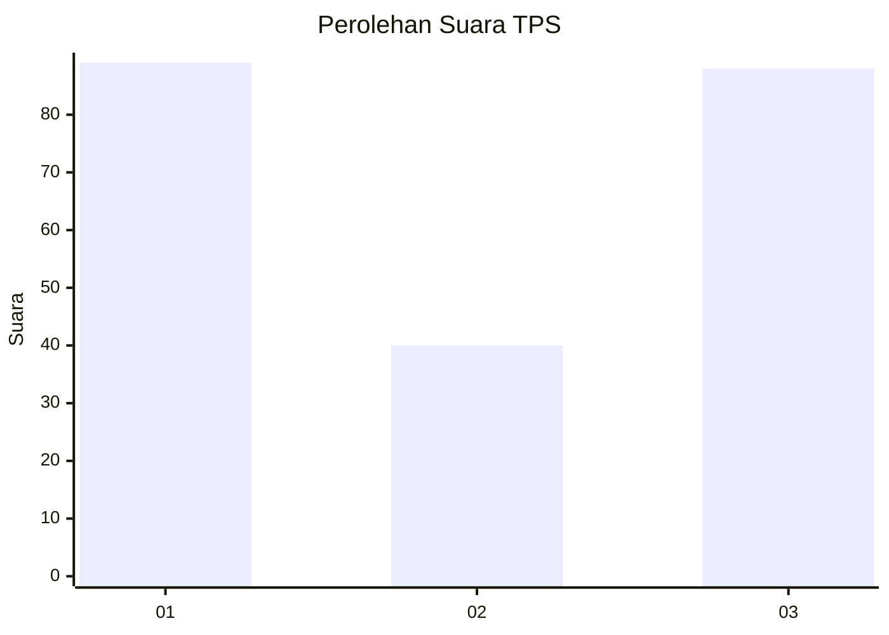
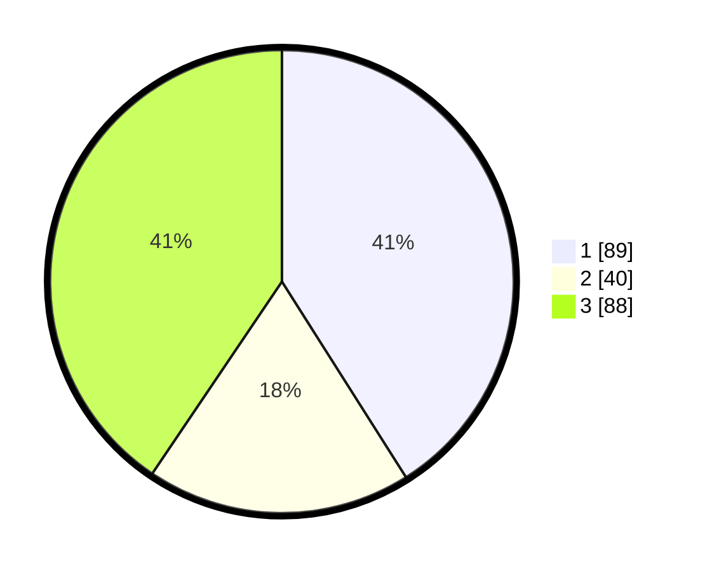

# Hasil

## Grafik

## Tabel

| No. | Nama Paslon    | Suara | Suara (raw) | Persentase |
|:--- |:-------------- | -----:| -----------:| ----------:|
| 1   | ANIES MUHAIMIN | 89    | [89][p-1]   | 41,01      |
| 2   | PRABOWO GIBRAN | 40    | [40][p-2]   | 18,43      |
| 3   | GANJAR MAHFUD  | 88    | [88][p-3]   | 40,55      |

[p-1]: https://github.com/gigit-pemilu/pemilu-2024-36-banten/blob/main/pilpres/hitung-suara/sub/36-banten/sub/03-tangerang/sub/16-sepatan/sub/2012-mekar-jaya/sub/022-tps/sub/paslon-1.txt
[p-2]: https://github.com/gigit-pemilu/pemilu-2024-36-banten/blob/main/pilpres/hitung-suara/sub/36-banten/sub/03-tangerang/sub/16-sepatan/sub/2012-mekar-jaya/sub/022-tps/sub/paslon-2.txt
[p-3]: https://github.com/gigit-pemilu/pemilu-2024-36-banten/blob/main/pilpres/hitung-suara/sub/36-banten/sub/03-tangerang/sub/16-sepatan/sub/2012-mekar-jaya/sub/022-tps/sub/paslon-3.txt

## Foto C Plano

https://sirekap-obj-formc.kpu.go.id/9cf9/pemilu/ppwp/36/03/16/20/12/3603162012022-20240223-164054--6fe416a2-a101-48fa-ae94-960970701a94.jpg

https://sirekap-obj-formc.kpu.go.id/9cf9/pemilu/ppwp/36/03/16/20/12/3603162012022-20240223-164754--72c72b77-9fa7-4b3a-95e5-c19c1600abf7.jpg

https://sirekap-obj-formc.kpu.go.id/9cf9/pemilu/ppwp/36/03/16/20/12/3603162012022-20240223-164859--3de7426b-072f-4a1c-ab1a-d4fe96bab9ab.jpg

## Metadata

| Key        | Value               |
| ---------- | ------------------- |
| Time Stamp | 2024-02-24 22:31:28 |

## DATA PEMILIH TETAP

Jumlah pemilih dalam DPT: **285**.
 * L: **148**.
 * P: **137**.

## DATA PENGGUNA HAK PILIH

Jumlah pengguna hak pilih dalam DPT: **246**.
 * L: **291**.
 * P: **246**.

Jumlah pengguna hak pilih dalam DPTb: **80**.
 * L: **880**.
 * P: **0**.

Jumlah pengguna hak pilih dalam DPK: **8**.
 * L: **808**.
 * P: **0**.

Jumlah pengguna hak pilih: **246**.
 * L: **682**.
 * P: **136**.

## JUMLAH SUARA SAH DAN TIDAK SAH

JUMLAH SELURUH SUARA SAH: **237**.

JUMLAH SUARA TIDAK SAH: **303**.

JUMLAH SELURUH SUARA SAH DAN SUARA TIDAK SAH: **246**.

