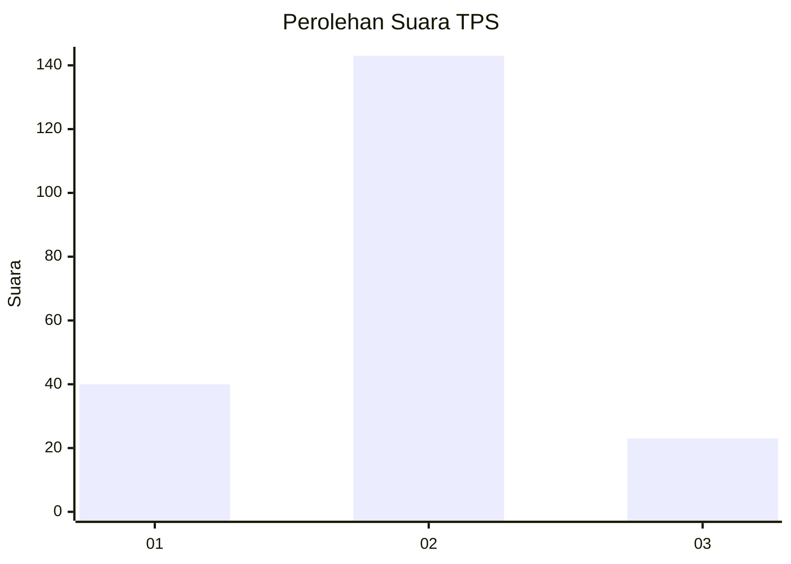
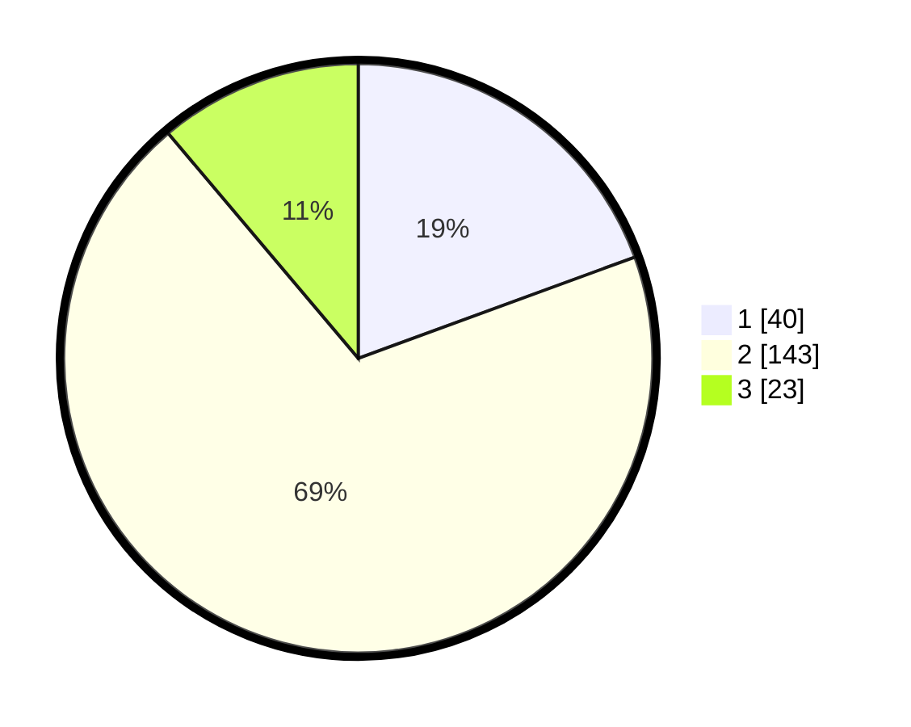

# Hasil

## Grafik

## Tabel

| No. | Nama Paslon    | Suara | Suara (raw) | Persentase |
|:--- |:-------------- | -----:| -----------:| ----------:|
| 1   | ANIES MUHAIMIN | 40    | [40][p-1]   | 19,42      |
| 2   | PRABOWO GIBRAN | 143   | [143][p-2]  | 69,42      |
| 3   | GANJAR MAHFUD  | 23    | [23][p-3]   | 11,17      |

[p-1]: https://github.com/gigit-pemilu/pemilu-2024/blob/main/pilpres/hitung-suara/sub/36-banten/sub/03-tangerang/sub/17-curug/sub/1001-curug-kulon/sub/001-tps/sub/paslon-1.txt
[p-2]: https://github.com/gigit-pemilu/pemilu-2024/blob/main/pilpres/hitung-suara/sub/36-banten/sub/03-tangerang/sub/17-curug/sub/1001-curug-kulon/sub/001-tps/sub/paslon-2.txt
[p-3]: https://github.com/gigit-pemilu/pemilu-2024/blob/main/pilpres/hitung-suara/sub/36-banten/sub/03-tangerang/sub/17-curug/sub/1001-curug-kulon/sub/001-tps/sub/paslon-3.txt

## Foto C Plano

https://sirekap-obj-formc.kpu.go.id/d1dd/pemilu/ppwp/36/03/17/10/01/3603171001001-20240214-212801--66cad3e0-a6b9-41ff-9c38-94040b16b5e7.jpg

https://sirekap-obj-formc.kpu.go.id/d1dd/pemilu/ppwp/36/03/17/10/01/3603171001001-20240214-212634--5af79a69-3682-4805-b4eb-6df1d3ada0a4.jpg

https://sirekap-obj-formc.kpu.go.id/d1dd/pemilu/ppwp/36/03/17/10/01/3603171001001-20240214-212408--af8a8319-a8bb-4197-b03e-45203e154631.jpg

## Metadata

| Key        | Value               |
| ---------- | ------------------- |
| Time Stamp | 2024-02-19 16:00:00 |

