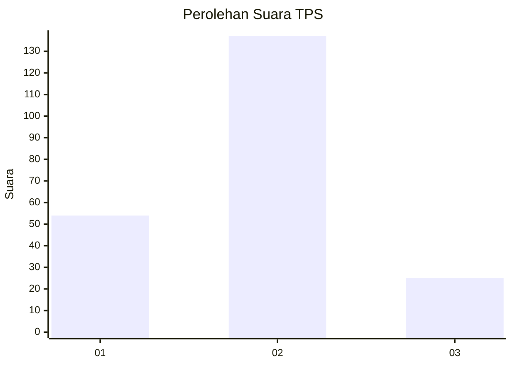
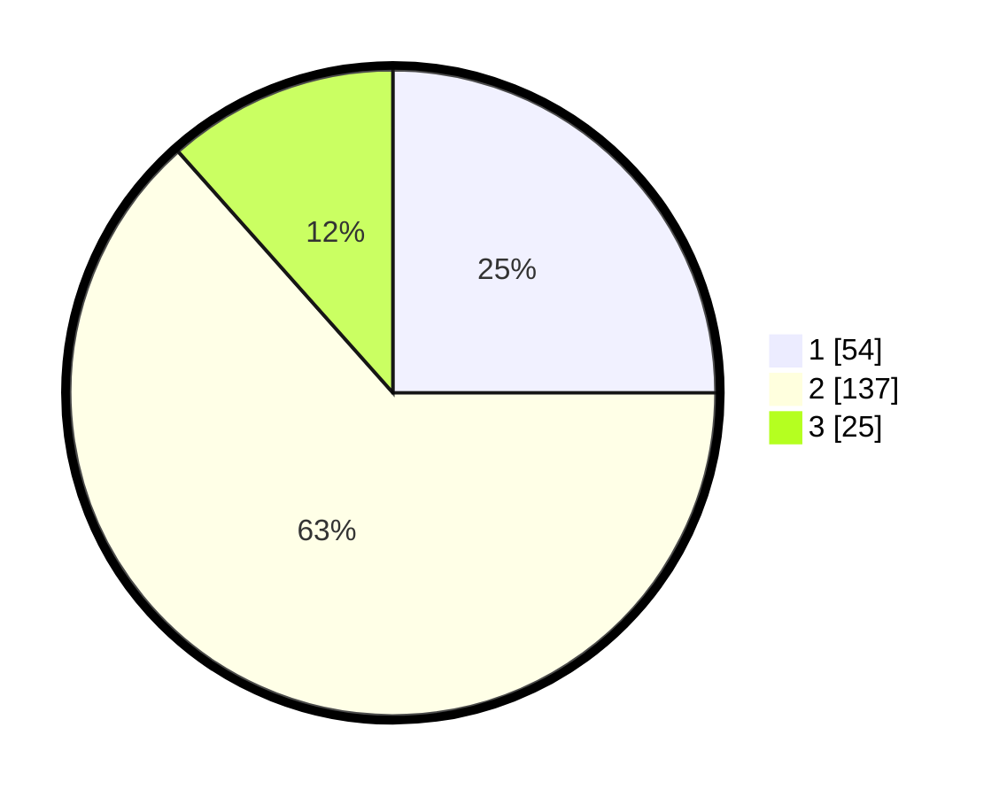

# Hasil

## Grafik

## Tabel

| No. | Nama Paslon    | Suara | Suara (raw) | Persentase |
|:--- |:-------------- | -----:| -----------:| ----------:|
| 1   | ANIES MUHAIMIN | 54    | [54][p-1]   | 25,00      |
| 2   | PRABOWO GIBRAN | 137   | [137][p-2]  | 63,43      |
| 3   | GANJAR MAHFUD  | 25    | [25][p-3]   | 11,57      |

[p-1]: https://github.com/gigit-pemilu/pemilu-2024/blob/main/pilpres/hitung-suara/sub/36-banten/sub/03-tangerang/sub/17-curug/sub/1001-curug-kulon/sub/003-tps/sub/paslon-1.txt
[p-2]: https://github.com/gigit-pemilu/pemilu-2024/blob/main/pilpres/hitung-suara/sub/36-banten/sub/03-tangerang/sub/17-curug/sub/1001-curug-kulon/sub/003-tps/sub/paslon-2.txt
[p-3]: https://github.com/gigit-pemilu/pemilu-2024/blob/main/pilpres/hitung-suara/sub/36-banten/sub/03-tangerang/sub/17-curug/sub/1001-curug-kulon/sub/003-tps/sub/paslon-3.txt

## Foto C Plano

https://sirekap-obj-formc.kpu.go.id/071c/pemilu/ppwp/36/03/17/10/01/3603171001003-20240215-100423--a524a325-7df8-4198-a344-2aaa1bb5f822.jpg

https://sirekap-obj-formc.kpu.go.id/071c/pemilu/ppwp/36/03/17/10/01/3603171001003-20240215-100433--0d38d32f-5a41-477f-a49a-ccbd23a625ae.jpg

https://sirekap-obj-formc.kpu.go.id/071c/pemilu/ppwp/36/03/17/10/01/3603171001003-20240215-100441--36140f69-8ec5-4570-938e-e30eefddd637.jpg

## Metadata

| Key        | Value               |
| ---------- | ------------------- |
| Time Stamp | 2024-02-19 17:00:00 |

