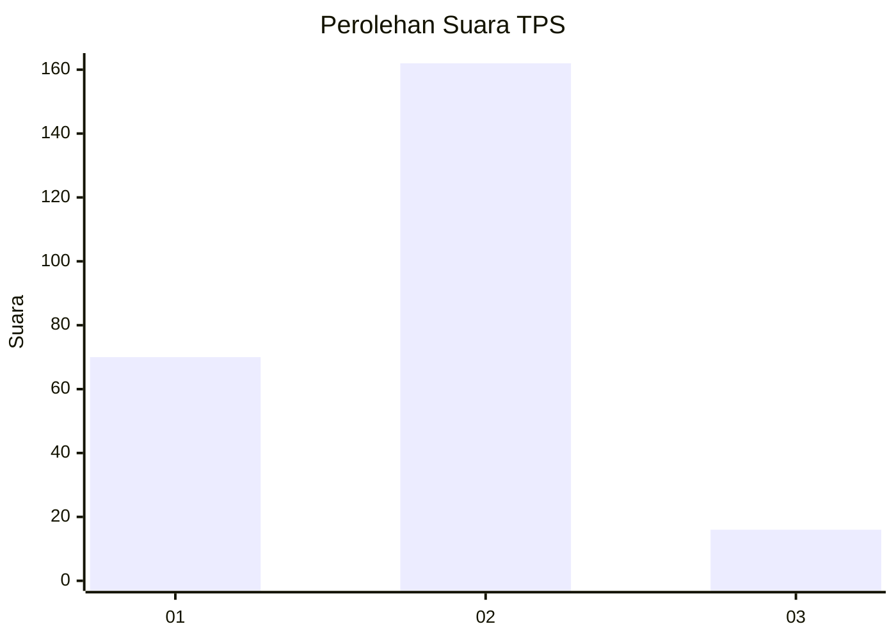
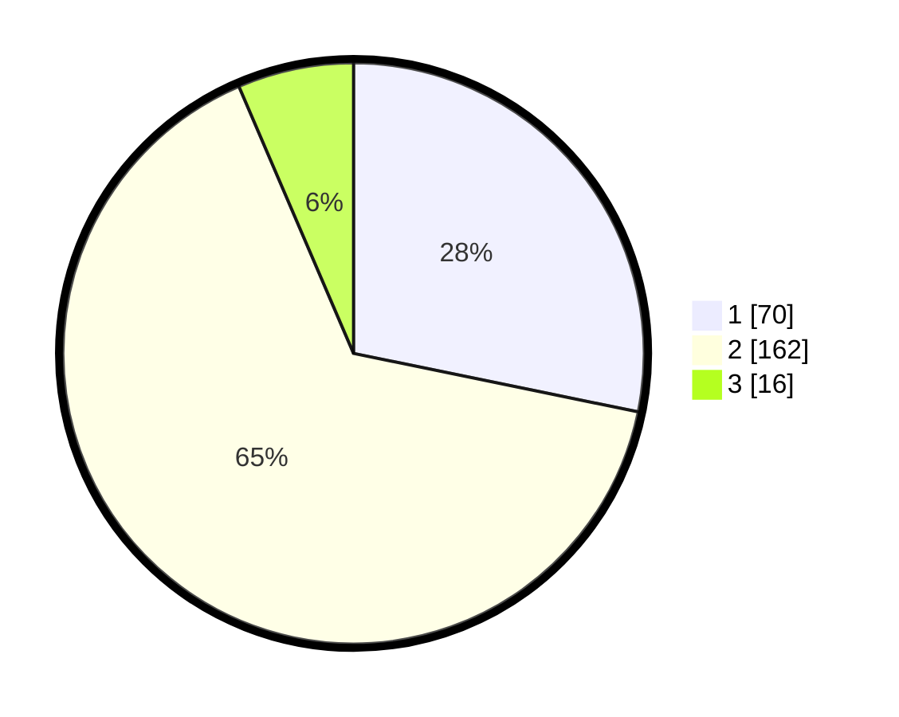

# Hasil

## Grafik

## Tabel

| No. | Nama Paslon    | Suara | Suara (raw) | Persentase |
|:--- |:-------------- | -----:| -----------:| ----------:|
| 1   | ANIES MUHAIMIN | 70    | [70][p-1]   | 28,23      |
| 2   | PRABOWO GIBRAN | 162   | [162][p-2]  | 65,32      |
| 3   | GANJAR MAHFUD  | 16    | [16][p-3]   | 6,45       |

[p-1]: https://github.com/gigit-pemilu/pemilu-2024-36-banten/blob/main/pilpres/hitung-suara/sub/36-banten/sub/03-tangerang/sub/17-curug/sub/1001-curug-kulon/sub/004-tps/sub/paslon-1.txt
[p-2]: https://github.com/gigit-pemilu/pemilu-2024-36-banten/blob/main/pilpres/hitung-suara/sub/36-banten/sub/03-tangerang/sub/17-curug/sub/1001-curug-kulon/sub/004-tps/sub/paslon-2.txt
[p-3]: https://github.com/gigit-pemilu/pemilu-2024-36-banten/blob/main/pilpres/hitung-suara/sub/36-banten/sub/03-tangerang/sub/17-curug/sub/1001-curug-kulon/sub/004-tps/sub/paslon-3.txt

## Foto C Plano

https://sirekap-obj-formc.kpu.go.id/3036/pemilu/ppwp/36/03/17/10/01/3603171001004-20240215-014813--f4941dc3-cdec-4384-9e5b-d5d79daa705d.jpg

https://sirekap-obj-formc.kpu.go.id/3036/pemilu/ppwp/36/03/17/10/01/3603171001004-20240215-015254--a30fc647-a490-488d-b554-b744c9ab85a8.jpg

https://sirekap-obj-formc.kpu.go.id/3036/pemilu/ppwp/36/03/17/10/01/3603171001004-20240215-014853--6d8bd0f5-3cc0-44ec-8cc1-5406221255fb.jpg

## Metadata

| Key        | Value               |
| ---------- | ------------------- |
| Time Stamp | 2024-02-19 16:00:00 |

