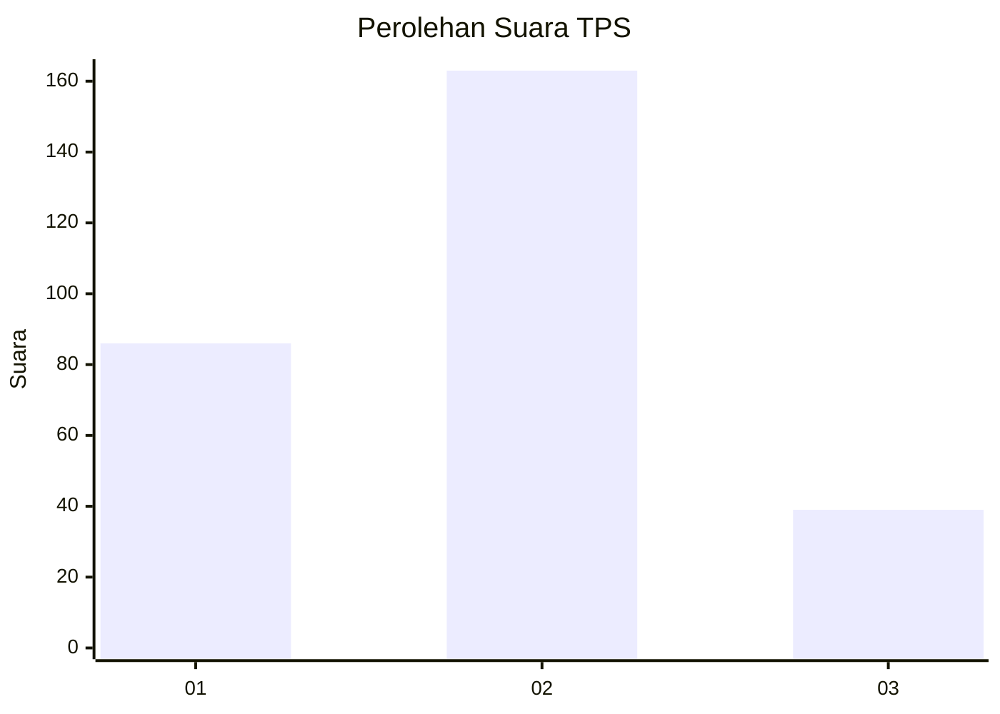
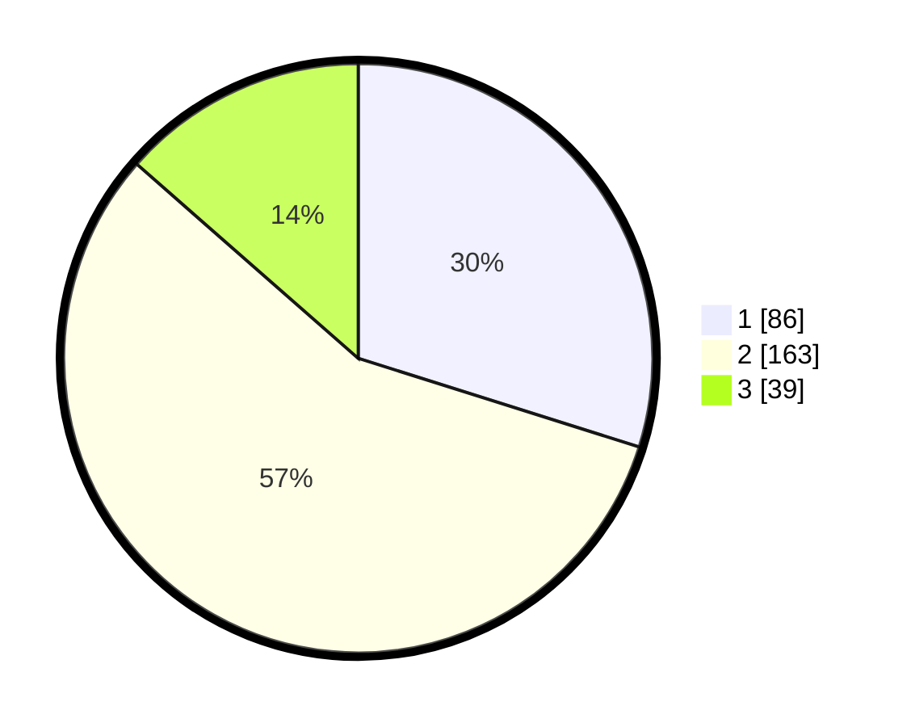

# Hasil

## Grafik

## Tabel

| No. | Nama Paslon    | Suara | Suara (raw) | Persentase |
|:--- |:-------------- | -----:| -----------:| ----------:|
| 1   | ANIES MUHAIMIN | 86    | [86][p-1]   | 29,86      |
| 2   | PRABOWO GIBRAN | 163   | [163][p-2]  | 56,60      |
| 3   | GANJAR MAHFUD  | 39    | [39][p-3]   | 13,54      |

[p-1]: https://github.com/gigit-pemilu/pemilu-2024-36-banten/blob/main/pilpres/hitung-suara/sub/36-banten/sub/03-tangerang/sub/17-curug/sub/1001-curug-kulon/sub/034-tps/sub/paslon-1.txt
[p-2]: https://github.com/gigit-pemilu/pemilu-2024-36-banten/blob/main/pilpres/hitung-suara/sub/36-banten/sub/03-tangerang/sub/17-curug/sub/1001-curug-kulon/sub/034-tps/sub/paslon-2.txt
[p-3]: https://github.com/gigit-pemilu/pemilu-2024-36-banten/blob/main/pilpres/hitung-suara/sub/36-banten/sub/03-tangerang/sub/17-curug/sub/1001-curug-kulon/sub/034-tps/sub/paslon-3.txt

## Foto C Plano

https://sirekap-obj-formc.kpu.go.id/980d/pemilu/ppwp/36/03/17/10/01/3603171001034-20240214-235611--19e90f29-9013-44fb-a87c-1ed6c79bf4c5.jpg

https://sirekap-obj-formc.kpu.go.id/980d/pemilu/ppwp/36/03/17/10/01/3603171001034-20240215-000226--acda8d2c-15d0-4ec4-8ddf-c5651b469eca.jpg

https://sirekap-obj-formc.kpu.go.id/980d/pemilu/ppwp/36/03/17/10/01/3603171001034-20240215-000401--a25f80d2-2e6c-43b4-bd84-1b2e5cab2f0f.jpg

## Metadata

| Key        | Value               |
| ---------- | ------------------- |
| Time Stamp | 2024-02-15 12:00:28 |

