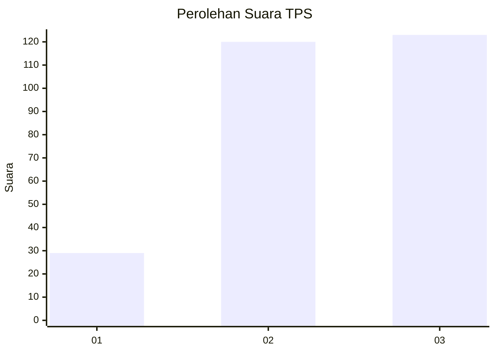
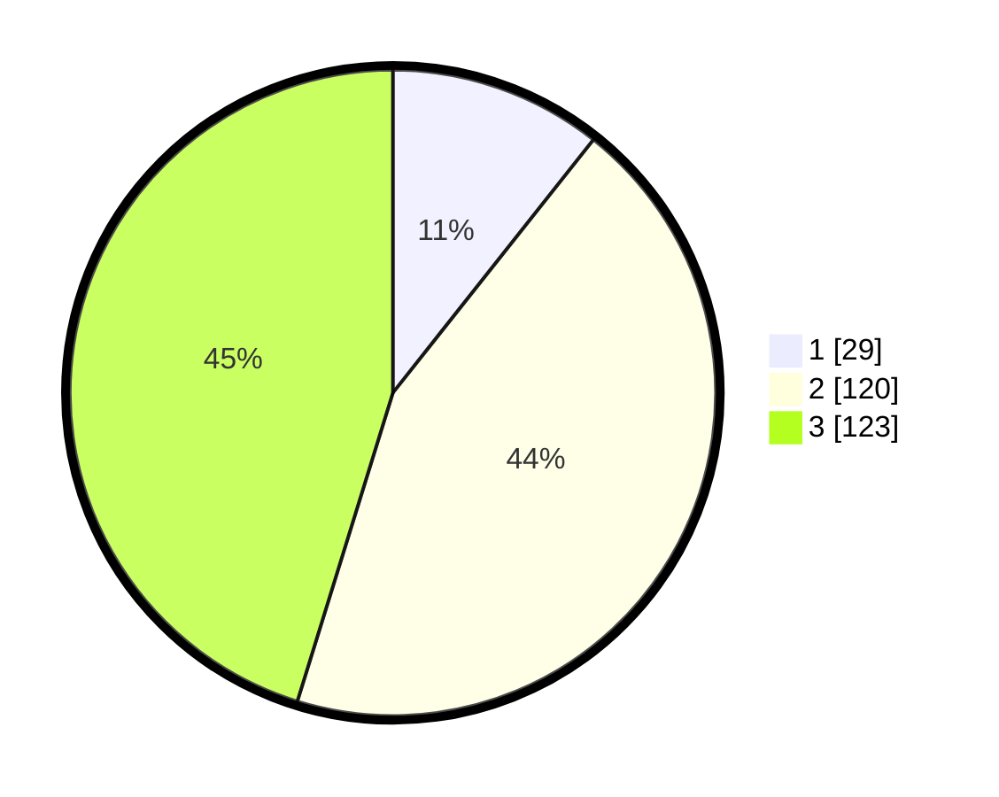

# Hasil

## Grafik

## Tabel

| No. | Nama Paslon    | Suara | Suara (raw) | Persentase |
|:--- |:-------------- | -----:| -----------:| ----------:|
| 1   | ANIES MUHAIMIN | 29    | [29][p-1]   | 10,66      |
| 2   | PRABOWO GIBRAN | 120   | [120][p-2]  | 44,12      |
| 3   | GANJAR MAHFUD  | 123   | [123][p-3]  | 45,22      |

[p-1]: https://github.com/gigit-pemilu/pemilu-2024/blob/main/pilpres/hitung-suara/sub/36-banten/sub/03-tangerang/sub/17-curug/sub/1006-binong/sub/148-tps/sub/paslon-1.txt
[p-2]: https://github.com/gigit-pemilu/pemilu-2024/blob/main/pilpres/hitung-suara/sub/36-banten/sub/03-tangerang/sub/17-curug/sub/1006-binong/sub/148-tps/sub/paslon-2.txt
[p-3]: https://github.com/gigit-pemilu/pemilu-2024/blob/main/pilpres/hitung-suara/sub/36-banten/sub/03-tangerang/sub/17-curug/sub/1006-binong/sub/148-tps/sub/paslon-3.txt

## Foto C Plano

https://sirekap-obj-formc.kpu.go.id/216f/pemilu/ppwp/36/03/17/10/06/3603171006148-20240214-215514--e163cd84-d8bb-4112-89fd-6a46a45b0399.jpg

https://sirekap-obj-formc.kpu.go.id/216f/pemilu/ppwp/36/03/17/10/06/3603171006148-20240214-215535--81d44b49-14d7-48ea-a932-72a2180e08a7.jpg

https://sirekap-obj-formc.kpu.go.id/216f/pemilu/ppwp/36/03/17/10/06/3603171006148-20240215-012828--30081543-ba3a-43d5-8237-e8f7b5922620.jpg

## Metadata

| Key        | Value               |
| ---------- | ------------------- |
| Time Stamp | 2024-02-19 18:00:00 |

