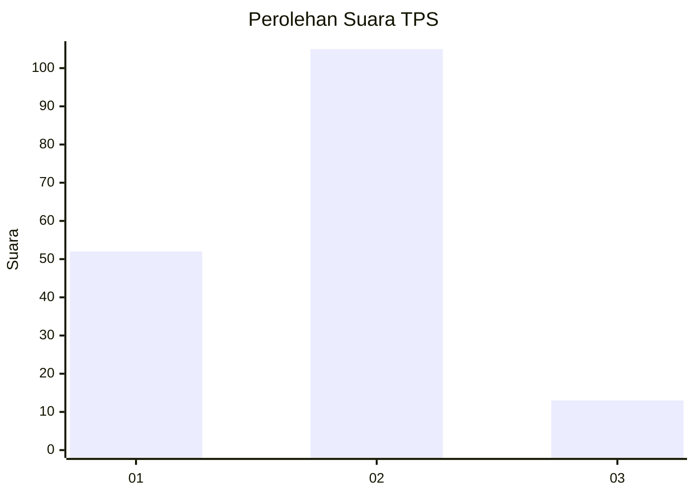
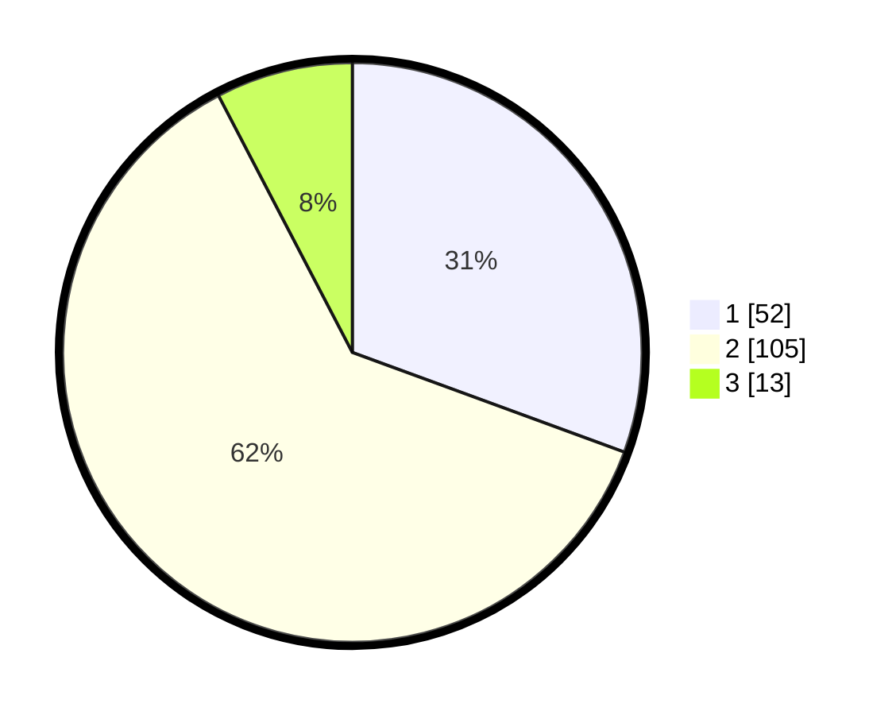

# Hasil

## Grafik

## Tabel

| No. | Nama Paslon    | Suara | Suara (raw) | Persentase |
|:--- |:-------------- | -----:| -----------:| ----------:|
| 1   | ANIES MUHAIMIN | 52    | [52][p-1]   | 30,59      |
| 2   | PRABOWO GIBRAN | 105   | [105][p-2]  | 61,76      |
| 3   | GANJAR MAHFUD  | 13    | [13][p-3]   | 7,65       |

[p-1]: https://github.com/gigit-pemilu/pemilu-2024-36-banten/blob/main/pilpres/hitung-suara/sub/36-banten/sub/03-tangerang/sub/18-cikupa/sub/1001-sukamulya/sub/002-tps/sub/paslon-1.txt
[p-2]: https://github.com/gigit-pemilu/pemilu-2024-36-banten/blob/main/pilpres/hitung-suara/sub/36-banten/sub/03-tangerang/sub/18-cikupa/sub/1001-sukamulya/sub/002-tps/sub/paslon-2.txt
[p-3]: https://github.com/gigit-pemilu/pemilu-2024-36-banten/blob/main/pilpres/hitung-suara/sub/36-banten/sub/03-tangerang/sub/18-cikupa/sub/1001-sukamulya/sub/002-tps/sub/paslon-3.txt

## Foto C Plano

https://sirekap-obj-formc.kpu.go.id/1212/pemilu/ppwp/36/03/18/10/01/3603181001002-20240214-205240--8fe3c443-6879-4025-98cb-6548df983acb.jpg

https://sirekap-obj-formc.kpu.go.id/1212/pemilu/ppwp/36/03/18/10/01/3603181001002-20240214-205400--1c5a1804-221a-4f89-9c68-47a86c98ace9.jpg

https://sirekap-obj-formc.kpu.go.id/1212/pemilu/ppwp/36/03/18/10/01/3603181001002-20240214-214527--4cbea6ee-d5e1-4301-9e3e-d7d234003d22.jpg

## Metadata

| Key        | Value               |
| ---------- | ------------------- |
| Time Stamp | 2024-02-19 06:16:00 |

