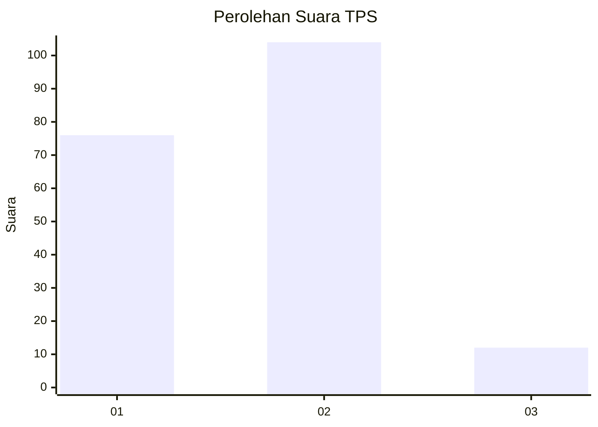

# Hasil

## Grafik

## Tabel

| No. | Nama Paslon    | Suara | Suara (raw) | Persentase |
|:--- |:-------------- | -----:| -----------:| ----------:|
| 1   | ANIES MUHAIMIN | 76    | [76][p-1]   | 39,58      |
| 2   | PRABOWO GIBRAN | 104   | [104][p-2]  | 54,17      |
| 3   | GANJAR MAHFUD  | 12    | [12][p-3]   | 6,25       |

[p-1]: https://github.com/gigit-pemilu/pemilu-2024/blob/main/pilpres/hitung-suara/sub/36-banten/sub/03-tangerang/sub/18-cikupa/sub/1001-sukamulya/sub/005-tps/sub/paslon-1.txt
[p-2]: https://github.com/gigit-pemilu/pemilu-2024/blob/main/pilpres/hitung-suara/sub/36-banten/sub/03-tangerang/sub/18-cikupa/sub/1001-sukamulya/sub/005-tps/sub/paslon-2.txt
[p-3]: https://github.com/gigit-pemilu/pemilu-2024/blob/main/pilpres/hitung-suara/sub/36-banten/sub/03-tangerang/sub/18-cikupa/sub/1001-sukamulya/sub/005-tps/sub/paslon-3.txt

## Foto C Plano

https://sirekap-obj-formc.kpu.go.id/abf4/pemilu/ppwp/36/03/18/10/01/3603181001005-20240215-204350--b99b9930-2359-4ab1-93d7-9b9f0939a955.jpg

https://sirekap-obj-formc.kpu.go.id/abf4/pemilu/ppwp/36/03/18/10/01/3603181001005-20240215-204355--5e231faa-3795-4ad2-9b65-89c59f26e926.jpg

https://sirekap-obj-formc.kpu.go.id/abf4/pemilu/ppwp/36/03/18/10/01/3603181001005-20240215-204359--2965a87d-bff0-4674-88b0-55ab5c98504b.jpg

## Metadata

| Key        | Value               |
| ---------- | ------------------- |
| Time Stamp | 2024-02-17 17:30:00 |

