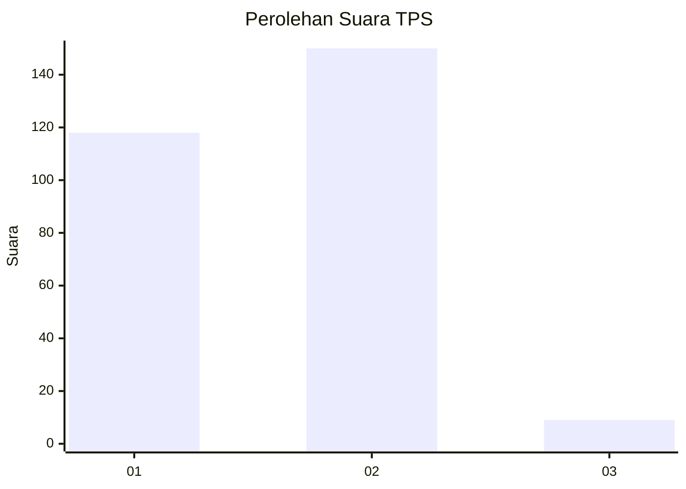
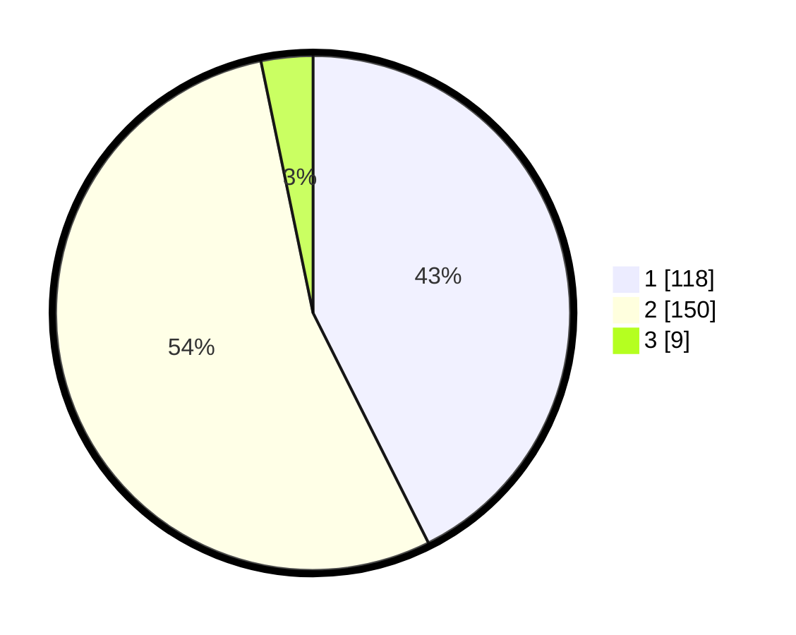

# Hasil

## Grafik

## Tabel

| No. | Nama Paslon    | Suara | Suara (raw) | Persentase |
|:--- |:-------------- | -----:| -----------:| ----------:|
| 1   | ANIES MUHAIMIN | 118   | [118][p-1]  | 42,60      |
| 2   | PRABOWO GIBRAN | 150   | [150][p-2]  | 54,15      |
| 3   | GANJAR MAHFUD  | 9     | [9][p-3]    | 3,25       |

[p-1]: https://github.com/gigit-pemilu/pemilu-2024-36-banten/blob/main/pilpres/hitung-suara/sub/36-banten/sub/03-tangerang/sub/18-cikupa/sub/2010-pasir-gadung/sub/034-tps/sub/paslon-1.txt
[p-2]: https://github.com/gigit-pemilu/pemilu-2024-36-banten/blob/main/pilpres/hitung-suara/sub/36-banten/sub/03-tangerang/sub/18-cikupa/sub/2010-pasir-gadung/sub/034-tps/sub/paslon-2.txt
[p-3]: https://github.com/gigit-pemilu/pemilu-2024-36-banten/blob/main/pilpres/hitung-suara/sub/36-banten/sub/03-tangerang/sub/18-cikupa/sub/2010-pasir-gadung/sub/034-tps/sub/paslon-3.txt

## Foto C Plano

https://sirekap-obj-formc.kpu.go.id/0d8b/pemilu/ppwp/36/03/18/20/10/3603182010034-20240215-011938--d605db87-8268-4638-9155-9c87bdaa9ded.jpg

https://sirekap-obj-formc.kpu.go.id/0d8b/pemilu/ppwp/36/03/18/20/10/3603182010034-20240215-012101--39e510c1-abe7-4a79-8518-03f725e668c5.jpg

https://sirekap-obj-formc.kpu.go.id/0d8b/pemilu/ppwp/36/03/18/20/10/3603182010034-20240215-012156--4aee471d-6101-406c-aebc-3efcb0dbea7f.jpg

## Metadata

| Key        | Value               |
| ---------- | ------------------- |
| Time Stamp | 2024-02-25 11:00:00 |

