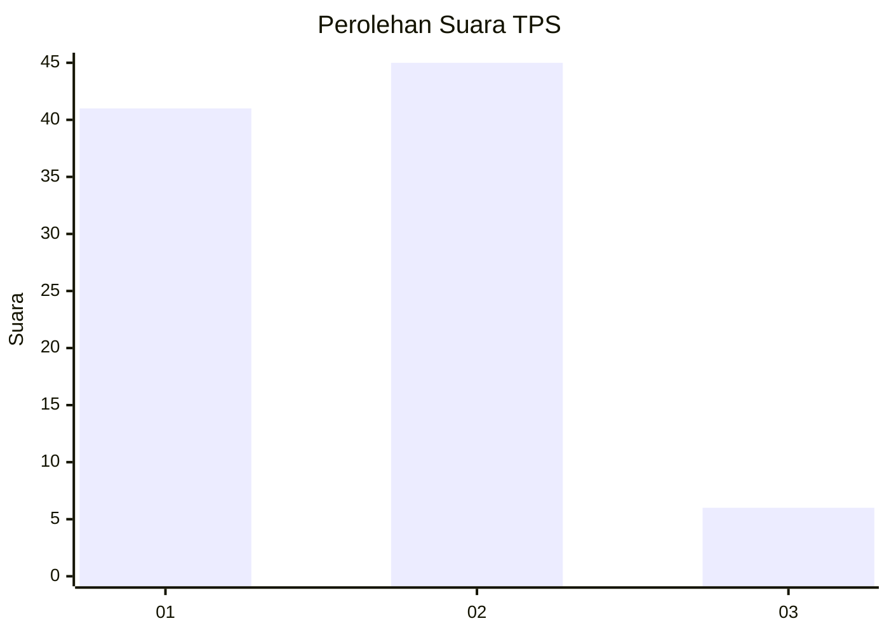
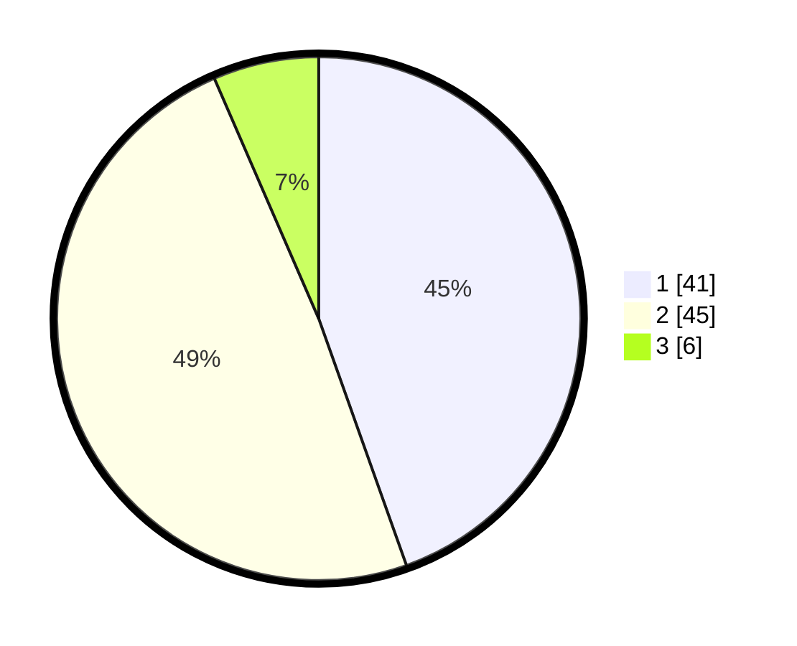

# Hasil

## Grafik

## Tabel

| No. | Nama Paslon    | Suara | Suara (raw) | Persentase |
|:--- |:-------------- | -----:| -----------:| ----------:|
| 1   | ANIES MUHAIMIN | 41    | [41][p-1]   | 44,57      |
| 2   | PRABOWO GIBRAN | 45    | [45][p-2]   | 48,91      |
| 3   | GANJAR MAHFUD  | 6     | [6][p-3]    | 6,52       |

[p-1]: https://github.com/gigit-pemilu/pemilu-2024-36-banten/blob/main/pilpres/hitung-suara/sub/36-banten/sub/03-tangerang/sub/18-cikupa/sub/2010-pasir-gadung/sub/040-tps/sub/paslon-1.txt
[p-2]: https://github.com/gigit-pemilu/pemilu-2024-36-banten/blob/main/pilpres/hitung-suara/sub/36-banten/sub/03-tangerang/sub/18-cikupa/sub/2010-pasir-gadung/sub/040-tps/sub/paslon-2.txt
[p-3]: https://github.com/gigit-pemilu/pemilu-2024-36-banten/blob/main/pilpres/hitung-suara/sub/36-banten/sub/03-tangerang/sub/18-cikupa/sub/2010-pasir-gadung/sub/040-tps/sub/paslon-3.txt

## Foto C Plano

https://sirekap-obj-formc.kpu.go.id/44d3/pemilu/ppwp/36/03/18/20/10/3603182010040-20240214-225845--bffecff8-69b1-4aa8-9106-ba5acfe02730.jpg

https://sirekap-obj-formc.kpu.go.id/44d3/pemilu/ppwp/36/03/18/20/10/3603182010040-20240214-230216--94d4a3c6-3fa5-4a1c-8c25-6680a0a736f4.jpg

https://sirekap-obj-formc.kpu.go.id/44d3/pemilu/ppwp/36/03/18/20/10/3603182010040-20240214-230146--652bdd0e-0010-4d7f-aa78-64ef6d9da1bb.jpg

## Metadata

| Key        | Value               |
| ---------- | ------------------- |
| Time Stamp | 2024-02-16 22:01:00 |

